#  尚品汇第 1 天


## 1. 项目介绍


### 1.1 项目演示


此项目为在线电商 `Web App` ，包括首页、搜索列表、 商品详情、 购物车、下单&支付、用户注册、登陆等多个子模块，采用模块化、组件化、工程化的模式开发


### 1.2 技术选型


1. 使用 `Vue Router` 开发单页应用
2. 使用 `Vuex` 管理应用组件状态
3. 使用 `Axios` 与后端进行数据交互
4. 使用 `Swiper & vue-awesome-swiper` 实现页面滑动效果
5. 使用 `Elment UI` 组件库构建界面
6. 使用 `vee-validate` 进行前台表单校验
7. 使用 `vue-lazyload` 实现图片惰加载
8. 使用 `mockjs` 模拟后台数据接口
9. 使用一些小的工具库

   - `Lodash`: 函数节流
   -  `Nprogress` : 请求进度
   -  `uuid` : 生成唯一用户临时ID
   - `qrcode`: 生成支付二维码
10. 其他开发中的注意事项.....
    - `Git` 和 `Gitflow`工作流
    - `Eslint` 和 `Prettier` 规范校验
    - `Standard` 代码规范
    - .......


## 2. Vue Cli 创建项目

> 🎯目标：对项目规范进行规范化，解决代码格式问题


**思路分析：**

`vue create xxx  vue2 vuex vuerouter `

在学习 `Vue` 基本功的时候，出于学习的目的，`Vue` 核心依赖库 `Vuex` 、`Vue Router` 的配置都是由我们自行来进行配置，因此之前创建创建项目的方式是：

1. 使用 `Vue Cli` 创建一个基础的项目模板
2. 自行安装和配置 `Vuex`
3. 自行安装和配置 `Vue Route`
4. 自行安装和配置 `Less-loader`
5. coding.......


其实，Vue 脚手架也给提供了交互式的安装助手，帮助我们安装这些依赖，并配置初始化的代码。

配置方式如下（简写版和图示）：


**落地代码：**

```powershell
vue create sph-font


Vue CLI v5.0.8

# 选择创建项目的方式：自定义 Manually select features
? Please pick a preset: 'Manually select features'

# 选择需要安装的库和插件：Babel, Router, Vuex, CSS Pre-processors, Linter
? Check the features needed for your project: 'Babel, Router, Vuex, CSS Pre-processors, Linter'

# 选择需要安装的 Vue 版本：2.x
? Choose a version of Vue.js that you want to start the project with '2.x'

# 是否需要启用 history 路由模式：No
? Use history mode for router? (Requires proper server setup for index fallback in production) 'No'

# 项目中需要使用的 CSS 预处理器：Less
? Pick a CSS pre-processor (PostCSS, Autoprefixer and CSS Modules are supported by default): 'Less'

# 项目中使用的代码规范：Standard
? Pick a linter / formatter config: 'Standard'

# 执行代码检查的时机：Lint on save, Lint and fix on commit 保存代码以及执行 git commit 的时候
? Pick additional lint features: 'Lint on save, Lint and fix on commit'

# 项目中额外的配置文件怎么管理：In dedicated config files
? Where do you prefer placing config for Babel, ESLint, etc.? 'In dedicated config files'

# 是否保存配置预设：No
? Save this as a preset for future projects? 'No'
```


**安装图示：**

1. 在命令行中输入以下命令创建 Vue 项目：

   ```bash
   # 创建项目
   
   vue create 项目名称
   ```

   

2. 选择安装预设

   - Default ([Vue 3] babel, eslint)：基于 Vue 3 创建，同时选中 babel、eslint，回车之后直接进入装包

   - Default ([Vue 2] babel, eslint)：基于 Vue 2 创建，同时选中 babel、eslint，回车之后直接进入装包

   - Manually select features：自定义勾选特性配置，选择完毕之后，才会进入装包

   - **推荐选择第 3 种：手动选择特性，支持更多自定义选项**

     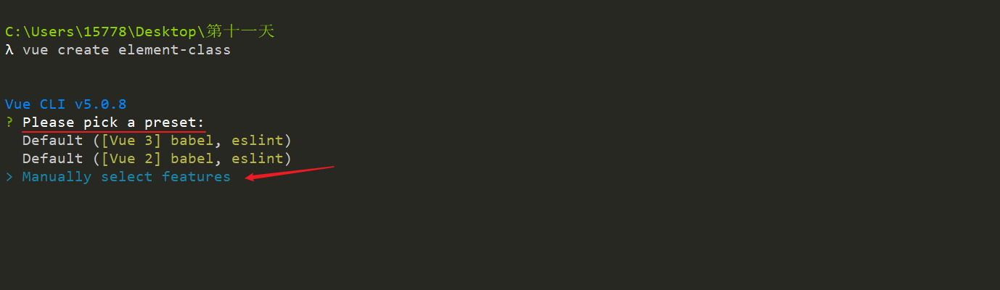


3. 安装项目中需要使用的库以及功能，分别选择以下几个模块

   - `Babel`：`es6` 转 `es5`

   - `Router`：路由，会根据选择的 Vue 安装对应的 Vue router 版本

   - `Vuex`：状态管理库，存储共享数据，会根据选择的 Vue 安装对应的 Vuex 版本，

   - `CSS Pre-processors`：`CSS`预处理器，后面会提示你选择 `less`、`sass`、`stylus` 等

   - `Linter / Formatter`：代码格式校验 **如果不需要选择任何格式规范，可以取消默认勾选 **

     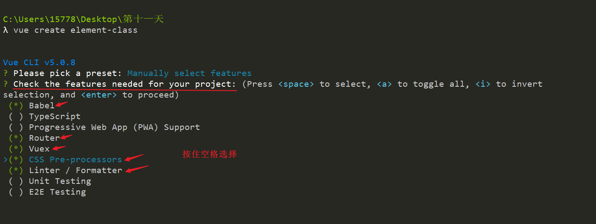

   

4. 选择 Vue 的版本

   - `2.x` ： 选择 Vue 2 的版本进行项目创建

     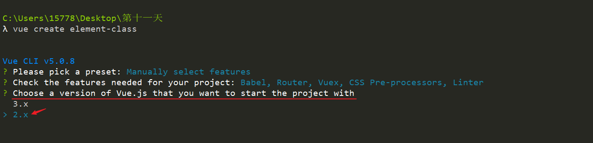

   

5. 配置路由模式

   - 是否使用 `history` 路由模式，这里输入 `n` 不使用
   - 后期我们可以根据自己更改和配置

   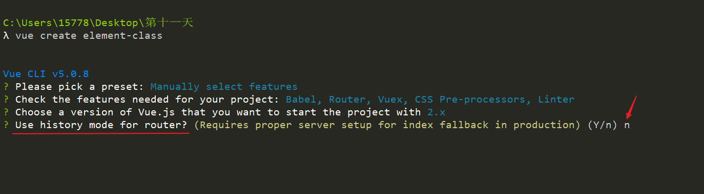

   

6. 选择 `CSS` 预处理器

   - 选择 `Less`，之前我们主要学习的 Less ，相对熟悉一点

   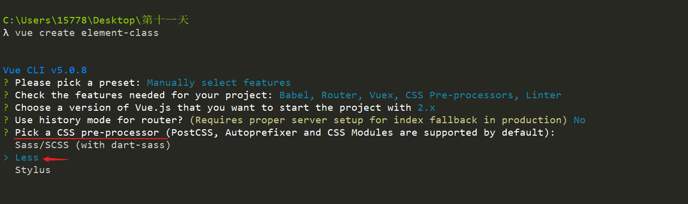

   

7. 选择代码格式规范

   - 选择 `ESLint` + [Standard config](https://standardjs.com/)
   - 如果不需要选择任何格式规范，可以在选择的时候取消掉 

   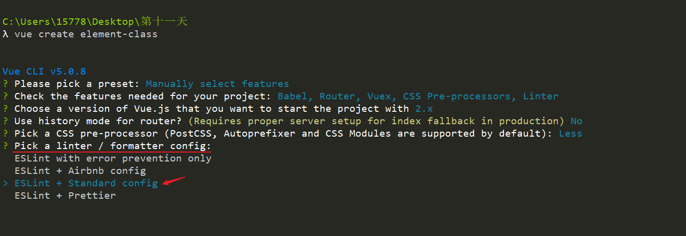

   

8. 选择在什么时机下触发代码格式校验

   - Lint on save：每当保存文件的时候
   - Lint and fix on commit：每当执行 `git commit` 提交的时候
   - **这里建议两个都选上，更严谨**

   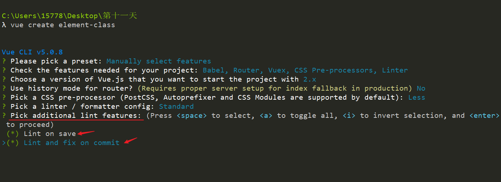


8. 额外的配置文件的配置

   - `Babel`、`ESLint` 等工具会有一些额外的配置文件，需要将这些工具相关的配置文件写到哪里
     - `In dedicated config files`：分别保存到单独的配置文件
     - `In package.json`：保存到 `package.json` 文件中
   - 里建议选择第 `1` 个，保存到单独的配置文件，这样方便我们做自定义配置

   - **这里建议两个都选上，更严谨**

   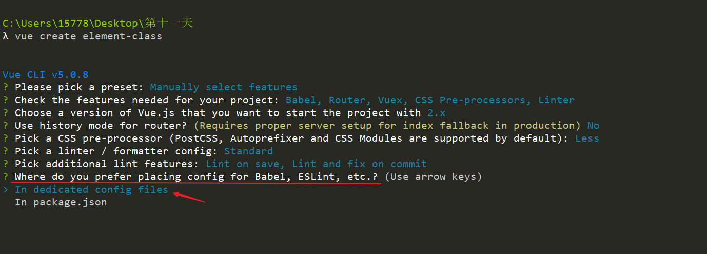

   

9. 是否保存配置预设

   - 是否需要将刚才选择一系列配置保存起来，并可以帮我们记住上面的一系列选择，以便下次直接复用
   - 输入 `y` 或者 `n`，我这里输入 `n` ，不保存

   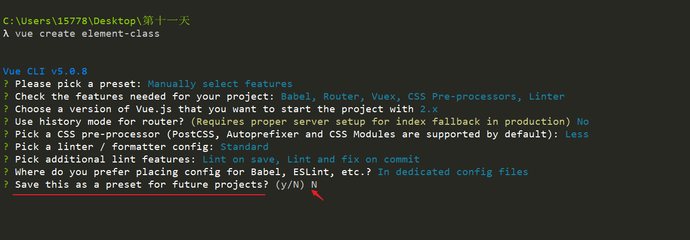

   

10. 安装向导配置结束后，开始装包，安装包的时间因为网络的原因，可能会比较长，请耐心等待~~~~

    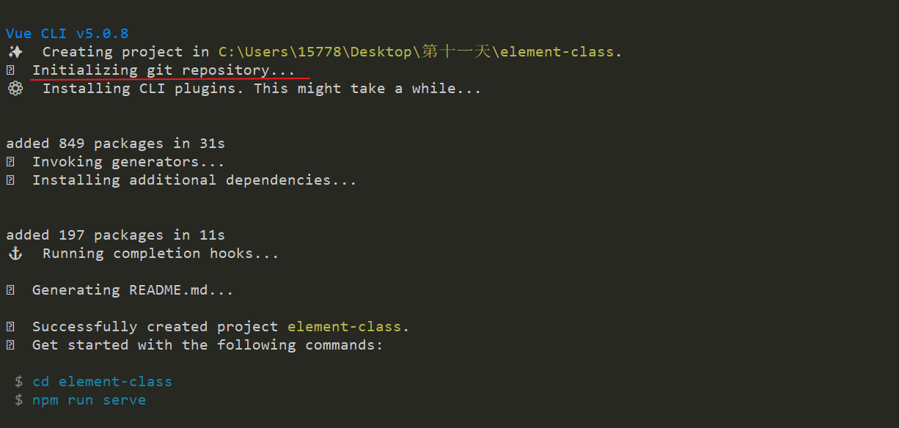


​    

11. 安装结束，命令提示你项目创建成功，按照命令行的提示在终端中分别输入

    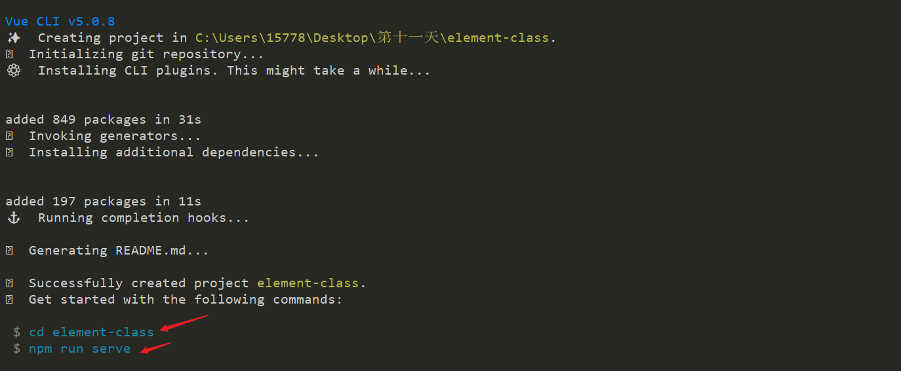

    

12. 进入你的项目目录，并启动项目

    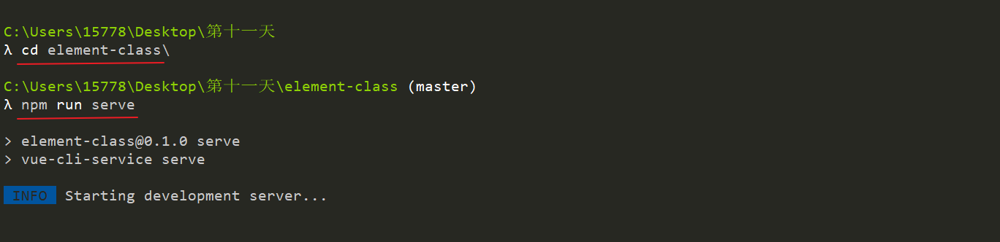


13.  项目运行成功

     - 启动成功，命令行中显示项目的运行地址

- 打开浏览器，输入其中任何一个地址进行访问

  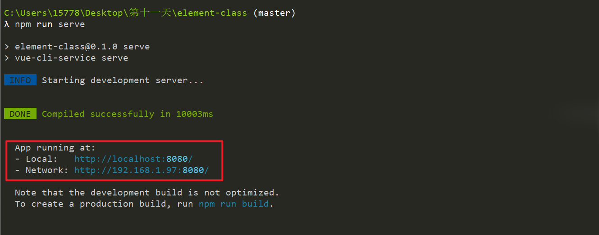

​     

14. 如果能看到该页面，表示项目创建成功了

    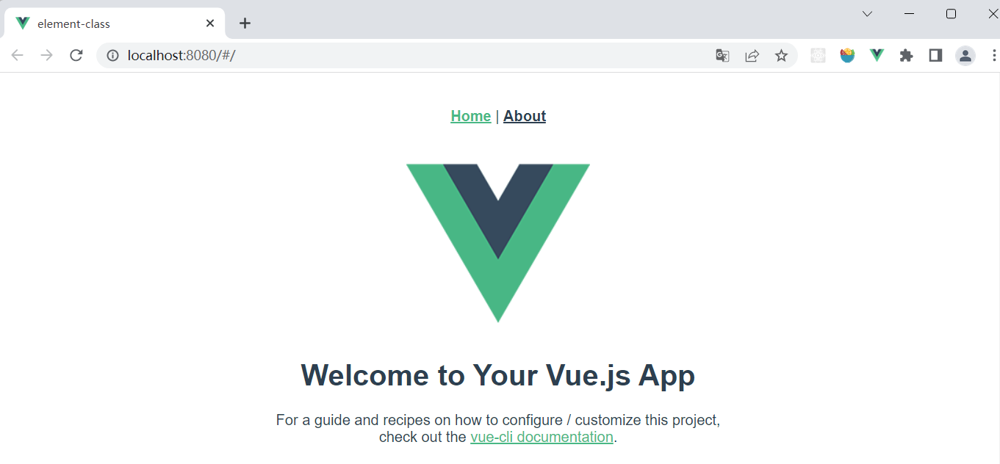


## 3. 统一代码规范

> 🎯目标：对项目规范进行规范化，解决代码格式问题


### 3.1 代码规范的重要性


为什么需要将代码进行规范化编写

1. 将代码进行规范化编写可以提高团队的开发效率

   - 30 (a: a) （b: b）

2. 将代码进行规范化编写降低了代码的维护成本
   - 对于大的项目或是公司，修复 bug 的这位伙计不是写代码的那个人、
   - 且有可能发现bug和修复bug的不是同一个人

3. 将代码进行规范化编写能够减少 Bug 出错的概率

   ```js
   handler () {
   console.log('1')
     console.log('1')
       console.log('1')
      console.log('1')
   console.log('1')
   }
   ```

   

4. 将代码进行规范化编写能够提高代码的审查 CodeReview

   - 随着应用的成熟，需要对代码审查，修改和调整


可维护的代码意味着：

1. 可读的
2. 一致的 (代码规范、写法风格)
3. 可预测的 .then() .catch()
4. 看上去就像是同一个人写的


### 3.2 Standard 代码规范介绍


官方地址：[Standard](https://github.com/standard/standard)

中文地址：[Standard](https://github.com/standard/standard/blob/master/docs/README-zhcn.md)

详细地址：[Standard 详细规范](https://github.com/standard/standard/blob/master/docs/RULES-zhcn.md#javascript-standard-style)


**几个重要的代码准则**


- **使用两个空格** – 进行缩进

- **字符串使用单引号** – 需要转义的地方除外 'Tom' "Tom"
- **不再有冗余的变量** – 这是导致 *大量* bug 的源头! 
- **无分号** – [这](http://blog.izs.me/post/2353458699/an-open-letter-to-javascript-leaders-regarding)[没什么不好。](https://web.archive.org/web/20201206065632/http://inimino.org/~inimino/blog/javascript_semicolons)[不骗你！](https://www.youtube.com/watch?v=gsfbh17Ax9I)
- 行首不要以 `(`, `[`, or ``` 开头
- **关键字后加空格** `if (condition) { ... }`
- **函数名后加空格** `function name (arg) { ... }`
- 坚持使用全等 `===` 摒弃 `==` 


### 3.3 代码格式化配置


**1. 安装两个插件**

- Eslint
- Prettier 

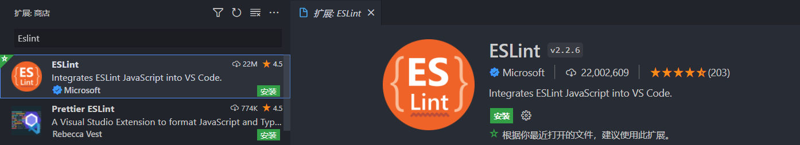

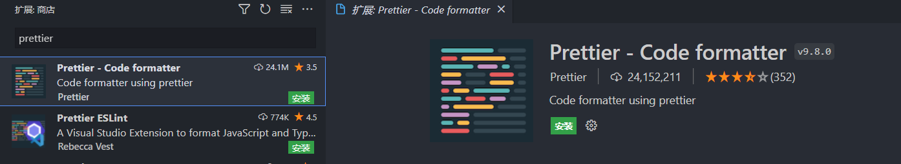


**2. Eslint 和 Prettier 是什么？**

1. `ESLint` 是一个插件， **用来对 `javascript` 代码检测质量的工具** ，说白了就是做 **对代码质量检测使用的**

   - 例如未使用的变量，未定义的引用，比较时使用 ===，禁止不必要的括号 等等代码质量检测

   - `ESLint`大大提高了团队协作的代码规范统一性，以及个人的代码质量

     

2. `Prettier` 的作用主要是进行代码格式化

   - `ESLint` 的作用是代码质量检测，`Prettier` 的作用则主要是代码格式化
   - `ESLint` 只能格式化 `js/ts` 文件，而 `Prettier` 支持多种文件


`Prettier` 自身的规范倾向于个人 / 团队的代码风格的规范或统一，例如单引号还是双引号，每行最大长度，等号左右空格，使用 tab 还是 空格等等，将`Prettier` 与 `ESLint` 一起协同工作犹如如虎添翼


**3. 配置方式**


1. VsCode 插件安装两个插件 `Eslint`、`Prettier - Code formatter`

2. 在项目的根目录下创建 `.vscode` 文件夹，注意：文件夹名字前面带 **`.`** 点❗

   - 在对代码进行处理的时候，会优先走 .vscode 里面的配置

3. 在 `.vscode` 文件夹下，创建 `settings.json` 文件，用来对 `当前项目`进行格式化

   - 用来告诉 VsCode ，按照 .vscode 中的配置对代码进行格式化

   ```json
   {
     // eslint 保存格式化
     "eslint.enable": true,
     // 执行 eslint 检测的时间，onType 输入时
     "eslint.run": "onType",
     //指定 eslint 所处理的文件的后缀
     "eslint.options": {
       "extensions": [".js", ".ts", ".jsx", ".tsx", ".vue"]
     },
     // 编辑器保存格式化
     "editor.codeActionsOnSave": {
       "source.fixAll": true,
       "source.fixAll.eslint": true
     },
     // .ts 文件格式化程序
     "[typescript]": {
       "editor.defaultFormatter": "esbenp.prettier-vscode"
     },
   
     // .vue 文件格式化程序
     "[vue]": {
       "editor.defaultFormatter": "esbenp.prettier-vscode"
     },
   
     "[json]": {
       "editor.defaultFormatter": "esbenp.prettier-vscode"
     },
   
     // 操作时作为单词分隔符的字符
     "editor.wordSeparators": "`~!@#%^&*()=+[{]}\\|;:'\",.<>/?",
   
     // 一个制表符等于的空格数
     "editor.tabSize": 2,
   
     // 行尾字符
     // "files.eol": "\n",
   
     // 保存到额时候用使用 prettier 进行格式化
     "editor.formatOnSave": true,
     
     // // 不要有分号
     // "prettier.semi": false,
     // // 使用单引号
     // "prettier.singleQuote": true,
     // // 默认使用prittier作为格式化工具
     // "editor.defaultFormatter": "esbenp.prettier-vscode",
     // // 一行的字符数，如果超过会进行换行，默认为80
     // "prettier.printWidth": 200,
     // // 尾随逗号问题，设置为none 不显示 逗号
     // "prettier.trailingComma": "none"
   }
   
   ```

   

4. 在项目根目录下创建 `.prettierrc` 文件，用来配置

   ```json
   {
     "semi": false,
     "singleQuote": true,
     "useTabs": false,
     "tabWidth": 2,
     "printWidth": 130,
     "trailingComma": "none"
   }
   
   ```

   


5. **可选**，看方法、函数的前面是否提示需要加一个空格，配置 Eslint 检测

   - 在项目根目录下找到`.eslintrc.js`，进行配置
   - 主要是为了解决这个空格问题
   - 原因是因为 `Eslint 和 Prettier` 的格式化工具冲突了

   ```json
   module.exports = {
     // ....
     rules: {
       'no-console': process.env.NODE_ENV === 'production' ? 'warn' : 'off',
       'no-debugger': process.env.NODE_ENV === 'production' ? 'warn' : 'off',
       'space-before-function-paren': 0
     }
   }
   
   ```


## 4. 初始化项目目录

> 🎯目标：初始化项目目录，并进行标题和图片的配置


**1. 思路分析：**


采用脚手架创建项目目录，目录中包含了一些不需要的文件夹，需要将这些文件进行删除、重置和更改


- 删除 `components` 目录下的公共组件
- 删除 `views` 目录下的页面组件
- 重置 `router/index.js` 目录下的路由配置文件
- 重置 `App.vue` 文件，删除不需要的页面结构和样式
- 更改 `public/index.html` 中项目的标题为 `尚品汇`
- 更改 `public/index.html` 中项目的`favicon.ico`图标
- 给空文件夹添加 `.gitkeep` 文件，否则空文件夹提交不到远程仓库去


**2. 落地代码：**


1. `router/index.js` 

   ```js
   import Vue from 'vue'
   import VueRouter from 'vue-router'
   
   Vue.use(VueRouter)
   
   const routes = []
   
   const router = new VueRouter({
     routes
   })
   
   export default router
   
   ```

   

2. `App.vue` 

   ```vue
   <template>
     <div id="app">根组件</div>
   </template>
   
   <style lang="less"></style>
   
   ```


## 5. 加入 Git 版本管理


**使用 git 的好处**

1. 代码备份
2. 多人协作
3. 历史记录
4. 其他等……


**创建远程仓库**

- [GitHub](https://github.com/lipengzhou)
- [码云](https://gitee.com/)


**将本地仓库推到线上**


如果没有本地仓库

```shell
# 创建本地仓库 (Vue 初始化的时候这一步已经帮我们 init 了，不需要我们手动 Init )
git init

# 将文件添加到暂存区
git add 文件

# 提交历史记录
git commit -m "提交日志"

# 添加远端仓库地址
git remote add origin 你创建的远程仓库地址

# 推送提交
git push -u origin master

# 因为不能够在 master（master 是包含上线代码） 写任何代码，需要创建 develop 分支
# 创建 develop 分支
git checkout -b develop

# 因为不能够在 develop（develop 应该 包含所有了功能） 写任何代码，需要创建 功能 分支
git checkout -b feature/xxxx

# 将 develop 和功能分支推送到远程
git push -u origin develop
git push -u origin feature/xxxx
```


如果已有本地仓库(Vue CLI 已经帮我们初始化好了)

```shell
# 添加远端仓库地址
git remote add origin 你的远程仓库地址

# 推送提交
git push -u origin master
```


在项目代码有了变动以后提交方式：

```shell
git add
git commit -m xxx
git push
```


## 6. 搭建项目整体结构

> 🎯目标：实现 头部、底部和中间区域结构的搭建


**1. 思路分析：**


分析已完成的项目，每个页面头部、底部区域都是一样的，中间区域随着路由的改变而给改变


因此可以将 `Header.vue`  和 `Footer.vue` 拆分成公共组件，那么这两个组件需要放到哪一个文件夹中 ❓


1. `components` 目录：放置项目中的公共组件
2. `views` 目录：放置随着路由改变而改变的页面组件


 `Header.vue`  和 `Footer.vue` 属于项目的公共组件，这两个组件需要都放置到`components` 目录下 ❗


> 📌 Tip：
>
> 组件通常不会直接写 `Header.vue`  和 `Footer.vue`，而是将其放到一个与组件同名的文件夹下，组件放置到文件夹中的 `index.vue` 组件中，例如： `Header/index.vue` 或 `Footer/index.vue`，这样我们在其他页面导入的时候，可以这么写 `import Header from './Layout/Header'`

> 📌 Tip：
>
> 组件结构在：`谷粒商城/home.html`中。
>
> 对应样式在：`谷粒商城/css/home.less`中。
>
> 重置 CSS 样式在：`谷粒商城/css/reset.css`。


**实现步骤：**

   

1. 在 `components` 目录下，创建`Header/index.vue` 或 `Footer/index.vue` 两个组件
2. 将组件在 `App.vue` 中导入并进行使用
3. 从准备的素材中复制对应的结构和样式到对应的组件中
   - 准备 `reset.css` 文件，并在入口文件 `main.js` 进行使用
   - 找到对应的 Header 和 Footer 对应的结构放到对应的结构中


**落地代码：**


1.  `components` 目录下创建`Header/index.vue` 和 `Footer/index.vue` 组件，并在 `App.vue` 中导入使用

   ```vue
   <template>
     <div id="app">
       <!-- 头部区域 -->
       <Header />
   
       <!-- 用于呈现页面中的其他组件 -->
       <router-view />
   
       <!-- 底部区域 -->
       <Footer />
     </div>
   </template>
   
   <script>
   import Header from './components/Header'
   import Footer from './components/Footer'
   
   export default {
     name: 'App',
     components: {
       Header,
       Footer
     }
   }
   </script>
   
   <style lang="less"></style>
   
   ```

   

2. `Header/index.vue` 

   ```vue
   <template>
     <!-- 头部 -->
     <header class="header">
       <!-- 头部的第一行 -->
       <div class="top">
         <div class="container">
           <div class="loginList">
             <p>尚品汇欢迎您！</p>
             <p>
               <span>请</span>
               <a href="###">登录</a>
               <a href="###" class="register">免费注册</a>
             </p>
           </div>
           <div class="typeList">
             <a href="###">我的订单</a>
             <a href="###">我的购物车</a>
             <a href="###">我的尚品汇</a>
             <a href="###">尚品汇会员</a>
             <a href="###">企业采购</a>
             <a href="###">关注尚品汇</a>
             <a href="###">合作招商</a>
             <a href="###">商家后台</a>
           </div>
         </div>
       </div>
       <!--头部第二行 搜索区域-->
       <div class="bottom">
         <h1 class="logoArea">
           <a class="logo" title="尚品汇" href="###" target="_blank">
             
           </a>
         </h1>
         <div class="searchArea">
           <form action="###" class="searchForm">
             <input type="text" id="autocomplete" class="input-error input-xxlarge" />
             <button class="sui-btn btn-xlarge btn-danger" type="button">搜索</button>
           </form>
         </div>
       </div>
     </header>
   </template>
   
   <script>
   export default {
     name: 'HeaderIndex'
   }
   </script>
   
   <style lang="less" scoped>
   .header {
     & > .top {
       background-color: #eaeaea;
       height: 30px;
       line-height: 30px;
   
       .container {
         width: 1200px;
         margin: 0 auto;
         overflow: hidden;
   
         .loginList {
           float: left;
   
           p {
             float: left;
             margin-right: 10px;
   
             .register {
               border-left: 1px solid #b3aeae;
               padding: 0 5px;
               margin-left: 5px;
             }
           }
         }
   
         .typeList {
           float: right;
   
           a {
             padding: 0 10px;
   
             & + a {
               border-left: 1px solid #b3aeae;
             }
           }
         }
       }
     }
   
     & > .bottom {
       width: 1200px;
       margin: 0 auto;
       overflow: hidden;
   
       .logoArea {
         float: left;
   
         .logo {
           img {
             width: 175px;
             margin: 25px 45px;
           }
         }
       }
   
       .searchArea {
         float: right;
         margin-top: 35px;
   
         .searchForm {
           overflow: hidden;
   
           input {
             box-sizing: border-box;
             width: 490px;
             height: 32px;
             padding: 0px 4px;
             border: 2px solid #ea4a36;
             float: left;
   
             &:focus {
               outline: none;
             }
           }
   
           button {
             height: 32px;
             width: 68px;
             background-color: #ea4a36;
             border: none;
             color: #fff;
             float: left;
             cursor: pointer;
   
             &:focus {
               outline: none;
             }
           }
         }
       }
     }
   }
   </style>
   
   ```

   

3.  `Footer/index.vue` 

   ```vue
   <template>
     <!-- 底部 -->
     <footer class="footer">
       <div class="footer-container">
         <div class="footerList">
           <div class="footerItem">
             <h4>购物指南</h4>
             <ul class="footerItemCon">
               <li>购物流程</li>
               <li>会员介绍</li>
               <li>生活旅行/团购</li>
               <li>常见问题</li>
               <li>购物指南</li>
             </ul>
           </div>
           <div class="footerItem">
             <h4>配送方式</h4>
             <ul class="footerItemCon">
               <li>上门自提</li>
               <li>211限时达</li>
               <li>配送服务查询</li>
               <li>配送费收取标准</li>
               <li>海外配送</li>
             </ul>
           </div>
           <div class="footerItem">
             <h4>支付方式</h4>
             <ul class="footerItemCon">
               <li>货到付款</li>
               <li>在线支付</li>
               <li>分期付款</li>
               <li>邮局汇款</li>
               <li>公司转账</li>
             </ul>
           </div>
           <div class="footerItem">
             <h4>售后服务</h4>
             <ul class="footerItemCon">
               <li>售后政策</li>
               <li>价格保护</li>
               <li>退款说明</li>
               <li>返修/退换货</li>
               <li>取消订单</li>
             </ul>
           </div>
           <div class="footerItem">
             <h4>特色服务</h4>
             <ul class="footerItemCon">
               <li>夺宝岛</li>
               <li>DIY装机</li>
               <li>延保服务</li>
               <li>尚品汇E卡</li>
               <li>尚品汇通信</li>
             </ul>
           </div>
           <div class="footerItem">
             <h4>帮助中心</h4>
             
           </div>
         </div>
         <div class="copyright">
           <ul class="helpLink">
             <li>
               关于我们
               <span class="space"></span>
             </li>
             <li>
               联系我们
               <span class="space"></span>
             </li>
             <li>
               关于我们
               <span class="space"></span>
             </li>
             <li>
               商家入驻
               <span class="space"></span>
             </li>
             <li>
               营销中心
               <span class="space"></span>
             </li>
             <li>
               友情链接
               <span class="space"></span>
             </li>
             <li>
               关于我们
               <span class="space"></span>
             </li>
             <li>
               营销中心
               <span class="space"></span>
             </li>
             <li>
               友情链接
               <span class="space"></span>
             </li>
             <li>关于我们</li>
           </ul>
           <p>地址：北京市昌平区宏福科技园综合楼6层</p>
           <p>京ICP备19006430号</p>
         </div>
       </div>
     </footer>
   </template>
   
   <script>
   export default {
     name: 'FooterIndex'
   }
   </script>
   
   <style lang="less" scoped>
   .footer {
     background-color: #eaeaea;
   
     .footer-container {
       width: 1200px;
       margin: 0 auto;
       padding: 0 15px;
   
       .footerList {
         padding: 20px;
         border-bottom: 1px solid #e4e1e1;
         border-top: 1px solid #e4e1e1;
         overflow: hidden;
         padding-left: 40px;
   
         .footerItem {
           width: 16.6666667%;
           float: left;
   
           h4 {
             font-size: 14px;
           }
   
           .footerItemCon {
             li {
               line-height: 18px;
             }
           }
   
           &:last-child img {
             width: 121px;
           }
         }
       }
   
       .copyright {
         padding: 20px;
   
         .helpLink {
           text-align: center;
   
           li {
             display: inline;
   
             .space {
               border-left: 1px solid #666;
               width: 1px;
               height: 13px;
               background: #666;
               margin: 8px 10px;
             }
           }
         }
   
         p {
           margin: 10px 0;
           text-align: center;
         }
       }
     }
   }
   </style>
   
   ```

   

4. `main.js`

   ```js
   // coding......
   
   // 导入样式重置文件
   import './assets/styles/reset.less'
   
   // coding......
   
   ```


## 7. 实现路由的切换

> 🎯目标：实现路由的切换


**思路分析：**


在当前阶段，我们先暂时配置四个路由组件，分别是：

1. Home      → 主页
2. Login       → 登录
3. Register   → 注册
4. Search     → 搜索


这 4 个路由组件，先不绘制页面结构，能跳转即可


**实现步骤：**


1. 创建 4 个路由，以及路由对应的组件
2. 更改首页跳转链接，实现路由跳转


**落地代码：**


1. 创建 4 个路由

   ```shell
   /Search/index.vue
   /Home/index.vue
   /Login/index.vue
   /Register/index.vue
   ```

   

2. 配置路由对应的组件

   ```js
   // coding......
   
   const routes = [
     {
       path: '/index',
       component: Home
     },
     {
       path: '/login',
       component: Login
     },
     {
       path: '/register',
       component: Register
     },
     {
       path: '/search',
       component: Search
     },
     {
       path: '/',
       redirect: '/index'
     }
   ]
   
   // coding......
   
   ```

   

3. 在`Header`组件中指定位置，使用链接标签实现跳转：

   ```vue
   <!-- 跳转登录 -->
   <router-link to="/login">登录</router-link>
   
   <!-- 跳转注册 -->
   <router-link to="/register" class="register">免费注册</router-link>
   
   <!-- 跳转主页 -->
   <router-link class="logo" title="尚品汇" to="/home">
     
   </router-link>
   
   <!-- 跳转搜索 -->
   <button class="sui-btn btn-xlarge btn-danger" type="button" @click="toSearch">
     搜索
   </button>
   
   <script>
     export default {
       name: "Header",
       methods: {
         toSearch(){
           this.$router.push('/search')
         }
       },
     };
   </script>
   ```


## 8. 对原生方法进行增强


**思路分析：**


1. 需求：对数组的`push`方法做增强，让`push`进去的数字，比写的数字大`1`。

2. 具体实现：

   ```js
   //将Array原型上的push方法备份一份
   const originPush = Array.prototype.push
   
   //修改push方法为我们写的方法
   Array.prototype.push = function (value){
     value += 1 //数字加1
     return originPush.call(this,value) //调用原始的push，完成添加元素
   }
   ```


**落地代码：**

```html
<!DOCTYPE html>
<html lang="en">

<head>
  <meta charset="UTF-8">
  <meta http-equiv="X-UA-Compatible" content="IE=edge">
  <meta name="viewport" content="width=device-width, initial-scale=1.0">
  <title>Document</title>
</head>

<body>

  <script>
    // 需求：将 push 的数据进行 + 1 处理
    let arr = [1, 2, 3, 4, 5]

    // ------- 不重写的实现方式：太 lower -------
    // function addArr(value) {
    //   value += 1
    //   arr.push(value)
    // }
    // addArr(6)

    // ------- 重写数组的原型链 -------

    // 缓存数组本身的内置方法
    const originArray = Array.prototype.push
    // [ 'push', 'pop', 'shift', 'unshift', 'splice', 'sort', 'reverse']

    // 对数组本身的 push 方法进行重写
    Array.prototype.push = function (value) {
      value += 1

      // 不能直接 pus实现不了 + 1, 还会造成死循环
      // arr.push(value)

      // 不能转换 null 和 undefined，到 object 中
      // 不知道将数据添加到哪一个数组中
      // originArray(value)

      // arr 调用的 push 方法是原型身上的，原型上没有 originArray 方法，行不通
      // arr.originArray(value)

      // this 指向问题
      console.log(this)

      // 只要更改 originArray 的指向到 arr 身上即可，怎么更改 this 指向 call 即可
      // call() 方法使用指定的 this 值和单独给出的一个或多个参数来调用一个函数
      originArray.call(this, value)
    }

    arr.push(6)

  </script>
</body>

</html>
```


## 9. 处理路由重复跳转报错


**问题分析：**


1. 问题描述：对路由跳转进行频繁点击，发现声明式导航没有问题，如果是**编程式导航重复跳转会抛出异常**❌

   ```js
   `Uncaught (in promise) NavigationDuplicated: Avoided redundant navigation to current location: "/search".`
   ```

   

2. 问题原因：

   - `vue-router 3.1.0` 后，编程式导航内部使用了 `Promise` 语法
   - 如果路由跳转时没有指定成功、失败的回调函数（方法第二、三个参数），返回值就是 `Promise` 实例
   - 内部判断路径是否变化的原则：
     1. 若 <strong style="color:red">无变化</strong>，则返回的 `Promise` 实例状态位 `失败`
     2. 若 <font color="green" ><strong style="color:green">有变化</strong></font>，则返回的 `Promise` 实例状态位 `成功`
   - `push` 和 `replace` 方法有返回值，返回值是 `Promise`

   

3. 解决办法：

   1. 办法一：指定成功、失败的回调函数，代码如下：

      ```js
      // 指定成功、失败的回调
      this.$router.push('/home/message', ()=>{}, () => {})
      ```

      ```js
      // 指定成功的回调
      this.$router.push('/home/message', ()=>{})
      ```

      ```js
      // 如果不想指定成功的回调
      this.$router.push('/home/message', undefined, ()=>{})
      ```

      

   2. 办法二：使用`catch`处理错误，代码如下：

      ```js
      this.$router.push('/home/message').catch(() => {})
      ```

      

   3. <strong style="color:red">办法三：修改 VueRouter 原型上的 push 和 replace 方法(推荐)</strong>


**落地代码：**


```vue
<script>
export default {
  name: 'HeaderIndex',
  methods: {
    toSearch() {
      // 指定成功、失败的回调
      // this.$router.push('/search', () => {}, () => {})

      // 指定成功的回调
      // this.$router.push('/search', () => {})

      // 如果不想指定成功的回调
      // this.$router.push('/search', undefined, () => {})

      // 使用 catch 处理错误
      this.$router.push('/search').catch(() => {})
    }
  }
}
</script>
```


## 10. 增强 VueRouter.prototype.push


**思路分析：**


通过上一节的分析，我们知道，每次调用 push 和 replace 的时候，都调用函数或者 catch 会让代码很冗余，因此我们可以修改 VueRouter 原型上的 push 和 replace 方法 （推荐）


**实现步骤：**


1. 在 `router/index.js` 文件中，通过 `VueRouter.prototype` 对原型进行重写
2. 使用循环的方式，实现对 `replace` 和 `push` 方法的重写
3. 创建测试路由进行测试


**落地代码：**


1. 增强 VueRouter.prototype.push

   ```js
   import Vue from 'vue'
   import VueRouter from 'vue-router'
   
   import Home from '../views/Home'
   import Login from '../views/Login'
   import Register from '../views/Register'
   import Search from '../views/Search'
   
   // 将原始的 push 方法保存一份
   // const originPush = VueRouter.prototype.push
   
   // 修改 VueRouter.prototype 的原型方法
   // VueRouter.prototype.push = function (location, successCb, errorCb) {
   //   if (successCb || errorCb) {
   //     return originPush.call(this, location, successCb, errorCb)
   //   } else {
   //     return originPush.call(this, location).catch((err) => err)
   //   }
   // }
   
   // 同时处理 push 和 replace 两种跳转方式
   const methodArr = ['push', 'replace']
   
   methodArr.forEach((method) => {
     const originPush = VueRouter.prototype[method]
     VueRouter.prototype[method] = function (location, successCb, errorCb) {
       if (successCb || errorCb) {
         return originPush.call(this, location, successCb, errorCb)
       } else {
         return originPush.call(this, location).catch((err) => err)
       }
     }
   })
   
   Vue.use(VueRouter)
   
   const routes = [
     // coding......
   ]
   
   const router = new VueRouter({
     routes
   })
   
   export default router
   
   ```

   

2. 创建路由进行测试


## 11. 代理转发解决跨域问题

> 🎯目标：能够使用代理转发解决跨域问题

**思路分析：**


1. 实现跨域的方式有以下几种：

   - jsonp：只能处理 GET 方式的跨域，以后开发中几乎用不到

   - CORS：一般由后端负责配置

   - 代理转发：目前开发中，解决跨域的主流方案

     

2. 代理转发的原理 

   -  跨域：浏览器的同源策略产生跨域问题，服务器之间不存在跨域问题
   -  代理服务器 向 接口服务器 发起请求，不存在跨域问题
   -  代理服务器  和 前端项目同源，也没有跨域问题

   

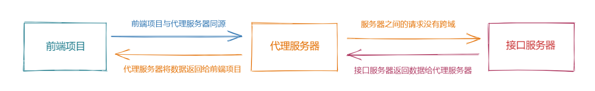


**落地代码：**


配置方式 1：

```vue
<script>
import axios from 'axios'

export default {
  name: 'TestPage',
  methods: {
    proxyData() {
      axios.get('/api/product/getBaseCategoryList').then((data) => {
        console.log(data)
      })
    }
  }
}
</script>
```


```js
const { defineConfig } = require('@vue/cli-service')

module.exports = defineConfig({
  transpileDependencies: true,
  devServer: {
    proxy: 'http://sph-h5-api.atguigu.cn'
  }
})

```


配置方式 2：

```vue
<script>
import axios from 'axios'

export default {
  name: 'TestPage',
  methods: {
    proxyData() {
      axios.get('/sph/api/product/getBaseCategoryList').then((data) => {
        console.log(data)
      })

      axios.get('/jhs/api/product/getBaseCategoryList').then((data) => {
        console.log(data)
      })
    }
  }
}
</script>
```


```js
const { defineConfig } = require('@vue/cli-service')

module.exports = defineConfig({
  transpileDependencies: true,
  devServer: {
    proxy: {
      '/sph': {
        // 匹配所有以 /sph 开头的请求路径
        target: 'http://sph-h5-api.atguigu.cn', // 代理目标的基础路径
        changeOrigin: true,
        pathRewrite: { '^/sph': '' }
      },
      '/jhs': {
        // 匹配所有以 /yulu 开头的请求路径
        target: 'http://sph-h5-api.atguigu.cn', // 代理目标的基础路径
        changeOrigin: true,
        pathRewrite: { '^/jhs': '' }
      }
    }
  }
})

```


## 12. 二次封装 Axios

> 🎯目标：熟练对 axios 进行二次封装


实际开发中，我们经常有这样的需求：

1. 开发中需要切换不同的开发环境，例如：开发环境、生产环境、测试环境
2. 对网络请求的超时时长进行设置，例如：5 秒内没有返回数据，抛出错误
3. 对提交数据和返回数据进行拦截，例如：给接口统一添加 token，格式化后端返回的数据
4. 对网络请求产生的错误统一处理，例如：请求超时提示、token 失效的错误
5. 添加 loading 效果 ...... 等等


### 12.1 二次封装 Axios


**思路分析：**


1. 配置`ajax`请求：基本路径、超时时间
2. 返回服务器响应的真正数据
3. 统一处理`ajax`请求错误


**实现步骤：**


1. 在 `utils` 目录下创建 `request.js` 文件
2. 创建 `request` 实例
3. 配置请求拦截器、响应拦截器
4. 分析和设置响应拦截器处理错误的方式


**落地代码：**


```js
import axios from 'axios'

const request = axios.create({
  baseURL: '/sph', // 接口请求前缀
  timeout: 5000 // 请求超时时间
})

// 添加请求拦截器
request.interceptors.request.use(
  (config) => {
    return config
  },
  (error) => {
    return Promise.reject(error)
  }
)

// 添加响应拦截器
request.interceptors.response.use(
  (response) => {
    // 响应成功的回调
    return response.data
  },
  (error) => {
    // 响应失败的回调
    console.log(error)

    // then 的返回值
    // 如果返回的是非 Promise 值，算 success
    // 如果返回的是 Promsie 实例，成功的，算 success
    // 如果返回是是 Promise 实例，失败的，算 error
    // return error

    // 处理错误的第一种方式：让错误继续往下传递，从而触发程序员发请求时的回调函数
    // return Promise.reject(error.message)

    // 错误处理的第二种方式：返回一个 pending 状态的 Promise 实例，中断了 Promise 链，不走程序员发请求时的回调
    alert(error.message)
    return new Promise(() => {})
  }
)

export default request

```


```vue
<script>
// 导入网络请求配置
import request from '../../utils/request'

export default {
  name: 'TestPage',
  methods: {
    async proxyData() {
      request.get('/api/product/getBaseCategoryList').then(
        (data) => {
          console.log('1', data)
        },
        (error) => {
          console.log('2', error)
        }
      )
    }
  }
}
</script>
```


### 12.2 添加进度条


**思路分析：**


1. 手动写 `CSS` ，比较繁琐、涉及动画等知识点 （一般不会手写）
2. 使用第三方库 `NProgress` （开发中主流 ）


**实现步骤：**


1. 下载安装 `NProgress`
2. 导入 `NProgress` 并设置 `CSS` 样式
3. 在请求拦截器中开始进度条效果
4. 在响应拦截器中将进度条进行关闭


**落地代码：**


utils/requst.js

```js
import axios from 'axios'

// 导入进度条插件
import nprogress from 'nprogress'
import 'nprogress/nprogress.css'

const request = axios.create({
  baseURL: '/sph',
  timeout: 500
})

// 添加请求拦截器
request.interceptors.request.use(
  (config) => {
    nprogress.start()
    return config
  },
  (error) => {
    return Promise.reject(error)
  }
)

// 添加响应拦截器
request.interceptors.response.use(
  (response) => {
    nprogress.done()
    // 响应成功的回调
    return response.data
  },
  (error) => {
    // xxxx
  }
)

export default request

```


## 13. 统一管理 AJAX 请求


**思路分析：**


在实际开发中，我们通常将所有的网络请求方法放置在 api 目录下统一管理，然后按照模块功能来划分成对应的文件，在文件中将每个接口的请求都单独**`导出`**了一个方法，例如：


```js
// 导入封装的网络请求工具 request.js
import request from '../utils/request'

/**
 * @description 请求三级分类列表的函数
 * @param 参数
 * @returns Promise
 */
export const reqCategoryList = () => request.get('/api/product/getBaseCategoryList')

```


这样做的有以下几点好处：

1.  易于维护：一个文件就是一个模块，一个方法就是一个功能，清晰明了，查找方便
2.  便于复用： 哪里使用，哪里导入，可以在任何一个业务组件中导入需要的方法即可
3.  语义清晰：方法名具有语义化，做到命名即注释，语义化清晰，维护方便，
4.  团队合作：分工合作


**落地代码：**

```js
// 导入封装的网络请求工具 request.js
import request from '../utils/request'

/**
 * @description 请求三级分类列表的函数
 * @param 参数
 * @returns Promise
 */
export const reqCategoryList = () => request.get('/api/product/getBaseCategoryList')

```

```vue
<script>
// 导入网络请求配置
import { reqCategoryList } from '../../api/index'

export default {
  name: 'TestPage',
  methods: {
    async proxyData() {
      // const data = await request.get('/api/product/getBaseCategoryList')
      
      const data = await reqCategoryList()
      console.log(data)
    }
  }
}
</script>
```


## 14. 绘制 Home 组件子组件


**思路分析：**


根据【项目组件拆分】图对 `Home` 组件进行拆分，共拆分成 7 个组件，分别是

1. `TypeNav`（三级分类导航）
2. `ListContainer`（轮播+右分类）
3. `Recommend`（今日推荐）
4. `Rank`（商品排行）
5. `Like`（猜你喜欢）
6. `Floor`（楼层，即：家用电器、手机通讯）
7. `Brand`（商标区）


> 📌 Tip：
>
> ​	建议大家自己写完一到三个，剩下的就可以直接复制提前准备的静态组件即可


**实现步骤：**


1. 从准备的 `HTML` 代码中找到 `TypeNav` 组件样式、结构，进行 `TypeNav` 组件的创建
2. 从准备的 `HTML` 代码中找到 `ListContainer` 组件样式、结构，进行 `ListContainer` 组件的创建
3. 其他组件从准备好的素材中导入
4. 在 `Home` 组件中导入组件并使用


