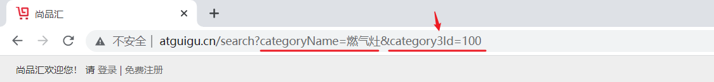

# 尚品汇第 2 天


## 1. 拆分 Vuex 模块


**思路分析：**

> 由于使用单一状态树，应用的所有状态会集中到一个比较大的对象。当应用变得非常复杂时，store 对象就有可能变得相当臃肿。


在我们项目中，需要通过 `Vuex` 存储多个数据，如果把所有的状态都存放在 `State` 中，当项目变得越来越大的时候，`Vuex` 会变得越来越难以维护，因为我们需要使用 `Vuex` 提供模块化，将状态按照功能模块进行划分。


**实现步骤：**


1. 在 `store` 目录下创建 `modules` 文件夹，用来统一管理项目中拆分的模块
2. 在 `modules`  目录下创建 `home.js` 和 `user.js` 模块，并初始化文件
3. 将文件在 `store/index.js` 文件中导入并注册


**落地代码：**


1. 创建 `modules` 文件夹和  `home.js` 和 `user.js` 模块

2. 创建 `home.js` 和 `user.js` 模块，并初始化文件

   ```js
   // home.js
   const state = {
     categoryList: []
   }
   
   const getters = {}
   const mutations = {}
   const actions = {}
   
   export default {
     namespaced: true,
     state,
     getters,
     mutations,
     actions
   }
   
   ```

   

   ```js
   // user.js 
   
   const state = {
     userInfo: {} // 用户数据
   }
   
   const getters = {}
   const mutations = {}
   const actions = {}
   
   export default {
     namespaced: true,
     state,
     getters,
     mutations,
     actions
   }
   
   ```

   

3. 将文件在 `store/index.js` 文件中导入并注册

   ```js
   import Vue from 'vue'
   import Vuex from 'vuex'
   
   // 导入首页模块
   import home from './modules/home'
   // 导入用户模块
   import user from './modules/user'
   
   Vue.use(Vuex)
   
   export default new Vuex.Store({
     modules: {
       home,
       user
     }
   })
   
   ```


## 2. 将三级分类数据存储到 Vuex


**思路分析：**


进入首页的时候，就需要展示三级分类，我们将数据存储到 Vuex 中，按照 Vuex 中使用的流程，从后端服务器获取到数据属于异步，因此我们需要在组件中通过 dispatch 调用 actions 方法


需要注意的时候，我们需要根据后端返回的业务逻辑判断是否需要赋值

> 📌 Tip：
>
> 注意区分：响应成功  和  业务逻辑成功
>
> 举例1：登录系统，若用户名密码正确，服务器返回登录成功，这是：响应成功、业务逻辑也成功。
>
> 举例2：登录系统，若密码输入错误，服务器返回登录失败，这是：响应成功、业务逻辑却失败。
>
> 举例3：登录系统，服务器繁忙，无法做出响应，这是：响应失败，业务逻辑必定失败。


**实现步骤：**


1. 封装获取三级分类数据的接口 `api`
2. 在 `state` 中定义三级分类的状态
3. 定义 `actions` 方法，处理异步的逻辑
4. 定义 `mutations` 方法，对数据进行变更
5. 在组件中通过 `dispatch` 或者 `mapActions` 调用 `action` 方法


**落地代码：**


1. 封装获取三级分类数据的接口 `api`

   ```js
   // 导入封装的网络请求工具 request.js
   import request from '@/utils/request'
   
   /**
    * @description 请求三级分类列表的函数
    * @param 参数
    * @returns Promise
    */
   export const reqCategoryList = () => request.get('/api/product/getBaseCategoryList')
   
   ```

   

2. 在 `state` 中定义三级分类状态，定义 `actions` 、 `mutations` 方法，处理异步和变更数据

   ```js
   import { reqCategoryList } from '@/api/index'
   
   const state = {
     categoryList: [] // 三级分类数据
   }
   
   const getters = {}
   
   const mutations = {
     // 更新三级分类数据
     saveGategoryList(state, list) {
       state.categoryList = list
     }
   }
   
   const actions = {
     // 获取三级分类列表数据
     async getCategoryList(context) {
       // 调用 reqCategoryList api 获取数据
       const res = await reqCategoryList()
       console.log(res)
       // 判断业务逻辑是否成功
       if (res.code === 200) {
         // 若业务逻辑成功，更新数据
         context.commit('saveGategoryList', res.data)
       } else {
         // 若业务逻辑失败，提示原因
         alert(res.message)
       }
     }
   }
   
   export default {
     namespaced: true,
     state,
     getters,
     mutations,
     actions
   }
   
   ```

   

3. 在组件中通过 `dispatch` 或者 `mapActions` 调用 `action` 方法

   ```vue
   <script>
   import { mapActions } from 'vuex'
   
   export default {
     name: 'TypeNav',
     mounted() {
       // 第一种使用 dispatch 方式
       // this.$store.dispatch('home/getCategoryList')
       
       // 第二种借助 mapActions 映射函数
       this.getCategoryList()
     },
     methods: {
       ...mapActions('home', ['getCategoryList'])
     }
   }
   </script>
   ```

   


## 3. 动态展示三级分类


**思路分析：**


获取到数据后，需要将返回的数据渲染到页面，此时需要从 Vuex 中获取到数据，获取数据数据的方式有以下两种:


1. 通过实例的方式获取
2. 通过辅助函数的方式获取(在项目中，我们使用辅助函数 `mapState` 来进行数据的获取和渲染)


组件中获取到数据后，使用 `v-for` 的方式对后端返回的数据进行渲染


**实现步骤：**


1. 利用辅助函数获取数据
2. 使用 v-for 对数组进行遍历，产出页面


**落地代码：**


1. 获取到三级分类数据

   ```js
   // 1. 借助辅助函数
   computed: {
     ...mapState('home', ['categoryList'])
   }
   
   // 2. 使用命名空间的方式
   computed: {
     ...mapState({
       categoryList: (state) => state.home.categoryList
     })
   }
   ```

   

2. 利用 v-for 对数组进行遍历

   ```vue
   <div class="nav-left">
     <h2 class="all">全部商品分类</h2>
     <div class="sort">
       <div class="all-sort-list2">
         <div class="item" v-for="cate1 in categoryList" :key="cate1.categoryId">
           <h3>
             <a href="">{{ cate1.categoryName }}</a>
           </h3>
           <div class="item-list clearfix">
             <div class="subitem" v-for="cate2 in cate1.categoryChild" :key="cate2.categoryId">
               <dl class="fore">
                 <dt>
                   <a href="">{{ cate2.categoryName }}</a>
                 </dt>
                 <dd>
                   <!-- 每一个三级分类 -->
                   <em v-for="cate3 in cate2.categoryChild" :key="cate3.categoryId">
                     <a href="">{{ cate3.categoryName }}</a>
                   </em>
                 </dd>
               </dl>
             </div>
           </div>
         </div>
       </div>
     </div>
   </div>
   ```


## 4. 动态展示 Footer 组件


**思路分析：**


产品需求：登录组件（`Login`）、注册组件（`Register`），不展示底部的`Footer`组件


如果想控制 `Footer`组件的隐藏和展示，我们可以对路由进行监听，例如：

```vue
<!-- 底部区域 -->
<Footer v-if="$route.path !== '/login' && $route.path !== '/register'" />
```


这种方式可以用于逻辑比较简单的判断，如果需要对 N 个组件进行判断就比较麻烦，只能通过计算属性、watch 写很多的逻辑。我们可以利用路由提供的 路由元信息 `meta` 来进行处理，只需要给路由配置 `meta` 属性，添加一些自定义的字段即可

```js
{
  path: '/login',
  component: Login,
  meta: {
    isShowFooter: true
  }
},
{
  path: '/register',
  component: Register,
  meta: {
    isShowFooter: true
  }
}
```


**实现步骤：**


1. 给 `Login` 和 `Register` 路由添加 `meta` 属性
2. 在 `meta` 属性中添加 `isShowFooter` 字段，用于决定`Footer` 组件的隐藏和展示
3. 给 `Footer` 组件标签添加 `v-if` 指令，控制`Footer` 组件的隐藏和展示

 

**落地代码：**


1. `router/index.js`

   ```js
   const routes = [
     // coding......
   
     {
       path: '/login',
       component: Login,
       meta: {
         isShowFooter: true
       }
     },
     {
       path: '/register',
       component: Register,
       meta: {
         isShowFooter: true
       }
     },
       
     // coding......
   ]
   
   ```

   

2. `App.vue`组件

   ```vue
   <Footer v-if="!$route.meta.isShowFooter" />
   ```


## 5. 跳转到搜索


### 5.1  跳转方式分析


实现跳转的方式有两种：

1. 第一种写法：把分类链接的 `<a>`改为`<router-link>` ——  不推荐，很占内存。
2. 第二种写法：依然写```<a>```，靠事件委派实现跳转 —— 推荐，节约内存。


**第一种写法思路分析：**


目前页面跳转的方式，使用的还是 a 标签

```vue
<a href="">{{ cate1.categoryName }}</a>
```


思考：能够将 `a` 标签改为 `<router-link />` ❓

回答：不能 ❗  

1. `<router-link />` 本身是内置的一个组件，如果将 `a` 标签改为 `<router-link />`，

​			通过对三级分类的遍历，在页面上会出现几百个 `<router-link />` 组件，通过调试工具进行查看

2. 组件本身是一个个实例，使用了组件，在底层需要 `new` 一个个构造函数，内存消耗很大，因此这里不能改为路由标签


**第二种写法思路分析：**


使用委托的方式进行实现，需要委托给共同的父级，因此可以选择 `<div class="all-sort-list2">` 标签

```vue
<div class="all-sort-list2" @click="toSearch">
  <div class="item" v-for="cate1 in categoryList" :key="cate1.categoryId">
    <!-- coding...... -->
  </div>
</div>
```


**实现步骤：**


1. 给 `<div class="all-sort-list2">` 标签绑定点击事件
2. 在事件处理程序通过编程式导航实现链接跳转


**落地代码：**


```vue
<div class="all-sort-list2" @click="toSearch">
  <div class="item" v-for="cate1 in categoryList" :key="cate1.categoryId">
    <!-- coding...... -->
  </div>
</div>
```

```js
<script>
export default {
  methods: {
    toSearch() {
      this.$router.push('/search')
    }
  }
}
</script>
```


### 5.2  携带参数分析


**思路分析：**





根据接口文档和产品的需求分析，跳转传递到 Search 页面需要传递 2 个参数

```shell
# 分类的名字 categoryName
# 分类的 id  category1Id(一级分类 ID)  category2Id(二级分类 ID)  category3Id(三级分类 ID)
categoryName=燃气灶&category3Id=100
```


`分类id` 和 `分类级别` 如何传递参数：❓


1. 给绑定的事件携带上参数？我们使用的是事件委托，无法将数据传递给父级！
2. 给需要跳转的标签携带上自定义属性？通过 `e.target.attributes` 获取参数，但是需要自己处理！
3. 给需要跳转的标签携带上 `data-` 开头的自定义属性？通过 `e.target.dataset`获取参数，选择这种！


```html
<body>
    
  <div>
    <button a="1" b="2" data-c="123" data-d="456">获取参数</button>
  </div>

  <script>
    window.onload = function () {
      const box = document.querySelector('div')

      box.addEventListener('click', function (e) {
        // console.dir(e.target.attributes)
        console.dir(e.target.dataset)
      })

    }
  </script>
</body>
```


**实现步骤：**


1. 给每导航里的分类加2个自定义属性：`data-level`、`data-id`
2. 分类名称，使用：`event.target.innerText`获取
3. 分类名称、分类编号，使用：`event.target.dataset.xxx`获取


**落地代码：**


1. 给每导航里的分类加2个自定义属性：`data-level`、`data-id`

   ```vue
   <!-- 一级分类 -->
   <a data-level="1" :data-id="c1.categoryId">{{c1.categoryName}}</a>
   <!-- 二级分类 -->
   <a data-level="2" :data-id="c2.categoryId">{{c2.categoryName}}</a>
   <!-- 三级分类 -->
   <a data-level="3" :data-id="c3.categoryId">{{c3.categoryName}}</a>
   ```

   

2. 使用`event.target.innerText`获取分类名称，使用`event.target.dataset.xxx`分类名称和编号

   ```js
     methods: {
       toSearch(e) {
         // 获取到点击分类的：分类级别、分类编号、分类名称
         const { level, id } = e.target.dataset
         const { innerText } = e.target
         
         // 判断点击的是否为分类
         if (level) {
           // 分类名称
           console.log(level, id, innerText)
         }
       }
     },
   ```


### 5.3 携带参数跳转


**思路分析：**


1. 携带参数的方式有两种：`params` 传参、`query` 传参，这里我们采用 query 传参的方式，
2. 需要携带的参数有两个 `分类名字` 、`分类的 ID`
   - 传递 ID 的属性，格式为：`category1Id`、`category2Id`、 `category3Id`
   - 主要是为了以后获取数据、使用数据方便


思考：如何处理 key ，如何进行拼接❓ 

回答：`[category${level}Id]:id`


>  📌 Tip：
>
> ​	 `[category${level}Id]`，这种写法并不是数组 ！！！！
>
> ​	  我们可以称为：中括号运算符，我们可以利用中括号运算符设置值、获取值
>
> ​	  中括号运算符可以用【字符串变量的内容】作为属性名


**实现步骤：**


1. 使用 `this.$router.push` 实现路由跳转
2. 将参数改成对象方式，方便携带参数


**落地代码：**

```js
methods: {
  ...mapActions('home', ['getCategoryList']),
      
  toSearch(e) {
    // 获取到点击分类的：分类级别、分类编号、分类名称
    const { level, id } = e.target.dataset
    const { innerText } = e.target
    
    // 判断点击的是否为分类
    if (level) {
      this.$router.push({
        path: '/search',
        query: {
          [`category${level}Id`]: id,
          categoryName: innerText
        }
      })
    }
  }
},
```


## 6.  TypeNav 变全局组件


**思路分析：**


`TypeNav` 组件需要在多个页面组件中进行使用，为了方便对 `TypeNav ` 组件进行复用，我们可以将 `TypeNav ` 组件注册为了全局组件，语法是：

```js
Vue.component('组件名', 组件)
```

 

**实现步骤：**

1. 将`TypeNav`组件，放入`/src/components`中。

2. 第二步：`src/main.js`中引入，并全局注册`TypeNav`组件。

3. 去除`src/views/Home/index.vue`中对`TypeNav`的引入与注册

4. 第四步：去`Search`、`Home/index.vue` 组件中，直编写`TypeNav`组件标签即可。

   

**落地代码：**

```js
// 导入 TypeNav 组件
import TypeNav from './components/TypeNav'

//全局注册 TypeNav 组件
Vue.component('TypeNav',TypeNav)

```


## 7. Search 中的 TypeNav


**思路分析：**


业务需求：


1. 需求1：在`Search`组件中使用`TypeNav`组件
2. 需求2：在`Search`组件中三级分类默认隐藏，鼠标移入时展示，鼠标移出隐藏
3. 需求3：若所处路由是`/home`那分类导航永不消失


**实现步骤：**


1. `TypeNav`组件中定义 `isShowNav` 状态，控制三级分类的展示和隐藏
2. 给最外侧的 `<div class="nav-left">` 加：鼠标移出事件，控制元素的隐藏
3. 给 `<h2 class="all">全部商品分类</h2>` 加：鼠标移入事件，控制元素的显示
4. 控制元素的隐藏的事件处理处理程序中，需要判断是否是 `/home`，决定是否展示三级分类


**落地代码：**

1. `TypeNav`组件中定义 `isShowNav` 状态，控制三级分类的展示和隐藏

   ```js
   data() {
     return {
       // isShowNav: false
       isShowNav: this.$route.path === '/home'
     }
   }
   ```

   

2. 添加鼠标移出事件和鼠标移入事件，控制元素的隐藏和显示

   ```html
   <div class="nav-left" @mouseleave="executeHidden">
     <h2 class="all" @mouseenter="isShowNav = true">全部商品分类</h2>
     <!-- coding... -->
   </div>
   ```

   

3. 控制元素的隐藏的事件处理处理程序中，需要判断是否是 `/home`，决定是否展示三级分类

   ```js
   methods: {
     ...mapActions('home', ['getCategoryList']),
   
     // 控制导航的隐藏和展示
     executeHidden() {
       if (this.$route.path !== '/home') {
         this.isShowNav = false
       }
     },
   
     // coding...
   },
   ```

   


## 8. TypeNav 添加动画


**思路分析：**


使用 `Vue` 提供的动画标签结合 `animate.css` 进行使用


**实现步骤：**


1. 下载并引入 `animate.css` 动画库
2. 给需要动画的元素，包裹 `transition` 组件
3. 给 `transition` 组件添加动画标签


**落地代码：**


1. 下载并引入 `animate.css` 动画库

   ```shell
   npm i animate.css
   ```

   

2. 给需要动画的元素，包裹 `transition` 组件，给 `transition` 组件添加动画标签

   ```vue
   <transition	
   	enter-active-class="animate__fadeIn"	
   	leave-active-class="animate__fadeOut"
   >	
     <div class="sort animate__animated" v-show="isShowNav">
       <!------------>
     </div>
   </transition>
   
   <script>	
     import 'animate.css'
      
     // coding...
   </script>	
   
   <style>    
     .sort {        
       /* coding... */
         
       --animate-duration: 0.5s;    
     }
   </style>
   ```

   


## 9. 携带关键字到 Search


**思路分析：**


在输入框输入关键字，点击搜索需要跳转到搜索页面，实现这个功能的方式有以下几种：

1. 使用 `v-model` 双向数据绑定
2. 使用 `ref` 获取 `innerText `


在这个功能中，我们使用 `v-model` 双向数据绑定


**实现步骤：**


1. 在 `data` 中定义 `keyword` 关键字，使用 `v-model` 和 `input` 输入框进行绑定
2. 点击输入框，判断用户是否输入内容，如果没有输入内容，路由跳转，不懈怠参数


**落地代码：**

```vue
<input
  type="text"
  id="autocomplete"
  class="input-error input-xxlarge"
  v-model.trim="keyword"
/>
```

```vue
<script>
export default {
  name: 'HeaderIndex',
  data() {
    return {
      keyword: '' // 用户输入的关键字
    }
  },
  methods: {
    toSearch() {
      this.$router.push({
        path: '/search',
        query: {
          keyword: this.keyword || undefined
        }
      })
    },
    toTest() {
      this.$router.push('/test')
    }
  }
}
</script>
```


## 10. 合并搜索参数


**思路分析：**


搜索的关键词 和 分类名，需要进行合并，例如：点击【手机分类】，随后再搜索【小米】，最终是一个组合的条件：【手机分类+小米】


因此需要将 `Header`组件、`TypeNav`组件中的 `toSearch` 方法都要改一下。


思考：如何快速将多个对象，合并成一个对象 ❓

回答：展开运算符


**实现步骤：**


1. `TypeNav`组件中，需要获取 `keyword` 关键字
2. `Header`组件中，需要获取 `分类的名字` 和 `分类的 Id` 后拼接


**落地代码：**


1. `TypeNav`组件

   ```js
   methods: {
     // 到搜索页面
     toSearch(e) {
       // 获取到点击分类的：分类级别、分类编号、分类名称
       const { level, id } = e.target.dataset
       const { innerText } = e.target
       const { keyword } = this.$route.query
       // 判断点击的是否为分类
       if (level) {
         this.$router.push({
           path: '/search',
           query: {
             keyword,
             [`category${level}Id`]: id,
             categoryName: innerText
           }
         })
       }
     }
   }
   ```

   

2. `Header`组件

   ```js
   methods: {
     toSearch() {
       const { query } = this.$route
   
       this.$router.push({
         path: '/search',
         query: {
           ...query,
           keyword: this.keyword || undefined
         }
       })
     }
   }
   ```

   


 