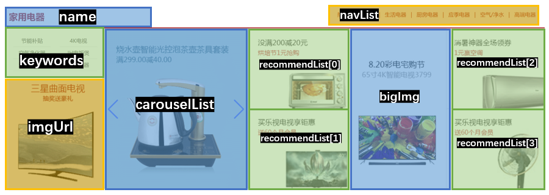

# 尚品汇第 3 天


## 1. Mock.js 的基本使用


**思路分析：**


在开发过程中，前端和后端一般是并行开发，前端需要后端提供的接口，通过接口返回的数据渲染页面，但是后端主要进行功能的开发，因为功能比较复杂等原因，接口需要很久才能开发完。这时候就会存在前端页面开发好了，接口没有完成的情况，这时候，一般就需要前端使用 `Mock` 模拟、伪造后端返回的数据，先行进行功能的开发，待接口开发完成后，将 `Mock` 的地址替换成真实的接口地址即可


`Mock` 数据的方式有很多：

1. 自己写 json 伪造数据
2. 使用 Node 写服务，伪造数据
3. 使用 json-server、Mock 等第三方库


在这里我们使用 Mock ，因为使用起来简单、方便、数据类型丰富。


[Mock.js 官网](http://mockjs.com/)

[Mock.js 使用文档](https://github.com/nuysoft/Mock/wiki)


**实现步骤：**


1. 安装 `mockjs`

   ```shell
   npm i mockjs
   ```

   

2. 在`src/mock/index.js`制订拦截规则（内容如下），只要通过发出去的是`get`类型的ajax请求，地址只要是`http://www.test.com`就能拦截了。

   ```js
   import Mock from 'mockjs'
   //制订拦截规则
   Mock.mock('http://www.test.com','get','Tom And Jerry')
   ```

   

3. 在入口文件中导入 `src/mock/index.js` 文件

   ```js
   // 导入 Mock 数据
   import './mock'
   ```

   

4. 去`Test`组件中发送一个请求测试一下。

   ```js
     methods: {
       async Mock() {
         const res = await axios.get('http://www.test.com')
         console.log(res)
       }
     }
   ```

   

> 📌 Tip：
>
> 使用`mockjs`后，浏览器的网络选项卡中一定看不到任何的请求。


## 2. Mock.js 模拟轮播图和楼层数据


**思路分析：**


首页中`轮播图区域`和`楼层区域` 数据是没有给提供的，需要我们使用 `Mock` 进行模拟 ，`轮播图区域`和`楼层区域` 的数据，素材中已经给提供好，直接使用即可

```js
Mock.mock('地址','请求方式', 'json 数据')
```


> 📌 Tip：
>
> 在使用 `Mock` 对数据模拟的时候，模拟的数据字段不是前端随意定义的，而且需要和后端进行协商，规定相应的字段，然后使用对应的字段使用 `Mock` 进行模拟


**实现步骤：**

1. 复制：`首页广告轮播数据.json`、`首页楼层数据.json`到`src/mock`中。

2. 分别改名为：`swiper.json`、`floor.json`。

3. 修改`/src/mock/index.js`如下：

   ```js
   import Mock from 'mockjs'
   import swiper from './swiper.json'
   import floor from './floor.json'
   
   // 制订拦截规则
   // Mock.mock('http://www.test.com', 'get', 'Tom And Jerry')
   
   // 模拟轮播图的接口
   Mock.mock('http://www.test.com/swiper', 'get', {
     code: 200,
     message: '成功',
     ok: true,
     data: swiper
   })
   
   // 模拟获取楼层信息的接口
   Mock.mock('http://www.test.com/floor', 'get', {
     code: 200,
     message: '成功',
     ok: true,
     data: floor
   })
   
   ```

   

4. 去`src\views\Test`里发个请求，测试一下

   ```js
   methods: {
     async Mock() {
       const res1 = await axios.get('http://www.test.com/swiper')
       const res2 = await axios.get('http://www.test.com/floor')
       
       console.log(res1)
       console.log(res2)
     }
   }
   ```


## 3. 为 Mock.js 封装 axios


**思路分析：**


前面数据的模拟已经基本和后端返回的数据一致，但是行为上还不一致：

1. 没有统一设置请求基准路径
2. 没有进度条
3. 没有拦截器
4. ......等其他功能


我们可以将之前封装的 `request.js` 重新复制一份，命名为 `mockRequest.js` 即可，然后更改`根域名`即可


> 📌 Tip：
>
> `Mock` 的数据以及 `mockRequest.js` 都是在开发中使用的，上线后都需要删除的，所以没必须再次进行判断处理，因为这样对代码进行了侵入


**实现步骤：**


1. 将之前封装的 `request.js` 重新复制一份，命名为 `mockRequest.js` 

2. 将根域名 `baseURL` 改为 `http://www.test.com`

3. 到`src\views\Test`导入`mockRequest.js` ，并发起请求

   ```js
   <script>
   import mockRequest from '@/utils/mockRequest.js'
   
   export default {
     name: 'TestPage',
     methods: {
       async Mock() {
         const res1 = await mockRequest.get('/swiper')
         const res2 = await mockRequest.get('/floor')
         
         console.log(res1)
         console.log(res2)
       }
     }
   }
   </script>
   ```


## 4. 轮播图数据存入vuex


**思路分析：**


轮播图数据已经获取成功，那么下一步，需要轮播图数据渲染轮播图区域，轮播图数据只在首页轮播图区域进行了使用，所以处理数据的方式有以下两种：


1. 在 `ListContainer` 组件中直接获取数据，渲染轮播图区域
2. 将数据存储到 Vuex 中


在实际开发中，使用第一种方式比较多，但是目前我们需要练习 `Vuex`，因此采用第二种方式


**实现步骤：**

1. 在`/api/index.js` 中导入 `mockRequest.js`，并封装获取轮播图数据的接口 `api`
2. 在 `state` 中定轮播图状态
3. 定义 `actions` 方法，处理异步的逻辑
4. 定义 `mutations` 方法，对数据进行变更
5. 在组件中通过 `dispatch` 或者 `mapActions` 调用 `action` 方法


**落地代码：**

1. 在`/api/index.js` 中导入 `mockRequest.js`，并封装获取轮播图数据的接口 `api`

   ```js
   // 导入封装的网络请求工具 request.js
   import request from '@/utils/request'
   import mockRequest from '@/utils/mockRequest.js'
   
   
   /**
    * @description 请求轮播图数据
    * @returns Promise
    */
   export const reqSwiperList = () => mockRequest.get('/swiper')
   
   ```

   

2. 在 `state` 中定义状态，定义 `actions` 方法，处理异步的逻辑，定义 `mutations` 方法，对数据进行变更

   ```js
   import { reqCategoryList, reqSwiperList } from '@/api/index'
   
   const state = {
     categoryList: [], // 三级分类数据
     swiperList: [] // 轮播图数据
   }
   
   const getters = {}
   
   const mutations = {
     // 更新三级分类数据
     // coding......
   
     // 存储轮播图数据
     SAVE_SWIPER_LIST(state, list) {
       state.swiperList = list
     }
   }
   
   const actions = {
     // 获取三级分类列表数据
     // coding......
   
     // 专门用于获取轮播图数据
     async getSwiperList(context) {
       const result = await reqSwiperList()
       // 判断是否获取成功
       if (result.code === 200) {
         // 若成功，联系对应的muatation去存储数据
         context.commit('SAVE_SWIPER_LIST', result.data)
       } else {
         // 若获取不成功，提示原因
         alert(result.message)
       }
     }
   }
   
   export default {
     namespaced: true,
     state,
     getters,
     mutations,
     actions
   }
   
   ```

   

3. 在组件中通过 `dispatch` 或者 `mapActions` 调用 `action` 方法

   ```js
   <script>
   export default {
     name: 'ListEl',
     mounted() {
       this.$store.dispatch('home/getSwiperList')
     }
   }
   </script>
   ```


##  5. 处理数据的假报错 


**思路分析：**


我们在页面上，拿到数据后进行渲染

```html
<!-- 这种方式不会报错 -->
<h2>{{ $store.state.home.swiperList[0] }}</h2>

<!-- 这种方式会报错 -->
<h2>{{ $store.state.home.swiperList[0].imgUrl }}</h2>
```


此时，浏览器控制台会报错，但是页面却渲染成功了~~ ❗❗


原因：

1. 首先解析模板的数据，还没有数据，所以报错
2. 等数据请求回来后，数据更新，数据更新驱动视图更新，所以页面显示了正确的数据


**解决方案：**

1. 第一种方法：在最初就设计好数据层次。

   ```js
   const state = {
     a:[{}],
     x:{y:{}}
   }
   ```

   

2. 第二种方法：使用数据时加判断。

   ```html
   <h1 v-if="a[0]">{{a[0].id}}</h1>
   <h1 v-if="x.y">{{x.y.z}}</h1>
   ```

   

3. 备注：若模板中恰巧使用了`v-for`遍历，那么问题自动消失。

   ```html
   <h1 v-for="s in slideList" :key="s.id">{{s.imgUrl}}</h1>
   ```

   


## 6. 渲染轮播图数据


**思路分析：**


数据已经获取成功，就需要使用 `v-for`  对数据遍历，然后渲染轮播图，但是在渲染数据的时候，会发现页面图片没有渲染成功，控制台会报错，审查元素会发现，图片路径不全。完整的路径：

```
完整的图片路径：协议://域名/图片路径
```


**解决方案：**


1. 脚手架的根路径是：`public`文件夹
2. 操作是：把`ListContainer`中的图片剪切一份，放在`public\images`中，这样项目才能用


## 7. Swiper 轮播图插件使用


**swiper 是什么：**


1. Swiper 是一款开源、免费、强大的触摸滑动插件
2. Swiper 是纯 javascript打造的滑动特效插件，面向PC、手机、平板电脑等移动终端
3. Swiper 能实现触屏焦点图、触屏Tab切换、触屏轮播图切换等常用效果


**vue-awesome-swiper 是什么：**


`Swiper` 为了更好的兼容 `Vue`，作者开发了 `vue-awesome-swiper ` 这个开源库

官方网址：[vue-awesome-swiper](https://swiperjs.com/vue)

Github 地址：[vue-awesome-swiper](https://github.com/surmon-china/vue-awesome-swiper)


目前官方仓库已经全部只是 Vue 3，如果想在 Vue2 中使用，需要安装特定的版本、

```shell
npm install vue-awesome-swiper@4.1.1 --save
```


**落地代码：**


1. 安装 `vue-awesome-swiper`

   ```shell
   npm install vue-awesome-swiper@4.1.1 --save
   ```

   

2. 在 `Test` 组件中，测试 `vue-awesome-swiper`

   ```vue
   <template>
     <div>
       <swiper class="swiper" :options="swiperOption">
         <swiper-slide>Slide 1</swiper-slide>
         <swiper-slide>Slide 2</swiper-slide>
         <swiper-slide>Slide 3</swiper-slide>
         <swiper-slide>Slide 4</swiper-slide>
         <swiper-slide>Slide 5</swiper-slide>
         <swiper-slide>Slide 6</swiper-slide>
         <swiper-slide>Slide 7</swiper-slide>
         <swiper-slide>Slide 8</swiper-slide>
         <swiper-slide>Slide 9</swiper-slide>
         <swiper-slide>Slide 10</swiper-slide>
         <div class="swiper-pagination" slot="pagination"></div>
         <div class="swiper-button-prev" slot="button-prev"></div>
         <div class="swiper-button-next" slot="button-next"></div>
       </swiper>
     </div>
   </template>
   
   <script>
   
   import { Swiper, SwiperSlide } from 'vue-awesome-swiper'
   import 'swiper/css/swiper.css'
   
   export default {
     name: 'TestPage',
     components: {
       Swiper,
       SwiperSlide
     },
     data() {
       return {
         swiperOption: {
           slidesPerView: 1,
           spaceBetween: 30,
           loop: true,
           pagination: {
             el: '.swiper-pagination',
             clickable: true
           },
           navigation: {
             nextEl: '.swiper-button-next',
             prevEl: '.swiper-button-prev'
           }
         }
       }
     }
   }
   </script>
   
   <style lang="less" scoped>
   .swiper {
     height: 400px;
   }
   </style>
   
   ```


## 8. Swiper 轮播图插件参数


**思路分析：**


`vue-awesome-swiper` 是基于 `swiper` 的封装，因此参数文档我们应该看 `swiper` 文档

[swiper 参数文档](https://www.swiper.com.cn/api/index.html)


**落地代码：**

```vue
<script>

import { Swiper, SwiperSlide } from 'vue-awesome-swiper'
import 'swiper/css/swiper.css'

export default {
  name: 'TestPage',
  components: {
    Swiper,
    SwiperSlide
  },
  data() {
    return {
      // 轮播图配置对象
      swiperOption: {
        slidesPerView: 1, // 轮播图展示几屏，同一页面展示几个轮播图
        spaceBetween: 30, // 每屏之间的间隔
        loop: true, // 是否循环播放
        // autoplay: true, // 是否自动播放
        autoplay: {
          delay: 2500 // 轮播间隔
        },
        // 分页器配置（小圆点）
        pagination: {
          el: '.swiper-pagination', // 分页器容器
          clickable: true, // 小圆点是否可以点击
          bulletActiveClass: 'my-bullet-active' // 当前被激活的小圆点类型
        },
        // 导航按钮（左箭头、右箭头）
        navigation: {
          nextEl: '.swiper-button-next',
          prevEl: '.swiper-button-prev'
        }
      }
    }
  }
}
</script>

<style lang="less" scoped>
.swiper {
  height: 400px;
}
// 深度作用选择器
/deep/ .my-bullet-active {
  background: #ea4a36;
  opacity: 1;
}
</style>

```


## 9.  ListContainer 中的轮播图


**思路分析：**


直接复用 Test 组件中的轮播图代码即可


**落地代码：**


模板区域

```html
<div class="center">
  <swiper class="swiper" :options="swiperOption">
    <swiper-slide v-for="item in swiperList" :key="item.id">
      
    </swiper-slide>
    <div class="swiper-pagination" slot="pagination"></div>
    <div class="swiper-button-prev" slot="button-prev"></div>
    <div class="swiper-button-next" slot="button-next"></div>
  </swiper>
</div>
```


js 区域

```vue
<script>
import { mapState } from 'vuex'
import { Swiper, SwiperSlide } from 'vue-awesome-swiper'
import 'swiper/css/swiper.css'

export default {
  name: 'ListEl',
  components: {
    Swiper,
    SwiperSlide
  },
  data() {
    return {
      // 轮播图配置对象
      swiperOption: {
        initialSlide: 1, // 初始化轮播图的索引
        slidesPerView: 1, // 轮播图展示几屏，同一页面展示几个轮播图
        spaceBetween: 30, // 每屏之间的间隔
        loop: true, // 是否循环播放
        // autoplay: true, // 是否自动播放
        autoplay: {
          delay: 2500 // 轮播间隔
        },
        // 分页器配置（小圆点）
        pagination: {
          el: '.swiper-pagination', // 分页器容器
          clickable: true, // 小圆点是否可以点击
          bulletActiveClass: 'my-bullet-active' // 当前被激活的小圆点类型
        },
        // 导航按钮（左箭头、右箭头）
        navigation: {
          nextEl: '.swiper-button-next',
          prevEl: '.swiper-button-prev'
        }
      }
    }
  },
  mounted() {
    this.$store.dispatch('home/getSwiperList')
  },
  computed: {
    ...mapState('home', ['swiperList'])
  }
}
</script>
```


## 10. 楼层数据存入Vuex


**实现步骤：**


1. 在`/api/index.js` 中导入 `mockRequest.js`，并封装获取楼层数据的接口 `api`
2. 在 `state` 中定楼层状态
3. 定义 `actions` 方法，处理异步的逻辑
4. 定义 `mutations` 方法，对数据进行变更
5. 在组件中通过 `dispatch` 或者 `mapActions` 调用 `action` 方法


**落地代码：**


1. 在`/api/index.js` 中导入 `mockRequest.js`，并封装获取楼层数据的接口 `api`

   ```js
   /**
    * @description 请求楼层数据
    * @returns Promise
    */
   export const reqFloorList = () => mockRequest.get('/floor')
   ```

   

2. 在 `state` 中定义状态，定义 `actions` 方法，处理异步的逻辑，定义 `mutations` 方法，对数据进行变更

   ```js
   import { reqCategoryList, reqSwiperList, reqFloorList } from '@/api/index'
   
   const state = {
     categoryList: [], // 三级分类数据
     swiperList: [], // 轮播图数据
     floorList: [] // 楼层数据
   }
   
   const getters = {}
   
   const mutations = {
     // 更新三级分类数据
     // coding......
   
     // 存储轮播图数据
     // coding......
   
     // 存储楼层数据
     SAVE_FLOOR_LIST(state, value) {
       state.floorList = value
     }
   }
   
   const actions = {
     // 获取三级分类列表数据
     // coding......
   
     // 专门用于获取轮播图数据
     // coding......
   
     // 专门用于获取轮楼层数据
     async getFloorList({ commit }) {
       const result = await reqFloorList()
       if (result.code === 200) {
         commit('SAVE_FLOOR_LIST', result.data)
       } else {
         alert(result.message)
       }
     }
   }
   
   export default {
     namespaced: true,
     state,
     getters,
     mutations,
     actions
   }
   
   ```

   

3. 在组件中通过 `dispatch` 或者 `mapActions` 调用 `action` 方法

   ```js
   <script>
   import { mapState } from 'vuex'
   
   export default {
     name: 'FloorEl',
     mounted() {
       this.$store.dispatch('home/getFloorList')
     },
     // 利用计算属性 和 mapState 方法读取数据
     computed: {
       ...mapState({
         floorList: (state) => state.home.floorList
       })
     }
   }
   </script>
   ```


## 11. 渲染 Floor 组件(不包含轮播图)


**思路分析：**

> 说明：这个任务没有技术含量，就是一个体力活，大家选择性练习。


**实现步骤：**


1. 由于`Floor`组件是`Home`的子组件，`Home`组件中要根据数据决定使用几个`Floor`。

2. `Home`组件读取楼层数据

   ```js
   ...mapState({
     floorList:state => state.home.floorList
   })
   ```

3. 后通过`props`传给`Floor`组件。

   ```vue
   <!-- 楼层 -->
   <Floor v-for="floor in floorList" :key="floor.id" :floor="floor"/>
   ```

4. `Floor`组件接收数据

   ```js
   export default {
     name: 'Floor',
     props:['floor']
   }
   ```

5. 复制`Floor`组件中的图片到：`src/public/images`

6. 数据说明：

   - imgUrl：左侧图片
   - carouselList：轮播数据（暂时不用）
   - keywords：左侧关键词
   - name：楼层名
   - navList：右上角分类
   - recommendList：右侧四个图片
   - bigImg：右侧图片组的大图




**落地代码：**

```vue
<template>
  <div>
    <div class="floor" v-for="floor in floorList" :key="floor.id">
      <div class="py-container">
        <div class="title clearfix">
          <h3 class="fl">{{ floor.name }}</h3>
          <div class="fr">
            <ul class="nav-tabs clearfix">
              <li class="active" v-for="(nav, index) in floor.navList" :key="index">
                <a :href="nav.url" data-toggle="tab">{{ nav.text }}</a>
              </li>
            </ul>
          </div>
        </div>
        <div class="tab-content">
          <div class="tab-pane">
            <div class="floor-1">
              <div class="blockgary">
                <ul class="jd-list">
                  <li v-for="(keyword, index) in floor.keywords" :key="index">{{ keyword }}</li>
                </ul>
                
              </div>
              <div class="floorBanner">
                <div class="swiper-container" id="floor1Swiper">
                  <div class="swiper-wrapper">
                    <div class="swiper-slide">
                      
                    </div>
                    <div class="swiper-slide">
                      <!--  -->
                    </div>
                    <div class="swiper-slide">
                      <!--  -->
                    </div>
                  </div>
                  <!-- 如果需要分页器 -->
                  <div class="swiper-pagination"></div>

                  <!-- 如果需要导航按钮 -->
                  <div class="swiper-button-prev"></div>
                  <div class="swiper-button-next"></div>
                </div>
              </div>
              <div class="split">
                <span class="floor-x-line"></span>
                <div class="floor-conver-pit">
                  
                </div>
                <div class="floor-conver-pit">
                  
                </div>
              </div>
              <div class="split center">
                
              </div>
              <div class="split">
                <span class="floor-x-line"></span>
                <div class="floor-conver-pit">
                  
                </div>
                <div class="floor-conver-pit">
                  
                </div>
              </div>
            </div>
          </div>
        </div>
      </div>
    </div>
  </div>
</template>
```


## 12. Floor中的轮播图


**思路分析：**

>  说明：这个任务没有技术含量，就是一个体力活，大家选择性练习。

**实现步骤：**

**落地代码：**

```vue
<template>
  <div>
    <div class="floor" v-for="floor in floorList" :key="floor.id">
      <div class="py-container">
        <div class="title clearfix">
          <h3 class="fl">{{ floor.name }}</h3>
          <div class="fr">
            <ul class="nav-tabs clearfix">
              <li class="active" v-for="(nav, index) in floor.navList" :key="index">
                <a :href="nav.url" data-toggle="tab">{{ nav.text }}</a>
              </li>
            </ul>
          </div>
        </div>
        <div class="tab-content">
          <div class="tab-pane">
            <div class="floor-1">
              <div class="blockgary">
                <ul class="jd-list">
                  <li v-for="(keyword, index) in floor.keywords" :key="index">{{ keyword }}</li>
                </ul>
                
              </div>
              <div class="floorBanner">
                <swiper class="swiper" :options="swiperOption" v-if="floor.carouselList">
                  <swiper-slide v-for="item in floor.carouselList" :key="item.id">
                    
                  </swiper-slide>
                  <div class="swiper-pagination" slot="pagination"></div>
                  <div class="swiper-button-prev" slot="button-prev"></div>
                  <div class="swiper-button-next" slot="button-next"></div>
                </swiper>
              </div>
              <div class="split">
                <span class="floor-x-line"></span>
                <div class="floor-conver-pit">
                  
                </div>
                <div class="floor-conver-pit">
                  
                </div>
              </div>
              <div class="split center">
                
              </div>
              <div class="split">
                <span class="floor-x-line"></span>
                <div class="floor-conver-pit">
                  
                </div>
                <div class="floor-conver-pit">
                  
                </div>
              </div>
            </div>
          </div>
        </div>
      </div>
    </div>
  </div>
</template>

<script>
import { mapState } from 'vuex'
import { Swiper, SwiperSlide } from 'vue-awesome-swiper'
import 'swiper/css/swiper.css'

export default {
  name: 'FloorEl',
  components: {
    Swiper,
    SwiperSlide
  },
  data() {
    return {
      // 轮播图配置对象
      swiperOption: {
        slidesPerView: 1, // 轮播图展示几屏，同一页面展示几个轮播图
        spaceBetween: 30, // 每屏之间的间隔
        loop: true, // 是否循环播放
        // autoplay: true, // 是否自动播放
        autoplay: {
          delay: 2500 // 轮播间隔
        },
        // 分页器配置（小圆点）
        pagination: {
          el: '.swiper-pagination', // 分页器容器
          clickable: true, // 小圆点是否可以点击
          bulletActiveClass: 'my-bullet-active' // 当前被激活的小圆点类型
        },
        // 导航按钮（左箭头、右箭头）
        navigation: {
          nextEl: '.swiper-button-next',
          prevEl: '.swiper-button-prev'
        }
      }
    }
  },
  mounted() {
    this.$store.dispatch('home/getFloorList')
  },
  // 利用计算属性 和 mapState 方法读取数据
  computed: {
    ...mapState({
      floorList: (state) => state.home.floorList
    })
  }
}
</script>

```


