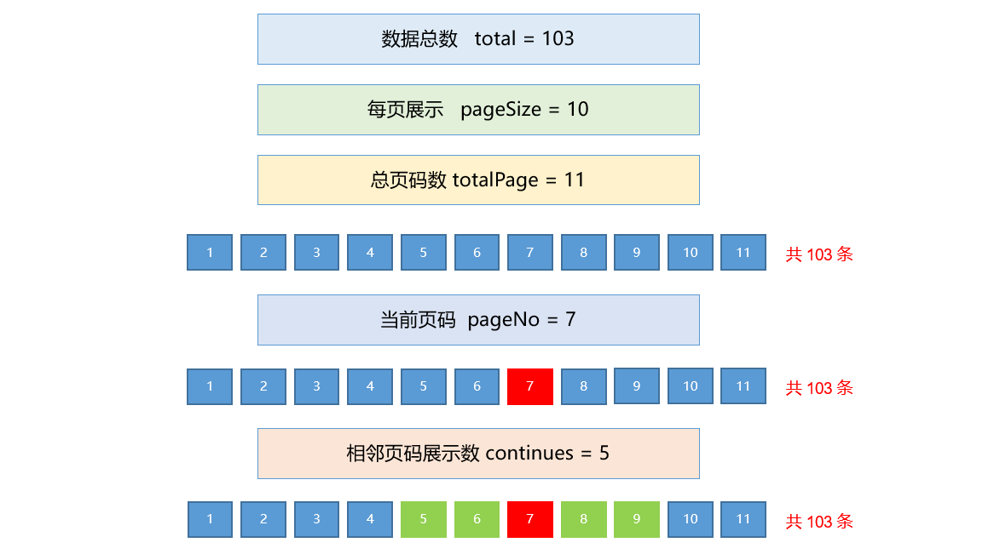
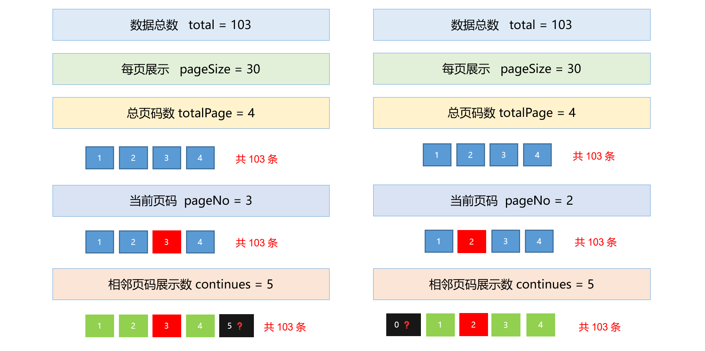
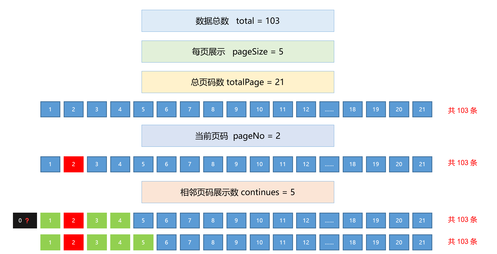
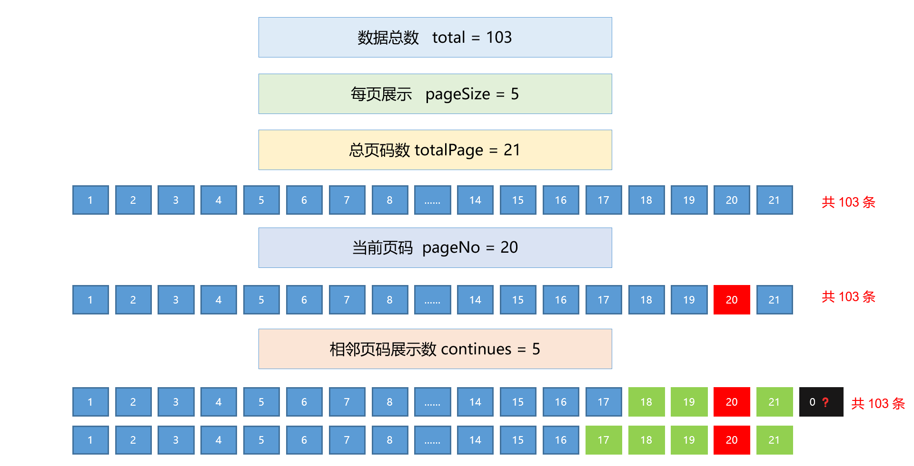

#   尚品汇第 5 天


## 1. 面包屑-接收品牌名


**思路分析：**


当用户点击品牌名的时候，需要将品牌名呈现到全部结果位置，之前实现的方式是将数据放到 `URL` 地址中，这里也可以拼接到 `URL` 地址中，但是如果我们将所有的参数都放到 `URL` 地址中，会导致地址很长，分享的时候会造成一些 应用 误判为垃圾链接，所以我们建议不要拼接到 `URL` 地址中，那么怎么处理呢 ？


经过分析，可以知道：

1. `SearchSelector` 为子组件
2. `Search` 为父组件


当点击子组件中的品牌时，需要将值传递给父组件，涉及到子往父传值，因此实现的方式是 `$emit` 自定义事件


**实现步骤：**


1. 在`SearchSelector` 子组件中通过 `$emit` 触发一个自定义事件，并传递参数
2. 在`Search` 组件中通过 `v-on` 监听一个自定义事件，对应一个事件处理程序
3. 在事件处理程序中，接收到参数，并将参数传递给搜索参数 `searchParams`


**落地代码：**


1. 在`SearchSelector` 子组件中通过 `$emit` 触发一个自定义事件，并传递参数

   ```html
   <!-- 品牌列表区 -->
   <ul class="logo-list">
     <!-- 遍历生成品牌列表 -->
     <li
       v-for="trademark in trademarkList"
       :key="trademark.tmId"
       @click="sendTrademark(trademark)"
      >
       {{ trademark.tmName }}
     </li>
   </ul>
   ```

   ```js
   methods: {
     // 点击品牌的回调
     sendTrademark(trademark) {
       this.$emit('get-trademark', trademark)
     }
   }
   ```

   

2. 在`Search` 组件中通过 `v-on` 监听一个自定义事件，对应一个事件处理程序，接收传递的参数

   ```html
   <!-- 搜索器 -->
   <!-- 给子组件 SearchSelector 绑定自定义事件，用于获取点击的品牌信息-->
   <SearchSelector @get-trademark="saveTrademark" />
   ```

   ```js
   methods: {
     // 用于接收 SearchSelector 子组件传递过来的品牌数据
     saveTrademark(trademark) {
       console.log('我是Search组件，收到了儿子给我的品牌：', trademark)
     }
   }
   ```

   

   


## 2. 面包屑-展示品牌名


**思路分析：**


点击品牌以后需要做两件事情：

1. 将品牌信息展示到面包屑位置
2. 需要使用品牌信息发起请求，获取最新的商品列表信息


在父组件中，接收到数据后，需要将数据展示到全部结果区域，同时需要发起网络请求，获取最新的搜索区域数据，渲染到页面上


需要注意接口接收的品牌参数格式：

| 参数名称  |  类型  | 是否必选 |                  描述                   |
| :-------: | :----: | :------: | :-------------------------------------: |
| trademark | string |    N     | 品牌: "`ID:品牌名称`"  示例: "`1:苹果`" |


**实现步骤：**


1. 从`searchParams`中得到`trademark`，展示到页面
2. 使用`v-show`做判断： `v-show="searchParams.trademark"` 
3. 通过 `dispatch` 调用 `action` 重新发起请求
4. 通过 `split` 处理展示出来的页面数据


**落地代码：**


1. 从`searchParams`中得到`trademark`，展示到页面

2. 使用`v-show`做判断： `v-show="searchParams.trademark"` 

   ```html
   <!-- 品牌面包屑 -->
   <li class="with-x" v-show="searchParams.trademark">
     {{ searchParams.trademark }} <i @click="removeTrademark">×</i>
   </li>
   ```

   

3. 通过 `dispatch` 调用 `action` 重新发起请求

   ```js
   methods: {
     // 面包屑-移除分类名
     // coding......
   
     // 面包屑-移除关键字
     // coding......
   
     // 面包屑-移除品牌名
     removeTrademark() {
       console.log('移除面包屑')
     },
   
     // 用于接收 SearchSelector 子组件传递过来的品牌数据
     saveTrademark(trademark) {
       // 对 searchParams 中的数据进行赋值
       this.searchParams.trademark = `${trademark.tmId}:${trademark.tmName}`
   
       // 重新搜索
       this.$store.dispatch('search/getSearchInfo', this.searchParams)
     }
   }
   ```

   

4. 处理展示出来的页面数据

   ```html
   <!-- 品牌面包屑 -->
   <li class="with-x" v-show="searchParams.trademark">
     {{ searchParams.trademark.split(':')[1] }} <i @click="removeTrademark">×</i>
   </li>
   ```

   


## 3. 面包屑-移除品牌名


**思路分析：**


当用户点击删除品牌的时候，应该将关键字移除，需要做以下处理


1. 将品牌重置为空
2. 重新发起网络请求


**实现步骤：**


1. 给品牌按钮绑定点击事件
2. 在事件处理程序中移除参数和重新搜索


**落地代码：**

```js
methods: {
  // 面包屑-移除品牌名
  removeTrademark() {
    // 移除参数
    this.searchParams.trademark = ''

    // 重新搜索
    this.$store.dispatch('search/getSearchInfo', this.searchParams)
  }
}
```


## 4. 面包屑-接收属性名


**思路分析：**


需求：

1. 需要将关键字展示到面包屑位置
2. 根据接口文档处理属性位置的参数
3. 需要根据最新的参数重新发起请求


当用户点击属性时，需要将属性展示到全部结果位置，经过分析，可以知道：

1. `SearchSelector` 为子组件
2. `Search` 为父组件


当点击子组件中的品牌时，需要将值传递给父组件，涉及到子往父传值，因此实现的方式是 `$emit` 自定义事件，只不过我们需要注意的是：`需要将哪些数据传递给父组件`，查阅接口文档得知，需要传递以下数据：

| 参数名称 | 类型  | 是否必选 |                             描述                             |
| :------: | :---: | :------: | :----------------------------------------------------------: |
|  props   | Array |    N     | 商品属性的数组: ["`属性ID`:`属性值`:`属性名`"]  <br />                 示例: ["2:6.0～6.24英寸:屏幕尺寸"] |


**实现步骤：**


1. 在`SearchSelector` 子组件中通过 `$emit` 触发一个自定义事件，并传递参数
2. 在`Search` 组件中通过 `v-on` 监听一个自定义事件，对应一个事件处理程序
3. 在事件处理程序中，接收到参数


**落地代码：**


1. 在`SearchSelector` 子组件中通过 `$emit` 触发一个自定义事件，并传递参数

   ```html
   <ul class="type-list">
     <!-- 遍历属性值（黄色、绿色、橙色、200g、215g、6.5寸、7.0寸） -->
     <li v-for="(attrValue, index) in attrs.attrValueList" :key="index">
       <a @click="handleClickAttrValue(attrs, attrValue)">{{ attrValue }}</a>
     </li>
   </ul>
   ```

   ```js
   methods: {
     handleClickAttrValue(attrs, attrValue) {
       this.$emit('get-attr', attrs, attrValue)
     }
   }
   ```

   

2. 在`Search` 组件中通过 `v-on` 监听一个自定义事件，对应一个事件处理程序

   ```vue
   <SearchSelector @get-trademark="saveTrademark" @get-attr="saveAttr" />
   ```

   

3. 在事件处理程序中，接收到参数

   ```js
   methods: {
     // coding......
     
     // 用于接收 SearchSelector 子组件传递过来的属性数据
     saveAttr(attrs, attrValue) {
       console.log('我是Search组件，收到了属性信息', attrs, attrValue)
     }
   },
   ```


## 5. 面包屑-展示属性名


**思路分析：**


| 参数名称 | 类型  | 是否必选 |                             描述                             |
| :------: | :---: | :------: | :----------------------------------------------------------: |
|  props   | Array |    N     | 商品属性的数组: ["`属性ID`:`属性值`:`属性名`"]  <br />                 示例: ["2:6.0～6.24英寸:屏幕尺寸"] |


根据接口文档的要求，需要将属性名处理成数组形式，并且每一项由三部分组成，格式为：

```text
['属性ID:属性值:属性名', '属性ID:属性值:属性名']

// 例如：

['2:机身内存:512G', '3:运行内存:12G']
```


但是页面展示的时候，只需要展示 属性值:属性名 即可，如下图：


因此展示属性名的时候，需要对数据使用 `split` 处理


**实现步骤：**


1. 接收传递过来的数据，按照接口文档格式化数据，然后将数据 `push` 到 `prop` 字段中
2. 重新请求数据
3. 在页面中通过 `v-for` 遍历 `prop` 中的数据


**落地代码：**

1. 接收传递过来的数据，按照接口文档格式化数据，然后将数据 `push` 到 `prop` 字段中

2. 重新请求数据

   ```js
   methods: {
     // coding......
     
     // 用于接收 SearchSelector 子组件传递过来的属性数据
     saveAttr(attrs, attrValue) {
       // 拼接合法的属性名，格式为：['属性ID:属性值:属性名', '属性ID:属性值:属性名']
       const attr = `${attrs.attrId}:${attrValue}:${attrs.attrName}`
       
       // 将拼接出来的属性信息，放到 searchParams 中
       this.searchParams.props.push(attr)
       
       // 重新发起网络请求
       this.$store.dispatch('search/getSearchInfo', this.searchParams)
     }
   }
   ```

   

3. 在页面中通过 `v-for` 遍历 `prop` 中的数据

   ```html
   <!-- 属性面包屑 -->
   <li class="with-x" v-for="(attr, index) in searchParams.props" :key="index">
     {{ attr.split(':')[2] + ' : ' + attr.split(':')[1] }} <i @click="removeProps">×</i>
   </li>
   ```


## 6. 面包屑-属性名去重


**思路分析：**


点击选择属性名，属性名会一直追加，这时候需要进行去重处理，处理的方式非常多，可以根据返回值来进行判断处理，例如：

```js
let arr = [1, 3, 5, 7, 9]

const x1 = arr.includes(9) // true，没有返回 false
const x2 = arr.indexOf(10) // 4 (索引)，没有返回 -1
const x3 = arr.filter(item => item === 9) // [9] 数组，没有返回 []
const x4 = arr.find(item => item === 9) // 9 返回本身，没有 undefined
const x5 = arr.findIndex(item => item === 10) // 4 (索引)，没有返回 -1
```


`ES6` 也给提供了 `Set` 构造函数用来进行数组的去重


**实现步骤：**

**落地代码：**

```js
methods: {
  // coding......
  
  // 用于接收 SearchSelector 子组件传递过来的属性数据
  saveAttr(attrs, attrValue) {
    // console.log('我是Search组件，收到了属性信息', attrs, attrValue)
    // 拼接合法的属性名，格式为：['属性ID:属性值:属性名', '属性ID:属性值:属性名']
    const attr = `${attrs.attrId}:${attrValue}:${attrs.attrName}`

    // ---------- 方式1：使用 includes 进行去重 ----------
    
    // 判断属性是否重复
    const result = this.searchParams.props.includes(attr)

    if (!result) {
      // 将拼接出来的属性信息，放到 searchParams 中
      this.searchParams.props.push(attr)
      // 重新发起网络请求
      this.$store.dispatch('search/getSearchInfo', this.searchParams)
    }

    // ---------- 方式2：使用 new Set 构造函数进行去重 ----------
    
    // 将拼接出来的属性信息，放到 searchParams 中
    // this.searchParams.props.push(attr)
      
    // 使用 new Set() 进行去重
    // this.searchParams.props = [...new Set(this.searchParams.props)]

    // 重新发起网络请求
    // this.$store.dispatch('search/getSearchInfo', this.searchParams)
  }
}
```


## 7. 面包屑-移除属性名


**思路分析：**


当用户点击删除属性名的时候，应该将属性名移除，需要做以下处理


1. 将属性名从 `props` 数组中移除
2. 重新发起网络请求


**实现步骤：**


1. 给属性名按钮绑定点击事件
2. 在事件处理程序中将属性名从 `props` 数组中移除和重新搜索


**落地代码：**


1. 给属性名按钮绑定点击事件

   ```vue
   <!-- 属性面包屑 -->
   <li class="with-x" v-for="(attr, index) in searchParams.props" :key="index">
     {{ attr.split(':')[2] + ' : ' + attr.split(':')[1] }} 
     <i @click="removeProps(index)">×</i>
   </li>
   ```

   

2. 在事件处理程序中将属性名从 `props` 数组中移除和重新搜索

   ```js
   methods: {
     // coding......
     
     // 面包屑-清除属性名
     removeProps(index) {
       this.searchParams.props.splice(index, 1)
   
       // 重新发起网络请求
       this.$store.dispatch('search/getSearchInfo', this.searchParams)
     }
   }
   ```


## 8. 面包屑-小细节完善(1)


**思路分析：**


目前在模板中有两个地方需要进行优化，如下两个代码片段：

```html
<!-- 属性面包屑 -->
<li class="with-x" v-for="(attr, index) in searchParams.props" :key="index">
  {{ attr.split(':')[2] + ' : ' + attr.split(':')[1] }} <i @click="removeProps(index)">×</i>
</li>
```

```html
<!-- 品牌面包屑 -->
<li class="with-x" v-show="searchParams.trademark">
  {{ searchParams.trademark.split(':')[1] }} <i @click="removeTrademark">×</i>
</li>
```


会发现，我们在插值表达式中写了大量的逻辑，我们需要对此进行优化，有哪几种优化的方式呢？

1. 计算属性
2. 方法
3. filter


**实现步骤：**


1. `品牌面包屑 ` 使用 `计算属性`
2. `属性面包屑` 使用 `methods 方法`


**落地代码：**

```js
computed: {
  trademarkName() {
    return this.searchParams.trademark.split(':')[1]
  }
}
```

```js
methods: {
  // coding......
  
  // 专门用于格式化每个商品属性的方法
  attrShowName(attr) {
    return attr.split(':')[2] + ':' + attr.split(':')[1]
  }
}
```


## 9. 面包屑-小细节完善(2)


**思路分析：**


`this.$store.dispatch('search/getSearchInfo', this.searchParams)` 触发 `actions` 重新发起网络请求，这句话要经常执行，且`searchParams`一变化就要执行，因此需要进行优化，如何优化：


`watch` 侦听器，使用 `watch` 侦听器 对 `searchParams` 进行深度监听


**实现步骤：**


1. 删掉每个方法里的 `this.$store.dispatch('search/getSearchInfo', this.searchParams)`
2. 在`watch`中监视`searchParams`，回调中进行`dispatch`


**落地代码：**

```js
watch: {
  // 监视searchParams，只要searchParams变化，直接拿着它发请求。
  searchParams: {
    handler() {
      // 拿着searchParams，发请求获搜索数据，并存入vuex
      this.$store.dispatch('getSearchInfo', this.searchParams)
    },
    deep: true,
    immediate: true
  }
}
```


## 10. 分页-对分页的理解


**思路分析：**


在网页上浏览内容时，如果搜索的内容数据比较大，在该页面的底部，通常都会有个分页，通过翻页等操作，跳转到其他页面查看新的内容。


当有大量信息需要展示给用户时，为了降低单次请求对服务器产生的性能压力和时间损耗，每次只加载固定数量的少量信息。用户浏览完之后，通过操作分页功能，再向服务器发起请求，以获取更多内容。


**分页作用：**


说到底，分页主要解决了 2 个问题：


1. 减少了单次请求对服务器产生的性能压力和等待时间

   - 假如我们逛淘宝，当有成千上万个商品要展示给用户
   - 若不做分页，服务端就需要将这么庞大的数据量一次性传递给前端
   - 会造成服务器压力大，用户等待数据加载的时间也会更长

   

2. 分页功能减少了低价值请求

   - 假如我们逛淘宝，每页有 100 个商品，总共99 页，一共 9900 个商品
   - 若不做分页功能，用户的一次搜索请求，就需要一次将 9900 个商品包含图片全部加载出来
   - 但实际情况是，用户不会把 4560个商品看完，一般只看了前 几页就确定了购买意向
   - 那这时后面其他页的内容就是白加载了，这其实就是无价值的加载请求


**分页组成及其功能**


1. **<font color="red">数据总条量</font>**：总共有多少条数据 （`total`）
3. **<font color="red">页面展示数量</font>**：每个页面展示多少数据 （`pageSize`）
4. **<font color="red">当前页码</font>：**当前所处的分页位置，第几页（`pageNo`）
5. **<font color="red">相邻页码展示数量</font>：**当前页码的前后几页 （`continues`）
5. **<font color="green">总页数</font>**：总共有多少分页，计算公式：`数据总量 / 页面展示数量 ` (`totalPage`)


> 📌 Tip：
>
> ​		红色是必须传项，绿色的不用传，可以根据红色算出来。


## 11. 分页-静态组件绘制


**思路分析：**


​	直接使用提供的组件即可，只不过需要注意的是：`分页组件是一个全局组件`


**实现步骤：**


1. 在 `components` 目录下新建 `Pagination` 组件 
2. 组件代码直接复制下方的代码即可
3. 将`Pagination` 组件 注册为全局组件
4. 在 `Search` 组件中使用 `Pagination` 组件


**落地代码：**


1. 创建：`src\components\Pagination\index.vue`，内容如下：

   ```vue
   <template>  
   	<div class="pagination">
       <button>上一页</button>
       <button>1</button>
       <span>···</span>
       
       <button>6</button>
       <button>7</button>
       <button class="active">8</button>    
       <button>9</button>
       <button>10</button>
       
       <span>···</span>
       <button>21</button>
       <button>下一页</button>
       
       <span>共 103 条</span>
     </div>
   </template>
   
   <script>    
     export default {      
       name: "Pagination",    
     };
   </script>
   
   <style lang="less" scoped>
     .pagination {
       text-align: center;
   
       button {
         margin: 0 5px;
         background-color: #f4f4f5;
         color: gray;
         outline: none;
         border-radius: 2px;
         padding: 0 4px;
         vertical-align: top;
         display: inline-block;
         font-size: 13px;
         min-width: 35.5px;
         height: 28px;
         line-height: 28px;
         cursor: pointer;
         box-sizing: border-box;
         text-align: center;
         border: 0;
   
         &[disabled] {
           color: #c0c4cc;
           cursor: not-allowed;
         }
   
         &.active {
           cursor: not-allowed;
           background-color: #c81623;
           color: #fff;
         }
       }
   
       span {
         display: inline-block;
         line-height: 28px;
         font-size: 14px;
         color: gray;
         vertical-align: middle;
       }
     }
   </style>
   ```

2. 记得去`main.js`中引入并注册`Pagination`组件。

   ```js
   import Pagination from './components/Pagination'
   //全局注册Pagination组件
   Vue.component('Pagination',Pagination)
   ```

3. 去`Search`组件指定位置，直接编写组件标签`<Pagination/>`

   ```html
   <!-- 分页器 -->
   <div class="pagination">
     <Pagination />
   </div>
   ```


## 11. 如何批量封装组件


`components/index.js`

```js
/**
 * components/index.js 文件的作用：用来批量注册组件
 */

// 将组件注册为全局组件
import TypeNav from './TypeNav'
import Pagination from './Pagination'

// 将导入的组件都放置到一个数组中
const components = [TypeNav, Pagination]

// 如何创建一个插件
const plugins = {
  install(Vue) {
    // 对放置组件数组进行遍历
    // component 就是一个个导入的组件
    components.forEach((component) => {
      // Vue.component('SphPagination', Pagination)
      // component.name 组件的名字
      // component 导入的组件
      Vue.component(component.name, component)
    })
  }
}

export default plugins

// 之前 TypeNav 注册的时候，名字的 TypeNav
// 但是目前批量注册后，名字使用了组件内部的别名 SphTypeNav
// 所以需要将组件标签 TypeNav 换成 SphTypeNav

// 前置知识：可以通过导入的 组件名称.name 的方式获取组件的别名
// console.dir(TypeNav.name) // SphTypeNav
// console.dir(Pagination.name) // SphPagination

// Vue.component('TypeNav', TypeNav)
// Vue.component('SphPagination', Pagination)

```


```js
// 导入批量注册的组件
import plugins from './components'
// 注册导入的插件
Vue.use(plugins)

```


·

## 12.分页-计算总页数


**思路分析：**


我们通常会在使用分页组件的时候，传入`数据总数`、`页面展示数量`、`当前页码` 等配置项。然后在组件内部进行相关逻辑的操作


为了一步步完成分页功能的开发，我们先伪造一些数据，计算出分页总页数


**实现步骤：**


1. 通过`Pagination`组件标签中传递一些模拟数据
2. 在`Pagination`组件内通过 `props` 接收一些模拟数据


**落地代码：**


1. 通过`Pagination`组件标签中传递一些模拟数据

   ```html
   <!-- 分页器 -->
   <!-- total：数据总条数 -->
   <!-- pageSize：每页展示多少条 -->
   <!-- pageNo：当前在多少页 -->
   <!-- continues：相邻展示多少数据 -->
   <Pagination :total="103" :pageSize="5" :pageNo="16" :continues="5"/>
   ```

   

2. 在`Pagination`组件内通过 `props` 接收一些模拟数据

   ```vue
   <template>
     <div class="pagination">
       <button>上一页</button>
       <button>1</button>
       <span>···</span>
   
       <button>6</button>
       <button>7</button>
       <button class="active">8</button>
       <button>9</button>
       <button>10</button>
   
       <span>···</span>
       <button>{{ totalPage }}</button>
       <button>下一页</button>
   
       <span>共 {{ total }} 条</span>
     </div>
   </template>
   
   <script>
   export default {
     name: 'SphPagination',
     props: {
       // 数据总条量
       total: {
         type: Number,
         require: true,
         default: 0
       },
       // 页面展示数量
       pageSize: {
         type: Number,
         require: true,
         default: 10
       },
       // 当前页码
       pageNo: {
         type: Number,
         require: true,
         default: 1
       },
       // 相邻页码展示数
       continues: {
         type: Number,
         require: true,
         default: 5
       }
     },
     computed: {
       totalPage() {
         return Math.ceil(this.total / this.pageSize)
       }
     }
   }
   </script>
   ```


 


## 13.分页-算连续页数-标准情况


**思路分析：**





需要根据传入的伪数据，计算出连续的页码数字分别是多少

我们目前希望 相邻页码展示数 是 5，那么当前页两侧左右应该为 2 ，计算公式如下：


```text
起始页：当前页码 - (连续页数 - 1) / 2

结束页：当前页码 + (连续页数 - 1) / 2
```


**实现步骤：**


1. 在计算属性中，利用分析出来的公式，得出标准情况下，连续页数


**落地代码：**


1. 通过公式计算出连续页数

   ```js
   computed: {
     // 算连续页的起始页、结束页
     startEnd() {
       // 获取分页器的各种参数
       const { total, pageSize, pageNo, continues } = this
   
       console.log(total, pageSize)
   
       let start = 0 // 连续页的起始位置
       let end = 0 // 连续页的结束位置
   
       start = pageNo - (continues - 1) / 2
       end = pageNo + (continues - 1) / 2
   
       return { start, end }
     }
   }
   ```

   

2. 在页面中展示出连续分页

   ```html
   <button>{{ startEnd.start }}</button>
   <button>xxx</button>
   <button class="active">{{ pageNum }}</button>
   <button>xxx</button>
   <button>{{ startEnd.end }}</button>
   ```


## 14.分页-算连续页数-特殊情况 (1)


**思路分析：**


<font color="red">**特殊情况 1 ：传入的 continues > 算出的 totalPage**</font>




若：<font color="red">**传入的 continues > 算出的 totalPage**</font>

则：<font color="green">**起始位置为 1，结束为位置为 totalPage**</font>


**实现步骤：**


1. 在 startEnd 计算属性中新增判断 <font color="red">**传入的 continues > 算出的 totalPage**</font>


**落地代码：**

```js
computed: {
  // 算连续页的起始页、结束页
  startEnd() {
    // 获取分页器的各种参数
    const { total, pageSize, pageNo, continues, totalPage } = this

    console.log(total, pageSize)

    let start = 0 // 连续页的起始位置
    let end = 0 // 连续页的结束位置

    if (continues > totalPage) {
      start = 1
      end = totalPage
    } else {
      start = pageNo - (continues - 1) / 2
      end = pageNo + (continues - 1) / 2
    }

    return { start, end }
  }
}
```


## 15.分页-算连续页数-特殊情况 (2)


**思路分析：**


<font color="red">**特殊情况 2 ：算出的起始位置 < 1**</font>





若：<font color="red">**算出的起始位置 < 1**</font>

则：<font color="green">**起始位置为 1，结束为位置为 continues**</font>


**实现步骤：**


1. 在 startEnd 计算属性中新增判断 <font color="red">**算出的起始位置 < 1**</font>


**落地代码：**

```js
computed: {
  // 算连续页的起始页、结束页
  startEnd() {
    // 获取分页器的各种参数
    const { total, pageSize, pageNo, continues, totalPage } = this

    console.log(total, pageSize)

    let start = 0 // 连续页的起始位置
    let end = 0 // 连续页的结束位置

    if (continues > totalPage) {
      start = 1
      end = totalPage
    } else {
      start = pageNo - (continues - 1) / 2
      end = pageNo + (continues - 1) / 2
      
      // 判断左边是否 < 1
      if (start < 1) {
        start = 1
        end = continues
      }
    }

    return { start, end }
  }
}
```


## 16.分页-算连续页数-特殊情况 (3)


**思路分析：**



<font color="red">**特殊情况 3 ：算出的结束位置 > totalPage**</font>


```shell
例如 ：

total = 103
pageSize = 5
pageNo = 20
continues = 5

经过计算：totalPage = 21

【当前页码 pageNo 】 等于【20】
【相邻页码 totalPage】 等于 【21】

对于例子：相邻页码区域展示  18 19 20 21 22 ! 但是 22 这个页面是不存在 ❗ ❗ ❗

因此需要往前补一位才对，补上后的分页：17 18 19 20 21
```


若：<font color="red">**算出的结束位置 > totalPage**</font>

则：<font color="green">**起始位置为 totalPage - continues + 1，结束为位置为 totalPage**</font>


**实现步骤：**


1. 在 startEnd 计算属性中新增判断 <font color="red">**算出的结束位置 > totalPage**</font>


**落地代码：**

```js
computed: {
  // 算连续页的起始页、结束页
  startEnd() {
    // 获取分页器的各种参数
    const { total, pageSize, pageNo, continues, totalPage } = this

    console.log(total, pageSize)

    let start = 0 // 连续页的起始位置
    let end = 0 // 连续页的结束位置

    if (continues > totalPage) {
      start = 1
      end = totalPage
    } else {
      start = pageNo - (continues - 1) / 2
      end = pageNo + (continues - 1) / 2
      
      // 判断左边是否 < 1
      if (start < 1) {
        start = 1
        end = continues
      }
        
      // 判断右边是否 > totalPage
      if (end > totalPage) {
        start = totalPage - continues + 1
        end = totalPage
      }
    }

    return { start, end }
  }
}
```


## 17. 分页-展示完整连续页


**思路分析：**


先伪造数据，利用伪造的数据展示完整连续页：

```html
<Pagination :total="103" :pageSize="5" :pageNo="15" :continues="5" />
```


那么需要展示的数据是完整连续页是：

```text
									13 14 15 16 17
```


 不能直接对传入的 `continues` 进行遍历，因为  `continues` 不可靠


这里借助 **开始和结束位置** 进行处理

```
例如：传入的当前页码是 15，完整连续页是 5

开始位置是 13，结束位置是 17

17 - 13 + 1 就等于完整连续页 5 // 遍历 5 次
```


遍历的内容怎么处理

```js
17 - 13 + 1 就等于完整连续页 5

遍历 5 次，对应的索引是 0, 1, 2, 3, 4

遍历产生的内容是：start + 索引

start 目前是 13

也就是：13+0, 13+1, 13+2, 13+3, 13+4

最终结果是：13 14 15 16 17

```


**实现步骤：**


按照分析的公式实现即可 


**落地代码：**

```html
<template>
  <div class="pagination">
    <!-- <button>上一页</button>
    <button>1</button>
    <span>···</span> -->

    <!-- <button>{{ startEnd.start }}</button>
    <button>xxx</button>
    <button class="active">{{ pageNo }}</button>
    <button>xxx</button>
    <button>{{ startEnd.end }}</button> -->

    <button
      v-for="(num, index) in startEnd.end - startEnd.start + 1"
      :key="index"
      :class="{ active: pageNo === startEnd.start + index }"
    >
      {{ startEnd.start + index }}
    </button>

    <!-- <span>···</span>
    <button>{{ totalPage }}</button>
    <button>下一页</button> -->

    <span>共 {{ total }} 条</span>
  </div>
</template>
```


## 18.分页-整体展示


**思路分析：**


1. 当前已经是第一页了，那么【上一页】就不能点了

2. 当前已经是最后一页了，那么【下一页】就不能点了

3. 两个数中间，有其他数，再出现三个点

   - 最简单的计算方式： `...` 两边的数字相减

     - 第一个点：` 3 - 1 = 2 ` 所以 `<span v-if="startEnd.start > 2">···</span>`
     - 最后一个点，和上面对应

     - `totalPage - 1 >  startEnd.end`

   - 如果依然没有思路，可以利用 start、end 一步步的推导

```html
<!-- 计算出来的 start ，1 和 3等等数字之间被 2  分隔了，就需要展示 ... -->
<!-- PageNo = 1   1 2 3 4 5  start = 1 , end = 5 不需要三个点 -->
<!-- PageNo = 2   1 2 3 4 5  start = 1 , end = 5 不需要三个点 -->
<!-- PageNo = 3   1 2 3 4 5  start = 1 , end = 5 不需要三个点 -->
<!-- PageNo = 4   2 3 4 5 6  start = 2 , end = 6，， 1 2 3 4 5 6，是连一块的 不需要三个点，  -->
<!-- PageNo = 5   3 4 5 6 7  start = 3 , end = 7 需要三个点-->
<!-- ⭐ 注意：start ⭐ 两个数字(1, 3)被其他数字(2)分隔的时候，需要展示 3 个点 -->

<span v-if="startEnd.start > 2">···</span>
```

```html
<!-- 第一个 ... 是 start > 2 -->
<!-- 这下面 ... 需要是 end - 1 -->
<!-- PageNo = 21  17 18 19 20 21  start = 17 , end = 21 不需要三个点 -->
<!-- PageNo = 20  17 18 19 20 21  start = 17 , end = 21 不需要三个点 -->
<!-- PageNo = 19  17 18 19 20 21  start = 17 , end = 21 不需要三个点 -->
<!-- PageNo = 18  16 17 18 19 20  start = 16 , end = 20, 16 17 18 19 20 21 是连一块的 不需要三个点 -->
<!-- PageNo = 17  15 16 17 18 19  start = 15 , end = 19 需要三个点 -->
<!-- ⭐ 注意：end ⭐ 两个数字(19 21)被其他数字(20)分隔的时候，需要展示 3 个点 -->

<span v-if="totalPage - 1 > startEnd.end">···</span>
```


**实现步骤：**

**落地代码：**


```html
<template>
  <div class="pagination">
    <!-- 当前已经是第一页了，那么【上一页】就不能点了 -->
    <button :disabled="pageNo === 1">上一页</button>
    <button v-if="startEnd.start !== 1">1</button>
    <!-- 两个数中间，有其他数，再出现三个点 -->
    <span v-if="startEnd.start > 2">···</span>

    <button
      v-for="(num, index) in startEnd.end - startEnd.start + 1"
      :key="index"
      :class="{ active: pageNo === startEnd.start + index }"
    >
      {{ startEnd.start + index }}
    </button>

    <!-- 两个数中间，有其他数，再出现三个点 -->
    <span v-if="startEnd.end < totalPage - 1">···</span>
    <button v-if="startEnd.end !== totalPage">{{ totalPage }}</button>
    <!-- 当前已经是最后一页了，那么【下一页】就不能点了 -->
    <button :disabled="pageNo === totalPage">下一页</button>

    <span>共 {{ total }} 条</span>
  </div>
</template>
```


## 19. 分页-传递真实数据


**思路分析：**


**实现步骤：**


1. 在`Search`组件从`vuex`中获取服务器返回的`total`，传递给`Pagination`组件
2. 将指定的 `pageSize`、`pageNum`传递给`Pagination`组件


**落地代码：**


1. 在`Search`组件从`vuex`中获取服务器返回的`total`，传递给`Pagination`组件

   ```js
   computed: {
     ...mapState({
       goodsList: (state) => state.search.searchInfo.goodsList,
       total: (state) => state.search.searchInfo.total
     })
   }
   ```

   

2. 将指定的 `pageSize`、`pageNum`传递给`Pagination`组件

   ```html
   <Pagination
     :total="total"
     :pageSize="searchParams.pageSize"
     :pageNum="searchParams.pageNum"
     :continues="5"
   />
   ```

   


## 20. 分页-整体交互


**思路分析：**


给每个按钮绑定点击事件，同时把页面传递给父组件，让父组件请求对应页面的数据


**实现步骤：**

**落地代码：**


1.  给每个按钮绑定点击事件，同时把页面传递给父组件

   ```html
   <template>
     <div class="pagination">
       <!-- 当前已经是第一页了，那么【上一页】就不能点了 -->
       <button @click="changePageNum(pageNo - 1)" :disabled="pageNo === 1">上一页</button>
       <button @click="changePageNum(1)" v-if="startEnd.start !== 1">1</button>
       <!-- 两个数中间，有其他数，再出现三个点 -->
       <span v-if="startEnd.start > 2">···</span>
   
       <button
         v-for="(num, index) in startEnd.end - startEnd.start + 1"
         :key="index"
         :class="{ active: pageNo === startEnd.start + index }"
         @click="changePageNum(startEnd.start + index)"
       >
         {{ startEnd.start + index }}
       </button>
   
       <!-- 两个数中间，有其他数，再出现三个点 -->
       <span v-if="startEnd.end < totalPage - 1">···</span>
       <button v-if="startEnd.end !== totalPage" @click="changePageNum(totalPage)">{{ totalPage }}</button>
       <!-- 当前已经是最后一页了，那么【下一页】就不能点了 -->
       <button :disabled="pageNo === totalPage" @click="changePageNum(pageNo + 1)">下一页</button>
   
       <span>共 {{ total }} 条</span>
     </div>
   </template>
   ```

   ```vue
   <script>
   export default {
     methods: {
       changePageNum(newPage) {
         this.$emit('changePageNum', newPage)
       }
     }
   }
   </script>
   ```

   

2. 父组件接收数据，传递给 `searchParams` 中的 `pageNo`

   ```html
   <!-- 分页器 -->
   <div class="pagination">
     <Pagination
       :total="total"
       :pageSize="searchParams.pageSize"
       :pageNum="searchParams.pageNo"
       :continues="5"
       @changePageNum="getPageNum"
     />
   </div>
   

   methods: {
     getPageNum(newNum) {
       this.searchParams.pageNo = newNum
     }
   }
   ```
   


##  21. 分页-切换分类时的 Bug


**思路分析：**


搜索商品时，商品分类、品牌、属性、关键词若变化，`pageNum`应该重置为1，因为这些动作会引起列表数量的变化，如果不重置，会导致分页的错乱


**实现步骤：**


在商品分类、品牌、属性、关键词对应的方法中，将`pageNum`应该重置为1


只能在各自的方法中进行重置为 1，不能放到 watch 中进行处理，

如果放到 watch 中进行处理，每次 pageNo = 1


**落地代码：**

```vue
export default {
  name: 'SearchPage',
  data() {
    return {
      // coding....
    }
  },
  methods: {
    getPageNum(newNum) {
      this.searchParams.pageNo = newNum
    },

    // 面包屑-移除分类名
    removeCategoryName() {
      // coding....

      this.searchParams.pageNo = 1
    },

    // 面包屑-移除关键字
    removeKeyword() {
      // coding....
      
      this.searchParams.pageNum = 1
    },

    // 面包屑-移除品牌名
    removeTrademark() {
      // coding....
        
      this.searchParams.pageNo = 1
    },

    // 面包屑-清除属性名
    removeProps(index) {
      // coding....
        
      this.searchParams.pageNo = 1
    },

    // 用于接收 SearchSelector 子组件传递过来的品牌数据
    saveTrademark(trademark) {
      // coding....
        
      this.searchParams.pageNo = 1
    },

    // 用于接收 SearchSelector 子组件传递过来的属性数据
    saveAttr(attrs, attrValue) {
      // coding....

      this.searchParams.pageNo = 1
    },

    // 专门用于格式化每个商品属性的方法
    // coding....
  },
  watch: {
    $route: {
      async handler(route) {
        // 需要重置的 query 参数数据
        const resetObj = { 
          category1Id: '',
          category2Id: '',
          category3Id: '',
          categoryName: '',
          keyword: '',
          pageNum: 1
         }

        // 将需要重置的 query 参数数据，并将最新参数合并进去
        Object.assign(this.searchParams, resetObj, route.query)

        this.$store.dispatch('search/getSearchInfo', this.searchParams)
      },
      immediate: true
    },
  }
}
</script>
```


## 21. 分页-数据为空时的优化


**思路分析：**


搜索没有结果时，给用户进行提示


**实现步骤：**


**落地代码：**

```html
<!-- 搜索器 -->
<SearchSelector v-show="total" ****** />

<!--商品展示区-->
<div class="details clearfix" v-if="total">
</div>

<!-- 数据为空的展示 -->
<div v-show="!total" class="empty">
  
  <h1>抱歉，搜索结果为空！</h1>
</div>
```


**思路分析：**

**实现步骤：**

**落地代码：**


