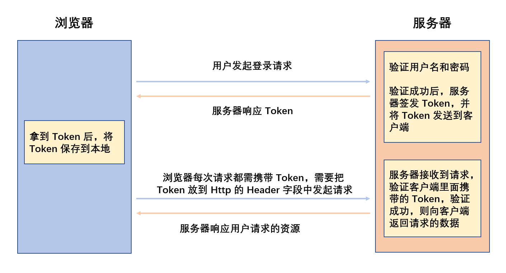

# 尚品汇第 8 天


## 1. Element-介绍


Element 由阿里巴巴集团-饿了么前端团队进行开发

Element 一套为开发者、设计师和产品经理准备的基于 Vue 2.0 的后台管理系统组件库，能够帮助你的网站快速成型，随着 Vue 3.0 的发布，Element 团队发布了 Element Plus，为了帮助开发者更好的进行 Vue 3.0 项目


1. [Element-官方网址](https://element.eleme.cn/#/zh-CN)
2. [Element Plus-官方网址](https://element-plus.gitee.io/#/zh-CN)


其他常见的组件库：


腾讯系：https://tdesign.tencent.com/ 最近一段时间出来的


1. 基于 Vue 的 PC 桌面端

   - iview：http://iview.talkingdata.com/#/
   - Ant Design of Vue：http://antdv.cdqianyun.com/docs/vue/introduce-cn/
   - amaze UI：http://amazeui.shopxo.net/ (不是基于 Vue 的)

   

2. 基于 Vue 的 Mobile 移动端

   - Vant：https://vant-contrib.gitee.io/vant/v2/#/zh-CN/
   - nutui：https://nutui.jd.com/#/
   - Mui：https://dev.dcloud.net.cn/mui/util/ (不是基于 Vue 的)


## 2. Element-基本使用


**知识点：**

UI 框架的使用流程都是具有通用性，不同的 UI 框架使用流程可以相互借鉴

只不过不同的 UI 框架 提供的使用 方法和 API 是不同的。


一般 UI 框架的使用流程如下：

1.  使用 `Vue Cli` 创建项目
2.  查阅 `官方文档` → `安装` →` 快速上手`
3.  参考文档进行导入和开发即可


## 3. Element-按需加载


**思路分析：**


Element 默认加载的方式，会加载项目中所有的组件，这样会造成项目的体积很大，为了解决这个问题， 我们可以配置按需引入，只引入需要的组件，以达到减小项目体积的目的。


[组件按需引入 | Element](https://element.eleme.cn/#/zh-CN/component/quickstart#an-xu-yin-ru)


**实现步骤：**


1. 安装 `babel-plugin-component` 插件
2. 按照文档修改 `babel.config.js`
3. 在 `src` 目录下创建 `plugins/element.js` 文件，导入 `element` 插件
4. 在 `main.js` 文件中导入 `plugins/element.js` 文件


**落地代码：**


1. 在 `src` 目录下创建 `plugins/element.js` 文件，导入 `element` 插件

   ```js
   import Vue from 'vue'
   // 导入样式
   import 'element-ui/lib/theme-chalk/index.css'
   
   // 导入需要使用的组件
   import { Button } from 'element-ui'
   
   // 注册组件
   Vue.use(Button)
   
   ```

   

2. 在 `main.js` 文件中导入 `plugins/element.js` 文件

   ```js
   // 导入 Element 插件
   import './plugins/element.js'
   ```

   

3. 在页面中使用 `Button` 组件

   ```html
   <el-row>
     <el-button icon="el-icon-search" circle></el-button>
     <el-button type="primary" icon="el-icon-edit" circle></el-button>
     <el-button type="success" icon="el-icon-check" circle></el-button>
     <el-button type="info" icon="el-icon-message" circle></el-button>
     <el-button type="warning" icon="el-icon-star-off" circle></el-button>
     <el-button type="danger" icon="el-icon-delete" circle></el-button>
   </el-row>
   ```


## 4. Element-提示组件


**思路分析：**


[按需引入的方式](https://element.eleme.cn/#/zh-CN/component/quickstart#an-xu-yin-ru)


`Element` 给提示组件，都增加了全局的方法，如果是按需引入的，需要自己手动添加，可以在 `plugins/element.js` 文件中导入对应的提示组件，然后按照以下方法配置到 `Vue` 的原型上，即可将提示组件当成方法来进行调用

```js
Vue.prototype.$loading = Loading.service;
Vue.prototype.$msgbox = MessageBox;
Vue.prototype.$alert = MessageBox.alert;
Vue.prototype.$confirm = MessageBox.confirm;
Vue.prototype.$prompt = MessageBox.prompt;
Vue.prototype.$notify = Notification;
Vue.prototype.$message = Message;
```


**实现步骤：**


1. 在  `plugins/element.js`  中导入组件
2. 将组件按照 `Element` 提供的方式挂载到 `Vue` 元原型上
3. 在方法中使用提示组件方法


**落地代码：**


1. 在  `plugins/element.js`  中导入组件

2. 将组件按照 `Element` 提供的方式挂载到 `Vue` 元原型上

   ```js
   import Vue from 'vue'
   // 导入样式
   import 'element-ui/lib/theme-chalk/index.css'
   
   // 导入需要使用的组件
   import { Message } from 'element-ui'
   
   
   Vue.prototype.$message = Message
   
   ```

   

3. 在方法中使用提示组件方法

   ```js
   this.$message('这是一个弹框组件~~~')
   
   this.$message({
     message: '警告哦，这是一条警告消息',
     type: 'warning'
   })
   ```


## 5. 注册-静态结构+收集数据


**思路分析：**


1. 准备静态组件，从准备好的组件中复制登录和注册组件，对已经存在的组件进行替换
2. 根据接口文档，准备注册表单需要的数据
3. 通过 v-model 将表单和数据进行绑定


先将结构的中的验证部分进行移除，后续在完成校验功能的开发


**实现步骤：**


1. 复制结构替换已有的组件
2. 根据接口文档定义数据
3. 将接口文档数据和表单元素进行绑定


**落地代码：**

```vue
<template>
  <div class="register-container">
    <!-- 注册内容 -->
    <div class="register">
     <!-- coding..... -->
     <input type="text" placeholder="请输入你的手机号" v-model="phone" />
     <!-- coding..... -->
     <input type="text" placeholder="请输入验证码" v-model="code" />
     <!-- coding..... -->
     <input type="text" placeholder="请输入你的登录密码" v-model="password" />
     <!-- coding..... -->
     <input type="text" placeholder="请输入确认密码" v-model="re_password" />
     <!-- coding..... -->
     <input name="m1" type="checkbox" v-model="isAgree" />
     <!-- coding..... -->
    </div>

    <!-- 底部 -->
    <div class="copyright">
     <!-- coding..... -->
    </div>
  </div>
</template>

<script>
export default {
  name: 'VRegister',
  data() {
    return {
      phone: '', // 手机号
      code: '', // 验证码
      password: '', // 密码
      re_password: '', // 确认密码
      isAgree: false // 是否同意协议
    }
  }
}
</script>
```


## 6. 注册-获取验证码


**思路分析：**


当用户输入手机号后，点击验证码，需要调用接口，获取到验证码


正常情况下：接口会给进行提示，手机也会收到也能收到验证码，

但是因为后端原因，手机并不能收到验证码，后端将验证码通过接口进行返回了，

因此用户输入手机号后，点击验证码，调用接口，就能获取到验证码


**实现步骤：**


1. 封装获取验证码的 `API`
2. 输入手机号，用户点击获取验证码按钮，调用 API


**落地代码：**


1. 封装获取验证码的 `API`

   ```js
   // 导入封装的网络请求工具 request.js
   import request from '@/utils/request'
   
   /**
    * @description 此函数专门用于根据手机号获取验证码
    * @param { string } phone 手机号
    * @returns Promise
    */
   export const reqGetCode = (phone) => request.get(`/api/user/passport/sendCode/${phone}`)
   
   ```

   

2. 输入手机号，用户点击获取验证码按钮，调用 API

   ```vue
   <template>	
     <!-- -->	
     <button class="getcode" @click="getCode">获取验证码</button>
     <!-- -->	
   </template>
   
   <script>
     import { reqGetCode } from '@/api/register'
     // coding......
     methods: {
       // 获取验证码
       async getCode() {
         // 调用接口获取验证码
         const res = await reqGetCode(this.phone)
   
         // 判断业务逻辑是否成功
         if (res.code === 200) {
           this.$message.success('验证码获取成功')
           this.code = res.data
         } else {
           this.$message.warning(res.message)
         }
       }
     }
   </script>
   ```


## 7. 注册-完成注册


**思路分析：**


在获取到验证码后，用户输入密码等，调用接口，进行注册即可


**实现步骤：**


1. 封装注册的 `API`
2. 输入密码等信息，点击立即注册，调用接口 `API`


**落地代码：**


1. 封装注册的 `API`

   ```js
   /**
    * @description 此函数专门用于注册
    * @param {*} params phone code password
    * @returns Promise
    */
   export const reqRegister = (params) => request.post('/api/user/passport/register', params)
   ```

   

2. 输入密码等信息，点击立即注册，调用接口 `API`

   ```vue
   <template>	
       <!-- -->	
      	<button @click="register">完成注册</button>
       <!-- -->	
   </template>
   
   <script>
     import { reqGetCode, reqRegister } from '@/api/register'
   
     methods:{
       // 用户注册
       async register() {
         // 获取用户输入
         const { phone, code, password } = this
         // 请求注册(注意此处传递的参数是一个对象)
         const res = await reqRegister({ phone, code, password })
         if (res.code === 200) {
           this.$message.success('注册成功！')
         } else {
           this.$message.warning(res.message)
         }
       }
     }
   </script>
   ```


## 8. 登录-完成登录功能


**思路分析：**


准备登录的静态结构

进行登录操作，需要发起请求，准备接口文档，封装登录的接口 `API`

在登录的 `data` 中声明手机号和密码数据，同时和表单进行绑定

点击登录，调用登录的 `API` 即可


**实现步骤：**


1. 准备登录的静态结构
2. 在 `data` 中声明状态，同时和 表单元素进行绑定
3. 封装登录的 `API` 接口
4. 点击登录，调用 `API` 接口


**落地代码：**


1. 封装登录的 `api`

   ```js
   // 导入封装的网络请求工具 request.js
   import request from '@/utils/request'
   
   /**
    * @description 该请求登录
    * @param {*} params phone，password
    * @returns
    */
   export const reqLogin = (params) => request.post('/api/user/passport/login', params)
   
   ```

   

2. 点击登录，调用 `API`

   ```vue
   <template>
     <div class="login-container">
       <!-- 登录 -->
       <div class="login-wrap">
         <div class="login">
           <div class="loginform">
             <div class="content">
               <form>
                 <div class="input-text clearFix">
                   <span></span>
                   <input type="text" placeholder="邮箱/用户名/手机号" v-model="phone" />
                 </div>
                 <div class="input-text clearFix">
                   <span class="pwd"></span>
                   <input type="text" placeholder="请输入密码" v-model="password" />
                 </div>
                 <button class="btn" @click.prevent="login">登&nbsp;&nbsp;录</button>
               </form>
               <div class="call clearFix">
                 <router-link class="register" to="/register">立即注册</router-link>
               </div>
             </div>
           </div>
         </div>
       </div>
       <!-- 底部 -->
       <div class="copyright">
         <ul>
           <li>关于我们</li>
           <li>联系我们</li>
           <li>联系客服</li>
           <li>商家入驻</li>
           <li>营销中心</li>
           <li>手机尚品汇</li>
           <li>销售联盟</li>
           <li>尚品汇社区</li>
         </ul>
         <div class="address">地址：北京市昌平区宏福科技园综合楼6层</div>
         <div class="beian">京ICP备19006430号</div>
       </div>
     </div>
   </template>
   
   <script>
   import { reqLogin } from '@/api/login'
   
   export default {
     name: 'VLogin',
     data() {
       return {
         phone: '', // 手机号
         password: '' // 密码
       }
     },
     methods: {
       async login() {
         // 获取手机号、密码
         const { phone, password } = this
         // 发请求登录
         const result = await reqLogin({ phone, password })
   
         // 判断业务逻辑是否成功
         if (result.code === 200) {
           // this.$message.success('登录成功')
           console.log('成功', result)
         } else {
           // this.$message.warning(result.message)
           console.log('失败', result)
         }
       }
     }
   }
   </script>
   
   ```


## 9. 登录-对 token 的理解（重要）


**思路分析：**


什么是 `Token`

​         `Token` 是服务端(后端程序员)生成的一串字符串，用作客户端(前端程序员)发起请求的一个令牌(当前用户的一个唯一标识)，当第一次登录成功后，服务器生成一个 `Token` 便将此 `Token` 返回给客户端，客户端在接收到令牌以后，会使用某种方式(例如：本地存储)将令牌保存到本地。以后客户端发起请求，只需要在请求头上带上这个 `Token` 即可，无需再次带上用户名和密码


`Token` 的具体流程如下：

1. 客户端向服务器发起登录请求，服务端验证用户名与密码
2. 验证成功后，服务端会签发一个 `Token`，并将 `Token` 发送到客户端
3. 客户端收到 `token` 以后，将其存储起来，比如放在 `localStorage` 、`sessionStorage` 中
4. 客户端每次向服务端请求资源的时候需要带着服务端签发的 `Token`，服务端收到请求，然后去验证客户端请求里面带着的 `Token` ，如果验证成功，就向客户端返回请求的数据

 




明确以下知识点：


1. 只有登录是成功的，服务器才会为该用户生成一个`token`

   

2. `token `是用户的真正标识，根据`token`，可以去服务器那查询到该用户的所有信息

   - `userTempId` 只是临时的唯一标识，只是用户没有登录的时候，暂时记录用户的行为
   - 如果想获取用户信息、结算、支付 等等等，需要使用用户的真正标识 `Token`

   

3. 浏览器端需要保存一份`token`，而且无论存在哪里，但推荐 —— `localStorage`中。

   - 用户希望浏览器关掉后打开，不需要频繁的去登录
   - 用户有可能跨浏览器页 进行方法
   - 为了每次请求的时候， `Token` 都存在

   

4. <span style="color:red">我们的服务器在用户登录成功后，会返回给我们：用户昵称、用户真实姓名、`token`，我们只存`token`。</span>

   > 为什么？ —— 根据`token`可以找服务器获取到更多的用户信息。
   >
   > 对于一般的服务器来说，登录成功后不会给任何多余的信息，只给一个`token`。

5. 若不允许多端登录，则服务器要在用户登录后，把之前的`token`销毁，再生成一个新的`token`。

   > 假设有两台电脑
   >
   > a 登录了 又想在 b 进行登录，注意如果项目不允许进行多端登录，b 登录后，a 设备会给你挤掉
   >
   > 不允许多端登录，这个得看具体需求，目前我们的尚品汇服务器允许多端登录。

6. `token`不是永久有效的，一旦到了过期时间，服务器就自动销毁该`token`了。

   - 后端决定 `Token` 过期时间

7. 若用户主动触发退出登录，那么服务器就会销毁该用户的`token`。


## 10. 登录-token 持久化存储


**思路分析：**


在登录后，需要将 token 存储到本地，如何将数据存储到本地 ？ `localStorage`

在什么时候进行存储呢 ？在登录成功后端返回数据以后进行执行

发送请求的时候需要携带 token，在哪里设置？ 在 请求拦截器中进行处理


**实现步骤：**


1. 在`src/utils/auth.js`追加存储、获取本地数据的方法
2. `Login`组件中，登录成功后，将`token`存入`localStorage`中
3. 修改`src/api/ajax.js`每次请求，都要判断是否有token，若有就携带


**落地代码：**


1. 在`src/utils/auth.js`追加存储、获取本地数据的方法

   ```js
   // 将数据存储到本地
   export function saveToken(token) {
     localStorage.setItem('token', token)
   }
   
   // 从本地存储中获取数据
   export function getToken() {
     return localStorage.getItem('token')
   }
   
   ```

   

2. `Login`组件中，登录成功后，将`token`存入`localStorage`中

   ```js
   methods: {
     async login() {
       // 获取手机号、密码
       const { phone, password } = this
       // 发请求登录
       const result = await reqLogin({ phone, password })
   
       // 判断业务逻辑是否成功
       if (result.code === 200) {
         // token存入本地
         saveToken(result.data.token)
         // 若登录成功，则提示
         this.$message.success('登录成功！')
         // 跳转主页
         this.$router.push('/home')
       } else {
         this.$message.warning(result.message)
       }
     }
   }
   ```

   

3. 修改`src/api/ajax.js`每次请求，都要判断是否有token，若有就携带

   ```js
   // 添加请求拦截器
   request.interceptors.request.use(
     (config) => {
       nprogress.start()
   
       // 从本地存储中获取到 token
       const token = getToken()
   
       // 如果 token 存在，证明用户成功登录过
       if (token) {
         config.headers.token = token
       }
   
       config.headers.userTempId = getUserTempId()
       return config
     },
     (error) => {
       return Promise.reject(error)
     }
   )
   
   ```


## 11. 登录-获取用户信息存入vuex


**思路分析：**


用户的信息，需要在多个组件中进行使用

因此我们根据 `token` 获取到的用户信息，存在`vuex`中，方便其他组件使用


**实现步骤：**


1. 编写接口 `API` 请求函数，根据 `token` 获取用户信息
2. 在 `src/store/modules/user.js` 中，创建 `actions`、`mutations` 操作数据
3. 在`Login`组件中，登录成功后，`dispatch`一个`getUserInfo`获取用户信息


**落地代码：**


1. 编写接口 `API` 请求函数，根据 `token` 获取用户信息

   ```js
   // 导入封装的网络请求工具 request.js
   import request from '@/utils/request'
   
   /**
    * @description 专门用于获取用户信息
    * @returns
    */
   export const reqUserInfo = () => request.get('/api/user/passport/auth/getUserInfo')
   
   ```

   

2. 在 `src/store/modules/user.js` 中，创建 `actions`、`mutations` 操作数据

   ```js
   import { reqUserInfo } from '@/api/user'
   import { Message } from 'element-ui'
   
   const state = {
     userInfo: {} // 用户数据
   }
   
   const getters = {}
   
   const mutations = {
     saveUserInfo (state, userInfo) {
       state.userInfo = userInfo
     }
   }
   
   const actions = {
     async getUserInfo({ commit }) {
       // 发送请求获取用户信息
       const res = await reqUserInfo()
       // 判断是否获取成功
       if (res.code === 200) {
         commit('saveUserInfo', res.data)
       } else {
         Message.warning(res.message)
       }
     }
   }
   
   export default {
     namespaced: true,
     state,
     getters,
     mutations,
     actions
   }
   
   ```

   

3. 在`Login`组件中，登录成功后，`dispatch`一个`getUserInfo`获取用户信息

   ```js
   methods: {
     async login() {
       // 获取手机号、密码
       const { phone, password } = this
       // 发请求登录
       const result = await reqLogin({ phone, password })
   
       // 判断业务逻辑是否成功
       if (result.code === 200) {
         // token存入本地
         saveToken(result.data.token)
         // 若登录成功，则提示
         this.$message.success('登录成功！')
         // 跳转主页
         this.$router.push('/home')
         // 获取用户信息
         this.$store.dispatch('user/getUserInfo')
       } else {
         this.$message.warning(result.message)
       }
     }
   }
   ```


## 12. 用户信息如何不丢失


**思路分析：**


在登录后，获取到用户信息，并将用户信息存入到 Vuex 中，但是刷新后导致`vuex`中的用户信息丢失。

这是因为：

1. `Vuex` 脱离组件，在将数据存储到 Vuex 后，数据会一直存储在，不会随着组件销毁而丢失
2. 页面刷新，等于重新加载了整个应用，包括 `Vuex` 中的数据，所以 `Vuex` 数据会销毁


如何解决刷新页面数据丢失的问题呢？


1. 方法 1：存入`localStorage`中。

   > 可以实现，但不是很好，因为存的一点意义都没有，
   >
   > 
   >
   > 例如：
   >
   > ​	手机端：对用户信息进行了更改
   >
   > ​	PC    端：刷新页面、重开浏览器后，会先走本地存储的数据
   >
   > 
   >
   > 这时候存储到本地的用户信息是无效的，还得通过`token` 重新请求用户信息。这时候就出现了下面的问题

   

2. 方法 2：分别在：`Search`组件、`Cart`组件、`Detail`组件等等，中`dispatch('getUserInfo')`。

   > 可以实现，但不是很好，如果组件很多的话，太麻烦了！
   >
   > 
   >
   > 例如：
   >
   > ​	多个组件都需要使用用户信息，那么我们需要在多个组件中调用 dispatch 获取用户信息

   

3. 方法  3：`App`组件中`dispatch('getUserInfo')`。

   > 可以实现，但不是很好，会有严重bug，在初次登录的时候，无法获取用户信息。
   >
   > 
   >
   > 例如：
   >
   > ​	App.vue 是根组件，只会在初始化的时候，执行一次，页面跳转，不会重新执行
   >
   > ​	但是用户登录后，直接跳转到 `/home`，这时候，`App.vue` 就不会执行了，就不会获取用户信息
   >
   > ​    这时候就需要 在 登录的时候调用一次 `dispatch`，刷新的时候在 `App.vue` 调用一次

   

4. 方法  4：靠`导航守卫`去维护用户信息。

   > 在Vue项目中，较为周全的做法是
   >
   > 1. `token`存入`localStorage`，根据`token`获取的用户信息存入`vuex`
   > 2. 每次刷新页面、重开浏览器时，靠`导航守卫`去维护用户信息。


## 14. dispatch的返回值


`dispatch` 具有返回值，即使用`this.$store.dispatch('xxx')`触发 `actions` 后返回值一个`Promise`实例。

```js
methods: {
  handler() {
    const result = this.$store.dispatch('test/changeNum', 1)
    
    console.log(result) // Promise {<pending>}
  }
}
```

```js
const state = {
  num: 1
}

const getters = {}

const mutations = {
  updateNum(state, newNum) {
    state.num += newNum
  }
}

const actions = {
  changeNum({ commit, state }, newNum) {
    commit('updateNum', newNum)
  }
}

export default {
  namespaced: true,
  state,
  getters,
  mutations,
  actions
}

```


返回的这个`Promise`实例，成功还是失败，要看`action` 函数的返回值，规则同`then`方法。

```js
methods: {
  handler() {
    this.$store.dispatch('test/changeNum', 1).then(
      (val) => {
        console.log(val)
      },
      (err) => {
        console.log(err)
      }
    )
      
    // 第二种写法
    // try {
    //   const res = await this.$store.dispatch('test/changeNum', 1)
    //   console.log(res)
    // } catch (error) {
    //   console.log(error)
    // }

    // 第三种写法
    const res = await this.$store.dispatch('test/changeNum', 1).catch((err) => err)
    console.log(res)
  }
}
```

```js
const actions = {
  changeNum({ commit, state }, newNum) {
    if (state.num === 3) {
      return Promise.reject(new Error('我报错了'))
    } else {
      commit('updateNum', newNum)
      return 123456
    }
  }
}
```


