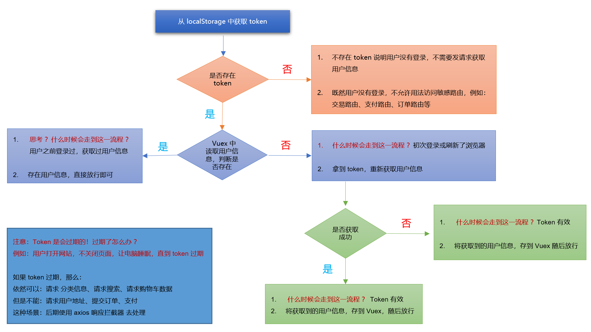
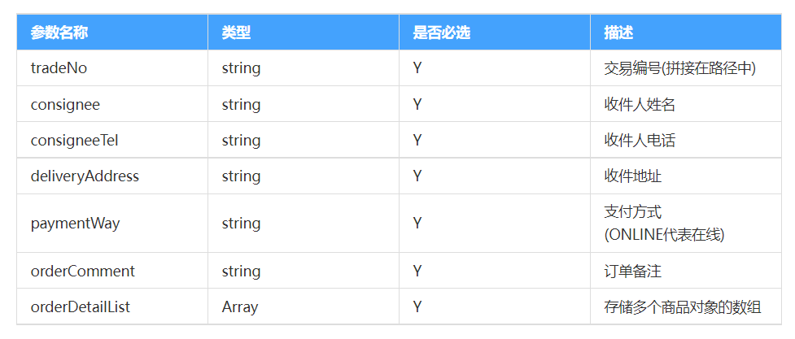

# 尚品汇第 9 天


## 1. 处理用户信息


### 1.1 思路分析


**文字描述：**


全局导航守卫，维护用户信息不丢失的逻辑如下：


1. 首先：立刻从 `localStorage` 中读取 `token`，有 `token` 就是登录过，无 `token` 就是没登录过

   

2. 有 `token`  → 进一步判断 `vuex`中是否有用户信息

   > 
   >
   > ✅有用户信息：
   >
   > 
   >
   > ​		要 `token` 有 `token`，要信息有信息，既然什么都有，直接放行！
   >
   > 
   >
   > ​		什么场景？—— 用户已经成功的登录了，并且获取过用户信息。
   > ​       ──────────────────────────
   > ​       │ 有一个特殊点：万一token是过期的，怎么办？
   > ​       │ token过期了，
   > ​       │ 依然可以：请求分类信息、请求搜索、请求购物车数据。
   > ​       │ 但是不能：请求收货地址、请求下订单、请求支付。
   > ​        │ 关于这个场景，我们后期用axios拦截器，去解决。
   > ​       ─────────────────────────

   > 
   >
   > ❎无用户信息：
   >
   > 
   >
   > ​		尝试拿着token去获取用户信息
   >
   > ​      什么场景？用户刚登录 或 刷新了页面
   >
   > ​		获取成功：信息存入vuex，供后续使用，直接放行！
   >
   > ​		获取失败：证明token已经过期了，删除本地的token，放行到登录
   >
   > 


3. 无 `token`  → 证明用户没有登录过

   > 
   >
   > 证明用户没有登录过，那就意为着：根本就不用发请求获取用户信息
   >
   > 
   >
   > 但要注意，没登录的话，
   >
   > 有些敏感路由是不能去的，比如：交易路由、支付路由、我的订单路由。
   >
   > 
   >
   > 截止目前，我们所有的路由，都是随便看的，没有出现过敏感路由。
   > 所以，暂时，我们暂时直接放行—— next()
   >
   > 


**图示：**




**思路分析：**

**实现步骤：**

**落地代码：**


### 1.2 落地代码


**思路分析：**


在 `src\store\user.js`里，我们已经写好获取用户的信息的 `action  `方法 `getUserInfo`，让 `getUserInfo`可以反馈自己的工作成果


**实现步骤：**


1. 去`src/utils/auth.js`中添加一个`deleteToken` 方法，用来删除 `Token`
2. 在`src\store\user.js`里，完善`getUserInfo`方法
3. 在`router.js` 文件中完善导航守卫中的逻辑


**落地代码：**


1. 去`src/utils/auth.js`中添加一个`deleteToken` 方法，用来删除 `Token`

   ```js
   //从localStoragre删除用户token
   export function deleteToken(){  
     localStorage.removeItem('token')
   }
   ```

   

2. 在`src\store\user.js`里，完善`getUserInfo`方法

   ```js
   const actions = {
     async getUserInfo({ commit }) {
       // 发送请求获取用户信息
       const res = await reqUserInfo()
       // 判断是否获取成功
       if (res.code === 200) {
         commit('saveUserInfo', res.data)
       } else {
         Message.warning(res.message)
   
         // 如果用户信息获取失败，则 return 一个失败的 Promise 实例
         // 那么 dispatch('getUserInfo') 得到的值就是一个失败的 Promise 实例
         return Promise.reject(new Error())
       }
     }
   }
   ```

   

3. 在`router.js` 文件中完善导航守卫中的逻辑

   ```js
   import Vue from 'vue'
   import VueRouter from 'vue-router'
   import routes from './routes'
   import { getToken, deleteToken } from '@/utils/auth.js'
   import store from '@/store'
   
   // coding......
   
   router.beforeEach(async (to, from, next) => {
     console.log('2222')
     // 获取本地的 token
     const token = getToken()
   
     // 判断 token 是否存在
     if (token) {
       // 存在，说明登录过，则尝试获取用户信息
       const { userInfo } = store.state.user
   
       // 判断 Vuex 中是否存在用户信息
       if (userInfo && userInfo.id) {
         // 如果存在用户信息，直接放行
         console.log('333333')
         next()
       } else {
         try {
           // 联系服务员，去获取用户信息
           await store.dispatch('user/getUserInfo')
   
           next() // 放行
         } catch (error) {
           // 删除本地token
           deleteToken()
           // 放行到登录
           next('/login')
         }
       }
     } else {
       // 没有登录，
       // 需要限制访问敏感路由，这里暂时先全部放行
       next()
     }
   })
   
   export default router
   
   ```

   


### 1.3 展示用户信息


**思路分析：**


在 `Header`组件中读取 `vuex` 数据，对用户信息进行展示


**实现步骤：**


**落地代码：**

```vue
<div class="loginList">
  <p>尚品汇欢迎您！</p>
  <!-- <p>
    <router-link to="/login">请登录</router-link>
    <router-link to="/register" class="register">免费注册</router-link>
    <span @click="toTest">测试</span>
  </p> -->

  <!-- 登录后才能呈现的元素 -->
  <p v-show="userInfo && userInfo.id">
    <span>{{ userInfo.nickName }}</span>
    <a class="register">退出登录</a>
  </p>

  <!-- 不登录才能呈现的元素 -->
  <p v-show="!userInfo.id">
    <span>请</span>
    <router-link to="/login">登录</router-link>
    <router-link to="/register" class="register">免费注册</router-link>
  </p>
</div>
```

```js
import { mapState } from 'vuex'

export default {
  // coding......
  
  computed: {
    ...mapState('user', ['userInfo'])
  }
}
```


## 2. 退出登录


**思路分析：**


1. 发请求，通知服务器销毁`token`
2. 清空`localStorage`中的`token`
3. 清空`vuex`中用户的信息
4. 跳转到`/login`路由


**实现步骤：**


1. 封装退出的接口 `API`
2. 创建退出的 `action`，执行清空 `token`、清除 `Vuex`、跳转到 `/login` 等逻辑


**落地代码：**


1. 封装退出的接口 `API`

   ```js
   /**
    * @description 用于请求退出登录
    * @returns
    */
   export const reqLogout = () => request.get('/api/user/passport/logout')
   
   ```

   

2. 创建退出的 `action`，执行清空 `token`、清除 `Vuex`、跳转到 `/login` 等逻辑

   ```js
   import { reqUserInfo, reqLogout } from '@/api/user'
   import { deleteToken } from '@/utils/auth.js'
   import router from '@/router'
   import { Message } from 'element-ui'
   
   const state = {
     userInfo: {} // 用户数据
   }
   
   const getters = {}
   
   const mutations = {
     // 保存用户数据
     // coding.....
     
     clearUserInfo(state) {
       state.userInfo = {}
     }
   }
   
   const actions = {
     // 获取用户信息
     // coding.....
   
     // 退出登录
     async logout({ commit }) {
       // 请求退出登录
       const result = await reqLogout()
   
       // 判断业务逻辑是否成功
       if (result.code === 200) {
         // 联系mutations清空用户信息
         commit('clearUserInfo')
         // 清空本地的token
         deleteToken()
         // 跳转到login
         router.push('/login')
       } else {
         // 就目前我们的尚品汇服务器来说，永远不会存在，退出登录失败。
         Message.warning(result.message)
       }
     }
   }
   
   export default {
     namespaced: true,
     state,
     getters,
     mutations,
     actions
   }
   
   ```


## 3. 交易路由-静态页面构建


**思路分析：**


1. 从准备的 `素材与资料\静态组件\订单与支付相关组件_静态` 中找到 `Trade` 组件拷贝到 `views` 目录下
2. 配置`Trade` 路由
3. 注释掉多余的结构
   - 支付方式：`货到付款按钮`
   - 配置方式：`配送方式` 区域 `.way`
   - `送货清单` 替换成`商品清单`，并将多余的一个 `商品清单` 去掉


**实现步骤：**


1. 准备`Trade`交易路由组件
2. 准备`Trade` 路由


**落地代码：**

```js
import Trade from '@/views/Trade'

{
  path: '/trade',
  component: Trade
}
```


点击结算按钮，进入交易路由

```vue
<router-link class="sum-btn" to="/trade">结算</router-link>
```


## 4. 交易路由-鉴权


**思路分析：**


如果用户没有登录，不允许用户访问交易路由页面，需要在全局守卫中追加逻辑


**实现步骤：**


1. 在 `router.js` 中配置敏感路由
2. 在 `router.js` 的 `router.beforeEach` 前置守卫配置


**落地代码：**

```js
const authPath = ['/trade']

router.beforeEach(async (to, from, next) => {
  console.log('2222')
  // 获取本地的 token
  const token = getToken()

  // 判断 token 是否存在
  if (token) {
    // ......
  } else {
    if (authPath.includes(to.path)) {
        
      Message.warning('请您先登录')

      // 删除本地token
      deleteToken()
      // 跳转到登录页面
      next('/login')

    } else {
      // 没有登录，
      // 需要限制访问敏感路由，这里暂时先全部放行
      next()
    }
  }
})
```


## 5.  交易路由-获取数据


**思路分析：**


进入交易路由页面后，需要获取`收货地址`和`商品清单` 的数据

根据接口文档封装请求 `api`，调用渲染即可


**实现步骤：**


1. 新建 `api/order.js` 文件，封装请求 `API`
2. 在组件中引入，并调用 `API` 


**落地代码：**


1. 新建 `api/order.js` 文件，封装请求 `API`

   ```js
   // 导入封装的网络请求工具 request.js
   import request from '@/utils/request'
   
   /**
    * @description 获取用户收货地址
    * @param
    * @returns Promise
    */
   export const reqGetCode = (phone) => request.get('/api/user/userAddress/auth/findUserAddressList')
   
   /**
    * @description 用于获取交易信息
    * @param
    * @returns Promise
    */
   export const reqTradeInfo = () => request.get('/api/order/auth/trade')
   
   ```

   

2. 在组件中引入，并调用 `API` 

   ```vue
   <script>
   import { reqUserAddressList, reqTradeInfo } from '@/api/order'
   
   export default {
     name: 'SphTrade',
     data() {
       return {
         addressList: [], // 收货地址
         tradeInfo: [] // 订单列表
       }
     },
     created() {
       // 调用获取收货地址和商品清单的方法
       this.getTradeAbout()
     },
     methods: {
       async getTradeAbout() {
         // 获取收货地址
         const addressRes = await reqUserAddressList()
         // 获取商品清单
         const tradeRes = await reqTradeInfo()
   
         if (addressRes.code === 200 && tradeRes.code === 200) {
           this.addressList = addressRes.data
           this.tradeInfo = tradeRes.data
         } else {
           this.$message.warning('获取交易信息失败！')
         }
       }
     }
   }
   </script>
   
   ```


## 6. 交易路由-拦截器处理身份过期


**思路分析：**


用户登录后一直使用系统，不刷新页面，用了好久好久，达到了`token`的过期时间，这时所有需要身份信息的请求，都不会有正确的响应（服务器`code`为`208`），此时应该触发：退出登录逻辑


处理思路：在`axios`拦截器中，对服务器响应的`code`属性进行判断，若`code`为`208`，则触发退出登录


**实现步骤：**


1. 在响应拦截器中，对响应的状态码进行判断
2. 同时更改弹框的提示


**落地代码：**


1. 在响应拦截器中，对响应的状态码进行判断

   ```js
   // 添加响应拦截器
   request.interceptors.response.use(
     (response) => {
       nprogress.done()
   
       // 判断code是否为208，208意味着：token过期了。
       if (response.data.code === 208) {
         // token已失效，强制触发退出登录
         // ⭐ 注意此处要携带具体的提示信息⭐
         store.dispatch('logout', '身份已过期，请您重新登录！')
         // 终止所有后续的逻辑
         return new Promise(() => {})
       } else {
         // 响应成功的回调
         return response.data
       }
     },
     (error) => {
       // ......
     }
   )
   ```

   

2. 在 `store/userjs` 更改弹框的提示

   ```js
   // 退出登录
   async logout({ commit }, sucessMsg) {
     // 请求退出登录
     const result = await reqLogout()
   
     // 判断业务逻辑是否成功
     if (result.code === 200) {
       // 联系mutations清空用户信息
       commit('clearUserInfo')
       // 清空本地的token
       deleteToken()
   +    // 给用户提示
   +    Message.success(sucessMsg)
       // 跳转到login
       router.push('/login')
     } else {
       // 就目前我们的尚品汇服务器来说，永远不会存在，退出登录失败。
       Message.warning(result.message)
     }
   }
   ```

   

3. 在头部组件中更改退出的时候，文字的提示

   ```js
   methods: {
     handleLogout() {
       if (confirm('确定退出登录吗？')) {
         this.$store.dispatch('user/logout', '退出登录成功！')
       }
     }
   }
   ```


## 7. 交易路由-展示页面信息


**思路分析：**


使用后端返回的数据渲染 `收货地址` 和 `商品清单` 区域


**实现步骤：**

**落地代码：**

```vue
<template>
  <div class="trade-container">
    <h3 class="title">填写并核对订单信息</h3>
    <div class="content">
      <h5 class="receive">收件人信息</h5>
      <!-- 收货地址 -->
      <div class="address clearFix" v-for="address in addressList" :key="address.id">
        <span class="username" :class="{ selected: address.isDefault == 1 }">
          {{ address.consignee }}
        </span>
        <p>
          <span class="s1">{{ address.fullAddress }}</span>
          <span class="s2">{{ address.phoneNum }}</span>
          <span class="s3" v-show="address.isDefault == 1">默认地址</span>
        </p>
      </div>
      <div class="line"></div>
      <h5 class="pay">支付方式</h5>
      <div class="address clearFix">
        <span class="username selected">在线支付</span>
      </div>
      <div class="detail">
        <h5>商品清单</h5>
        <!-- 清单里的每一个商品 -->
        <ul class="list clearFix" v-for="detail in tradeInfo.detailArrayList" :key="detail.skuId">
          <li>
            
          </li>
          <li>
            <p>{{ detail.skuName }}</p>
          </li>
          <li>
            <h3>￥{{ detail.orderPrice }}</h3>
          </li>
          <li>X{{ detail.skuNum }}</li>
        </ul>
      </div>
      <div class="bbs">
        <h5>买家留言：</h5>
        <textarea placeholder="建议留言前先与商家沟通确认" class="remarks-cont"></textarea>
      </div>
    </div>
    <div class="money clearFix">
      <ul>
        <li>
          <b
            ><i>{{ tradeInfo.totalNum }}</i
            >件商品，总商品金额</b
          >
          <span>¥{{ tradeInfo.originalTotalAmount }}</span>
        </li>
      </ul>
    </div>
    <div class="trade">
      <div class="price">
        应付金额: <span>¥{{ tradeInfo.totalAmount }}</span>
      </div>
      <div class="receiveInfo">
        寄送至:
        <span>{{ showAddressInfo.fullAddress }}</span>
        收货人：<span>{{ showAddressInfo.consignee }}</span>
        <span>{{ showAddressInfo.phoneNum }}</span>
      </div>
    </div>
    <div class="sub clearFix">
      <router-link class="subBtn" to="/pay">提交订单</router-link>
    </div>
  </div>
</template>

<script>
import { reqUserAddressList, reqTradeInfo } from '@/api/order'

export default {
  name: 'SphTrade',
  data() {
    return {
      addressList: [],
      tradeInfo: {}
    }
  },
  created() {
    // 调用获取收货地址和商品清单的方法
    this.getTradeAbout()
  },
  methods: {
    // .......
  },
  computed: {
    showAddressInfo() {
      return this.addressList.find((address) => address.isDefault === '1') || {}
    }
  }
}
</script>
```


## 8.交易路由-切换地址


**思路分析：**


点击收件人信息，可以进行地址切换，参考 `排它思想`


**实现步骤：**


给地址绑定点击事件，传递 `ID`


**落地代码：**

```vue
<!-- 收货地址 -->
<div
  class="address clearFix"
  v-for="address in addressList"
  :key="address.id"
  @click="handleChangeAddress(address.id)">
    <span class="username" :class="{ selected: address.isDefault == 1 }">
      {{ address.consignee }}
    </span>
    <p>
    <span class="s1">{{ address.fullAddress }}</span>
    <span class="s2">{{ address.phoneNum }}</span>
    <span class="s3" v-show="address.isDefault == 1">默认地址</span>
  </p>
</div>
```

```js
methods: {
  // 切换收货地址的回调
  handleChangeAddress(id) {
    this.addressList.forEach((address) => {
      if (address.id === id) {
        address.isDefault = '1'
      } else {
        address.isDefault = '0'
      }
    })
  }
    
  // ......
}
```


## 9. 提交订单-收集必备参数


**思路分析：**




根据接口文档要求，准备`提交订单` 需要的参数


**实现步骤：**

**落地代码：**

```js
methods: {
  // 提交订单的回调
  handleSubmitOrder() {
    // 获取交易编号、商品清单
    const { tradeNo, detailArrayList } = this.tradeInfo
    // 获取收件信息
    const { consignee, phoneNum, fullAddress } = this.showAddressInfo
    // 订单备注
    const { message } = this
    // 维护一个参数对象
    const paramsObj = {
      tradeNo,
      consignee,
      consigneeTel: phoneNum,
      deliveryAddress: fullAddress,
      paymentWay: 'ONLINE',
      orderComment: message,
      orderDetailList: detailArrayList
    }
    console.log(paramsObj)
  },

  // coding.......
}
```


##10. 提交订单-准备支付静态页面


**思路分析：**


从准备的组件中拷贝 `pay` 组件到页面中并配置路由


**实现步骤：**

**落地代码：**


1. 将模板替换

   ```vue
   <template>
     <div class="pay-main">
       <div class="pay-container">
         <div class="checkout-tit">
           <h4 class="tit-txt">
             <span class="success-icon"></span>
             <span class="success-info">订单提交成功，请您及时付款，以便尽快为您发货~~</span>
           </h4>
           <div class="paymark">
             <span class="fl"
               >请您在提交订单
               <em class="orange time">4小时</em>
               之内完成支付，超时订单会自动取消。订单号：
               <em>{{ $route.query.order_id }}</em></span
             >
             <span class="fr"
               ><em class="lead">应付金额：</em>
               <em class="orange money">￥17,654</em>
             </span>
           </div>
         </div>
         <div class="checkout-info">
           <h4>重要说明：</h4>
           <ol>
             <li>尚品汇商城支付平台目前支持<span class="zfb">微信</span>支付方式。</li>
             <li>其它支付渠道正在调试中，敬请期待。</li>
           </ol>
         </div>
         <div class="checkout-steps">
           <div class="step-tit">
             <h5>支付平台</h5>
           </div>
           <div class="step-cont">
             <ul class="payType">
               <li></li>
             </ul>
           </div>
           <div class="hr"></div>
           <div class="payshipInfo">
             <div class="step-tit">
               <h5>支付网银</h5>
             </div>
             <div class="step-cont">
               <ul class="payType">
                 <li></li>
                 <li></li>
                 <li></li>
                 <li></li>
                 <li></li>
                 <li></li>
                 <li></li>
                 <li></li>
                 <li></li>
                 <li></li>
                 <li></li>
                 <li></li>
                 <li></li>
               </ul>
             </div>
           </div>
           <div class="hr"></div>
           <div class="submit">
             <router-link class="btn" to="/paysuccess">立即支付</router-link>
           </div>
         </div>
       </div>
     </div>
   </template>
   
   <script>
   export default {
     name: 'SphPay'
   }
   </script>
   
   ```

   

2. 配置路由表 

   ```js
   import Pay from '@/views/Pay'
   
   
   {
     path:'/pay',
     component:Pay,
   }
   ```

   


##11. 提交订单-提交订单并跳到支付页面


**思路分析：**


携带之前维护好的必备参数，直接发送请求，订单提交成功，跳转到支付路由`/pay`


**实现步骤：**


1. 准备提交订单的接口 `API`
2. 点击提交订单按钮，调用提交订单 `API`，并携带参数
3. 提交成功后跳转到支付页面


**落地代码：**


1. 准备提交订单的接口 `API`

   ```js
   /**
    * @description 用于请求提交订单
    * @param {*} tradeNo 交易编号
    * @param {*} params https://www.showdoc.com.cn/2077491945864902/9443888348945332
    * @returns
    */
   export const reqSubmitOrder = (tradeNo, params) => request.post(`/api/order/auth/submitOrder?tradeNo=${tradeNo}`, params)
   
   ```

   

2. 点击提交订单按钮，调用提交订单 `API`，并携带参数

   ```js
   import { reqUserAddressList, reqTradeInfo, reqSubmitOrder } from '@/api/order'
   
   methods: {
     // 提交订单的回调
     async handleSubmitOrder() {
       // 获取交易编号、商品清单
       const { tradeNo, detailArrayList } = this.tradeInfo
       // 获取收件信息
       const { consignee, phoneNum, fullAddress } = this.showAddressInfo
       // 订单备注
       const { message } = this
       // 维护一个参数对象
       const paramsObj = {
         tradeNo,
         consignee,
         consigneeTel: phoneNum,
         deliveryAddress: fullAddress,
         paymentWay: 'ONLINE',
         orderComment: message,
         orderDetailList: detailArrayList
       }
   
       const result = await reqSubmitOrder(tradeNo, paramsObj)
       
       if (result.code === 200) {
         this.$message.success('提交订单成功，请您及时支付！')
         // 提交订单成功，跳转到支付组件
         this.$router.push({
           path: '/pay',
           query: { order_id: result.data }
         })
       } else {
         this.$message.warning(result.message)
       }
     },
   
     // ......
   }
   ```


## 12.发起支付-获取支付信息


**思路分析：**


支付组件一挂载，就携带订单编号，去请求具体的支付信息，例如：该订单需要支付多少钱


**实现步骤：**


1. 准备获取支付信息的接口 `API`
2. `Pay`组件挂载完毕后，立刻请求支付信息，呈现到页面


**落地代码：**


1. 准备获取支付信息的接口 `API`

   ```js
   /**
    * @description 获取支付信息
    * @param {*} orderId  支付订单ID(通过提交订单得到)
    * @returns
    */
   export const reqPayInfo = (orderId) => request.get(`/api/payment/weixin/createNative/${orderId}`)
   ```

   

2. `Pay`组件挂载完毕后，立刻请求支付信息，呈现到页面

   ```vue
   <script>
   import { reqPayInfo } from '@/api/order'
   
   export default {
     name: 'SphPay',
     data() {
       return {
         payInfo: {} // 存储本次支付信息
       }
     },
     methods: {
       // 获取支付信息
       async getPayInfo() {
         // 获取订单编号
         const { order_id } = this.$route.query
         // 发送请求获取支付信息
         const result = await reqPayInfo(order_id)
         // 判断业务逻辑是否成功
         if (result.code === 200) {
           // 若获取支付信息成功，则存储数据
           this.payInfo = result.data
         } else {
           // 若获取支付信息失败，则提示原因
           this.$message.warning(result.message)
         }
       }
     },
     mounted() {
       // 组件一挂载，就获取支付信息
       this.getPayInfo()
     }
   }
   </script>
   ```


## 13. 发起支付_支付弹窗


**思路分析：**


使用`element-ui` 提供的 `MessageBox` 组件实现付款弹窗


[使用 HTML 片段](https://element.eleme.cn/#/zh-CN/component/message-box#shi-yong-html-pian-duan)


**实现步骤：**

**落地代码：**

```vue
<a class="btn" @click="handlePay">立即支付</a>

<script>
import { reqPayInfo } from '@/api/order'

export default {
  name: 'SphPay',
  data() {
    return {
      payInfo: {} // 存储本次支付信息
    }
  },

  methods: {
    // 立即支付按钮的回调
    handlePay() {
      // 弹窗中的内容
      const htmlStr =
        ''
      
      // 弹窗的具体配置
      const options = {
        dangerouslyUseHTMLString: true,
        center: true,
        showClose: false,
        showCancelButton: true,
        cancelButtonText: '支付遇到问题',
        confirmButtonText: '已完成支付'
      }

      // 弹框组件
      this.$alert(htmlStr, '微信扫码支付', {
        ...options,
        callback: (type) => {
          if (type === 'confirm') {
            console.log('您点了确定按钮')
          } else {
            console.log('您点了取消按钮')
          }
        }
      })
    },

    // ......
  }
}
</script>
```


## 14. 发起支付-生成支付生成二维码


**思路分析：**


服务器返回的是支付的链接，因此我们需要将支付的链接转换成支付二维码

如果想将二维码转换为图片，需要借助 `qrcode` 插件


**实现步骤：**


1. 安装 `qrcode` 插件
2. 使用  `qrcode` 插件对链接进行转换


**落地代码：**

1. 安装 `qrcode` 插件

   ```shell
   npm i qrcode
   ```

   

2. 使用  `qrcode` 插件对链接进行转换

   ```js
   import QRCode from 'qrcode'
   
   methods: {
     // 立即支付按钮的回调
     async handlePay() {
       // 把支付链接转为二维码
       const payImg = await QRCode.toDataURL(this.payInfo.codeUrl)
       // 弹窗中的内容
       const htmlStr = ``
   
       // 弹窗的具体配置
       const options = {
         dangerouslyUseHTMLString: true,
         center: true,
         showClose: false,
         showCancelButton: true,
         cancelButtonText: '支付遇到问题',
         confirmButtonText: '已完成支付'
       }
   
       // 弹起来！
       this.$alert(htmlStr, '微信扫码支付', {
         ...options,
         callback: (type) => {
           if (type === 'confirm') {
             console.log('您点了确定按钮')
           } else {
             console.log('您点了取消按钮')
           }
         }
       })
     }
   }
   ```

   


## 15. 发起支付-支付成功静态页面


**思路分析：**


支付成功后，需要跳转到支付成功的静态页面

复制提前准备好的组件和路由


**实现步骤：**


1. 准备成功之后的组件
2. 准备成功的路由


**落地代码：**

```js
import PaySuccess from '@/views/PaySuccess'

{
  path:'/paysuccess',
  component:PaySuccess,
}
```


## 16. 发起支付-心跳请求与支付


**思路分析：**


因为网络请求的各种不确定性

因此当支付弹窗出现后，紧随其后，发起一个心跳请求，不断问服务器订单的支付状态

因此后端提供了一个接口 `用于请求订单的支付状态`


**实现步骤：**


1. 封装接口 `API`，用于请求订单的支付状态
2. 将地址放到定时器中，进行实时的查询


**落地代码：**

1. 封装接口 `API`，用于请求订单的支付状态

   ```js
   /**
    * 用于请求订单的支付状态
    * @param {*} orderId 订单 ID
    * @returns
    */
   export const reqPayStatus = (orderId) => request.get(`/api/payment/weixin/queryPayStatus/${orderId}`)
   ```

   

2. 将地址放到定时器中，进行实时的查询

   ```js
   methods: {
     // 立即支付按钮的回调
     async handlePay() {
       try {
         // 把支付链接转为二维码
         const payImg = await QRCode.toDataURL(this.payInfo.codeUrl)
         // 弹窗中的内容
         const htmlStr = ``
         // 弹窗的具体配置
         const options = {
           dangerouslyUseHTMLString: true,
           center: true,
           showClose: false,
           showCancelButton: true,
           cancelButtonText: '支付遇到问题',
           confirmButtonText: '已完成支付'
         }
   
         // 弹起来！
         this.$alert(htmlStr, '微信扫码支付', {
           ...options,
           callback: (type) => {
             if (type === 'confirm') {
               console.log('您点了确定按钮')
             } else {
               console.log('您点了取消按钮')
             }
           }
         })
   
         // 发起心跳请求
         this.timer = setInterval(async () => {
           // 请求订单支付状态
           const result = await reqPayStatus(this.payInfo.orderId)
           if (result.code === 200) {
             // 关闭定时器
             clearInterval(this.timer)
             // 关掉弹窗
             this.$msgbox.close()
             // 跳转到成功支付路由
             this.$router.push('/paysuccess')
           }
         }, 1000)
       } catch (error) {
         this.$message.warning('支付二维码获取失败，请联系客服！')
       }
     },
   
     // coding......
   }
   ```

   


## 17. 发起支付-弹窗按钮逻辑


**整体逻辑梳理：**

> ① 无论点击【已完成支付】还是点击【支付遇到问题】`element-ui`都会自动关闭弹窗。
>
> ② 弹窗有，心跳请求就有； 弹窗没，心跳请求就没。

- 点击【支付遇到问题】按钮逻辑：
  1. 立刻停止心跳
  2. 提示：若您支付遇到问题，请致电客服解决！

- 点击【已支付完成】按钮逻辑：
  1. 立刻停止心跳
  2. 再次联系服务器，看看是否真的支付了
     - 支付了 —— 提示：支付成功！跳转支付成功页面
     - 未支付 —— 提示：您的订单并未支付成功，点击【立即支付】重新支付

弹窗最终完整代码如下：

```js
//立即支付按钮的回调
async handlePay(){
  try {
    // 把支付链接转为二维码
    const url = await QRCode.toDataURL(this.payInfo.codeUrl)
    // 弹窗中的内容
    const htmlStr = ``
    // 弹窗的具体配置
    const options = {
      dangerouslyUseHTMLString: true,
      center:true,
      showClose:false,
      showCancelButton:true,
      cancelButtonText:'支付遇到问题',
      confirmButtonText:'已完成支付',
    }
    // 弹起来！
    this.$alert(htmlStr, '微信扫码支付', {
      ...options,
      callback:async(type)=>{
        if(type === 'confirm'){
          // 心跳停止
          clearInterval(this.timer)
          // 再次像服务器发请求，确认订单状态
          const result = await reqPayStatus(this.payInfo.orderId)
          if(result.code === 200){
            // 若真的支付了
            this.$router.push('/paysuccess')
          }else{
            // 若没有支付
            this.$message.error('您的订单并未支付成功，请重新支付！')
          }
        }else{
          // 心跳停止
          clearInterval(this.timer)
          // 给一个小提示
          this.$message.warning('若您支付遇到问题，请致电客服解决！')
        }
      }
    })
    // 发起心跳请求
    this.timer = setInterval(async()=>{
      // 请求订单支付状态
      const result = await reqPayStatus(this.payInfo.orderId)
      if(result.code === 200){
        // 关闭定时器
        clearInterval(this.timer)
        // 关掉弹窗
        this.$msgbox.close()
        // 跳转到成功支付路由
        this.$router.push('/paysuccess')
      }
    },1000)
  } catch (error) {
    this.$message.warning('支付二维码获取失败，请联系管理员！')
  }
}
```

