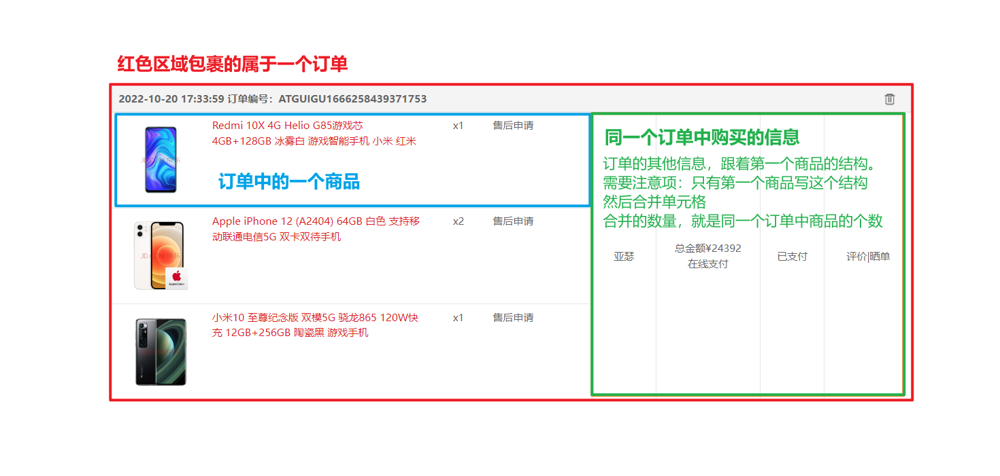

# 尚品汇第 10 天


## 1. 我的订单-静态结构


**思路分析：**


直接复制准备好的`Center`组件，配置路由规则

分析我的订单静态页面结构


**实现步骤：**


**落地代码：**

```js
import Center from '@/views/Center'

{
  path:'/center',
  component:Center
}
```


## 2. 我的订单-渲染订单列表


**思路分析：**


准备订单列表数据，进行订单列表的渲染


> 要注意：先遍历订单，在遍历每个订单中的商品，且要合并单元格




**实现步骤：**


1. 封装获取订单列表的接口 `Api`
2. 在订单组件中调用接口 `Api`，获取数据
3. 渲染订单列表


**落地代码：**


1. 封装获取订单列表的接口 `Api`

   ```js
   /**
    * @desc 我的订单
    * @param {*} pageNo 页码
    * @param {*} pageSize 每页展示的页码数量
    * @returns
    */
   export const reqMyOrder = (pageNo, pageSize) => request.get(`/api/order/auth/${pageNo}/${pageSize}`)
   ```

   

2. 在订单组件中调用接口 `Api`，获取数据

   ```js
   <script>
   import { reqMyOrder } from '@/api/order'
   
   export default {
     name: 'SphCenter',
     data() {
       return {
         records: [],
         pageNo: 1, // 页码
         pageSize: 2 // 每页展示多少条数据
       }
     },
     mounted() {
       // 调用获取订单数据的方法
       this.getMyOrderInfo()
     },
     methods: {
       // 获取订单信息
       async getMyOrderInfo() {
         const result = await reqMyOrder(this.pageNo, this.pageSize)
         if (result.code === 200) {
           this.records = result.data.records
         } else {
           this.$message.warning(result.message)
         }
       }
     }
   }
   </script>
   ```

   

3. 渲染订单列表

   ```vue
   <div class="orders">
     <table class="order-item" v-for="good in records" :key="good.id">
       <thead>
         <tr>
           <th colspan="5">
             <span class="ordertitle"
               >{{ good.createTime }} 订单编号：{{ good.outTradeNo }}
               <span class="pull-right delete"></span
             ></span>
           </th>
         </tr>
       </thead>
   
       <tbody>
         <tr v-for="(order, index) in good.orderDetailList" :key="index">
           <td width="60%">
             <div class="typographic">
               
               <a href="#" class="block-text">{{ order.skuName }}</a>
               <span>x{{ order.skuNum }}</span>
               <a href="#" class="service">售后申请</a>
             </div>
           </td>
           <td v-if="index === 0" :rowspan="good.orderDetailList.length" width="8%" class="center">
             {{ good.consignee }}
           </td>
           <td v-if="index === 0" :rowspan="good.orderDetailList.length" width="13%" class="center">
             <ul class="unstyled">
               <li>总金额¥{{ good.totalAmount }}</li>
               <li>在线支付</li>
             </ul>
           </td>
           <td v-if="index === 0" :rowspan="good.orderDetailList.length" width="8%" class="center">
             <a href="#" class="btn">{{ good.orderStatusName }} </a>
           </td>
           <td v-if="index === 0" :rowspan="good.orderDetailList.length" width="13%" class="center">
             <ul class="unstyled">
               <li>
                 <a href="mycomment.html" target="_blank">评价|晒单</a>
               </li>
             </ul>
           </td>
         </tr>
       </tbody>
     </table>
   </div>
   ```


## 3. 我的订单-使用分页器


**思路分析：**


使用之前封装的 `Pagination` 组件实现订单区域的分页


**实现步骤：**


1. 导入 `Pagination` 组件
2. 配置参数
3. 准备事件


**落地代码：**

```vue
<div class="pagination">
   <Pagination
      :total="total"
      :pageSize="pageSize"
      :pageNum="pageNo"
      @changePageNum="changePageNum"
    />
</div>
```

```js
export default {
  name: 'SphCenter',
  data() {
    return {
      records: [],
      total: 0, // 总条数
      pageNo: 1, // 页码
      pageSize: 2 // 每页展示多少条数据
    }
  },
  mounted() {
    // 调用获取订单数据的方法
    this.getMyOrderInfo()
  },
  methods: {
    changePageNum(newPageNo) {
      this.pageNo = newPageNo

      this.getMyOrderInfo()
    },

    // 获取订单信息
    // ......
  }
}
</script>
```


## 4. 表单验证-vee-validate 基本使用


**思路分析：**


`vee-validate`是专门用来做表单验证的`vue`插件

`vee-validate` 官网：https://vee-validate.logaretm.com/v2/


我们当前用的是 `2.x` 的版本, 最新的 `4` 版本必须结合 `Vue3` 使用，我们用 `2` 版本


如何转换成中文：

1. 先导入语言包 (从官网提供的路径中进行导入中文语言包)
2. 导入 `vee-validate` 给提供的方法 `Validator`
3. 使用  `Validator.localize` 方法对语言包进行配置


**实现步骤：**


1. 安装`npm install vee-validate@2`
2. 在项目中导入 `vee-validate`
3. 按照[官方案例](https://vee-validate.logaretm.com/v2/guide/getting-started.html#usage)测试在 `Test` 组件基本使用方式


**落地代码：**


```vue
<template>
  <div>
      <!-- input 中的 name="email" 是用来关联 span 中的 "email"  -->
      <!-- 关联后，只要 input 输入的值不合法，就会在 span 中进行错误的展示 -->
      <!-- errors.first 用来获取字段为 xxx 的错误信息 -->

      <!-- 第一种写法：字符串写法 -->
      <!-- <input v-validate="'required|email'" name="email" type="text" /> -->

      <!-- 第二种写法：对象写法 -->
      <input v-validate="{ required: true, email: true }" name="email" type="text" />
      <span>{{ errors.first('email') }}</span>
  </div>
</template>
```


## 5. 表单验证-vee-validate 完成验证


**思路分析：**


采用 [自定义验证](https://vee-validate.logaretm.com/v2/guide/custom-rules.html#creating-a-custom-rule) 规则的方式实现项目中的需求


```js
// Validator.extend：用来新增验证的规则

Validator.extend('phone', {
  // validate 用来定义验证规则
  // value 是我们输入的值
  validate: value => phoneReg.test(value),//验证规则，value是我们输入的值
    
  // 验证失败的回调
  // filed 是验证的字段
  getMessage: filed => '手机号格式不合法！'
})
```


兜底验证：

```js
let validateResult = await this.$validator.validateAll()
```


**实现步骤：**


1. 在 `src\utils\reg.js` 中配置几个正则
2. 配置校验规则，为了以后好管理，我们在`utils/validate.js`写规则
3. 在组件中使用自定义的验证规则对表单输入项进行验证
4. 点击注册按钮，进行兜底验证


**落地代码：**


1. 在 `src\utils\reg.js` 中配置几个正则

   ```js
   // 用于限制加入购物车数量
   export const goodNumReg = /^([1-9]|[1-9]\d|1\d{2}|200)$/
   // 手机号正则
   export const phoneReg = /^(0|86|17951)?(13[0-9]|15[012356789]|166|17[3678]|18[0-9]|14[57])[0-9]{8}$/
   // 验证码正则
   export const codeReg = /^\d{6}$/
   // 密码正则
   export const pwdReg = /^\w{6,21}$/
   
   ```

   

2. 配置校验规则，为了以后好管理，我们在`utils/validate.js`写规则

   ```js
   // 引入vue
   import Vue from 'vue'
   // 引入VeeValidate核心库、Validator自定义验证规则
   import VeeValidate, { Validator } from 'vee-validate'
   
   // 引入中文语言包
   // import zh_CN from 'vee-validate/dist/locale/zh_CN'
   
   // 引入正则
   import { phoneReg, codeReg, pwdReg } from '@/utils/reg'
   // 使用插件
   Vue.use(VeeValidate)
   
   // 手机号的验证规则
   Validator.extend('phone', {
     validate: (value) => phoneReg.test(value), // 验证规则，value是我们输入的值
     getMessage: (filed) => '手机号格式不合法！' // 验证失败的回调
   })
   
   // 验证必要性的规则
   Validator.extend('required', {
     validate: (value) => value, // 验证规则，value是我们输入的值
     getMessage: (field) => field + '必须输入！' // 验证失败的回调
   })
   
   // 验证码的验证规则
   Validator.extend('code', {
     validate: (value) => codeReg.test(value), // 验证规则
     getMessage: (filed) => '验证码必须为6位数字！' // 验证失败的回调
   })
   
   // 密码的验证规则
   Validator.extend('pwd', {
     validate: (value) => pwdReg.test(value), // 验证规则
     getMessage: (filed) => '密码为6到21位英文、数字、下划线' // 验证失败的回调
   })
   
   // 重复密码的验证规则
   Validator.extend('ispwd', {
     validate: (value, args) => value === args[0], // 验证规则
     getMessage: (filed) => '重复密码必须和登录密码一致' // 验证失败的回调
   })
   
   // 协议规则
   Validator.extend('isagree', {
     validate: (value) => value, // 验证规则
     getMessage: (filed) => '协议必须同意！' // 验证失败的回调
   })
   
   ```

   

3. 在组件中使用自定义的验证规则对表单输入项进行验证

   ```vue
   <template>
     <div class="register-container">
       <!-- 注册内容 -->
       <div class="register">
         <h3>
           注册新用户
           <span class="go">我有账号，去 <a href="login.html" target="_blank">登录</a> </span>
         </h3>
         <div class="content">
           <label>手机号:</label>
           <input type="text" placeholder="请输入你的手机号" v-model="phone" v-validate="'required|phone'" name="phone" />
           <span class="error-msg">{{ errors.first('phone') }}</span>
         </div>
         <div class="content">
           <label>验证码:</label>
           <input type="text" placeholder="请输入验证码" v-model="code" v-validate="'required|code'" name="code" />
           <button class="getcode" @click="getCode">获取验证码</button>
           <span class="error-msg">{{ errors.first('code') }}</span>
         </div>
         <div class="content">
           <label>登录密码:</label>
           <input type="text" placeholder="请输入你的登录密码" v-model="password" v-validate="'required|pwd'" name="pwd" />
           <span class="error-msg">{{ errors.first('pwd') }}</span>
         </div>
         <div class="content">
           <label>确认密码:</label>
           <input
             type="text"
             placeholder="请输入确认密码"
             v-model="re_password"
             v-validate="{ required: true, ispwd: password }"
             name="ispwd"
           />
           <span class="error-msg">{{ errors.first('ispwd') }}</span>
         </div>
         <div class="controls">
           <input type="checkbox" v-model="isAgree" v-validate="'isagree'" name="isagree" />
           <span>同意协议并注册《尚品汇用户协议》</span>
           <span class="error-msg">{{ errors.first('isagree') }}</span>
         </div>
         <div class="btn">
           <button @click="register">完成注册</button>
         </div>
       </div>
   
       <!-- 底部 -->
       <div class="copyright">
         <ul>
           <li>关于我们</li>
           <li>联系我们</li>
           <li>联系客服</li>
           <li>商家入驻</li>
           <li>营销中心</li>
           <li>手机尚品汇</li>
           <li>销售联盟</li>
           <li>尚品汇社区</li>
         </ul>
         <div class="address">地址：北京市昌平区宏福科技园综合楼6层</div>
         <div class="beian">京ICP备19006430号</div>
       </div>
     </div>
   </template>
   ```

   

4. 点击注册按钮，进行兜底验证

   ```js
   methods: {
     // 用户注册
     async register() {
       const validateResult = await this.$validator.validateAll()
   
       if (validateResult) {
         // 获取用户输入
         const { phone, code, password } = this
         // 请求注册(注意此处传递的参数是一个对象)
         const res = await reqRegister({ phone, code, password })
         if (res.code === 200) {
           this.$message.success('注册成功！')
         } else {
           this.$message.warning(res.message)
         }
       }
     }
   }
   ```


## 6. 路由懒加载


**思路分析：**


当打包构建应用时，JavaScript 包会变得非常大，影响页面加载。如果我们能把不同路由对应的组件分割成不同的代码块，然后当路由被访问的时候才加载对应组件，这样就更加高效了。


目前项目没有使用理由懒加载，在访问任意路由的时候，实际上是把多有的路由对应的组件都加载出来了

如果我们能把不同路由对应的组件分割成不同的代码块，a 路由对应一个 a 组件代码块(js 文件)

当访问 a 的时候，只加载和 a 对应的组件代码，这时候加载速度就会很快

其他路由，只有在被访问的时候，才会加载对应的组件 


-


什么是懒加载：其实就是延迟加载，即当需要用到的时候再去加载

优点：减少网络开销，节约网络流量

缺点：如果某个资源过大，加载很耗时，用户体验下降


**实现步骤：**

**落地代码：**

```js
// import Home from '@/views/Home'
// import Login from '@/views/Login'
// import Register from '@/views/Register'
// import Search from '@/views/Search'
// import Detail from '@/views/Detail'
// import AddCartSuccess from '@/views/AddCartSuccess'
// import Cart from '@/views/Cart'
// import Trade from '@/views/Trade'
// import Pay from '@/views/Pay'
// import PaySuccess from '@/views/PaySuccess'
// import Center from '@/views/Center'

// 懒加载的引入方式
const Home = () => import('@/views/Home')
const Login = () => import('@/views/Login')
const Register = () => import('@/views/Register')
const Search = () => import('@/views/Search')
const Detail = () => import('@/views/Detail')
const AddCartSuccess = () => import('@/views/AddCartSuccess')
const Cart = () => import('@/views/Cart')
const Trade = () => import('@/views/Trade')
const Pay = () => import('@/views/Pay')
const PaySuccess = () => import('@/views/PaySuccess')
const Center = () => import('@/views/Center')
```


## 7. 图片懒加载


**思路分析：**


[vue-lazyload](https://www.npmjs.com/package/vue-lazyload) 用于在应用程序中延迟加载图像的 Vue 模块

如果图片还没有加载好，我先呈现默认图片，

如果图片开始加载了，将默认图片进行替换


**实现步骤：**


1. 安装vue-lazyload：`npm i vue-lazyload@1` 
2. 提前准备好一个过渡图片：`/assets/images/loading.gif`
3. 导入并使用插件


**落地代码：**

1. 安装vue-lazyload：`npm i vue-lazyload@1` 

2. 提前准备好一个过渡图片：`/assets/images/loading.gif`

3. 导入并使用插件

   ```html
   
   ```
   
   
   
   ```js
   // main.js
   
   import VueLazyload from 'vue-lazyload'
   import picture from '@/assets/images/loading.gif'
   
   
   Vue.use(VueLazyload,{
   	loading:picture
   })
   ```


##8. 完善路由鉴权


**思路分析：**


明确：有些路由只有登录了，才能看；—— 使用<strong style="color:red">全局守卫</strong>去做

他们分别是：`/trade`、`/pay`、`/paysuccess`、`/center`

在全局导航守卫中追加几个规则，具体编码如下：

```js
// 数组中存放的是登录后才能访问的路由地址
const authPath = ['/trade', '/pay', '/paysuccess', '/center']

router.beforeEach(async (to, from, next) => {
  // coding...
}
```


明确：只有在特定路由，才能去特定路由

使用【路由独享守卫】细化鉴权规则，配置写在路由规则中（`src/router/routes.js`）

```js
//只有从【详情】页面才能跳到【添加购物车成功】页面
{
    path:'/addcart_success',
    component:AddCartSuccess,
    beforeEnter: (to, from, next) => {
        if(from.path.slice(0,7) === '/detail') next()
        else next('/home')
    }
},

//只有从【交易】页面才能跳到【支付】页面
{
    path:'/pay',
    component:Pay,
    beforeEnter: (to, from, next) => {
        if(from.path === '/trade') next()
        else next('/home')
    }
}
```


使用【组件内守卫】细化鉴权规则，配置写在组件中（`.vue`文件）

```js
export default {
	name: 'PaySuccess',
  //只有从【支付】页面，才能去【支付成功】页面 （也可以在路由独享守卫中写）
	beforeRouteEnter(to, from, next) {
		if(from.path === '/pay'){
			next()
		}else{
			next('/home')
		}
	}
}
```


**思路分析：**

**实现步骤：**

**落地代码：**


